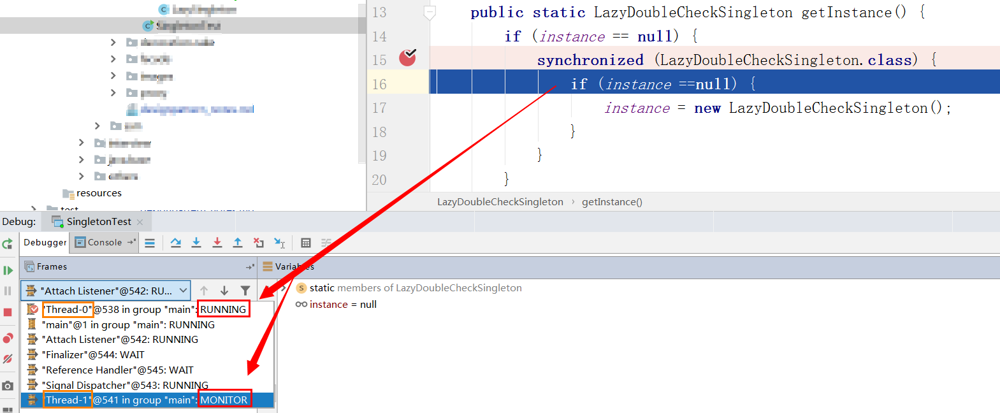
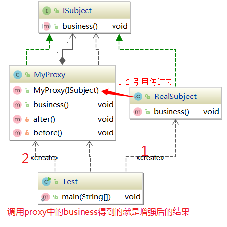
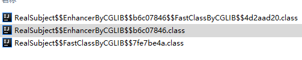
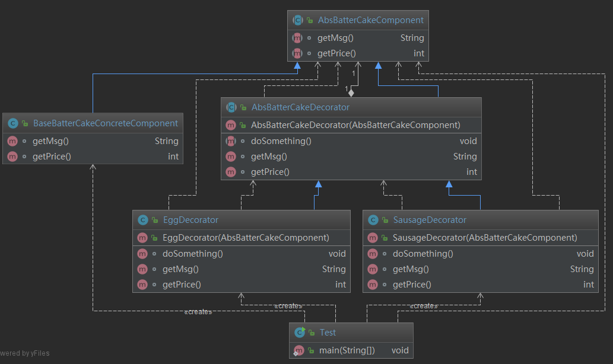

### 前言

> 设计模式最重要的是**解耦**，学习过程主要学习设计模式是如何**总结经验并将经验为自己所用**，同时锻炼将业务需求转换技术实现的一种有效方式。

## 七大软件设计原则

> 设计原则是**设计模式的基础**，实际开发中**并不是所有代码都必须遵循设计原则**，它只是一种指导思想，在适当的场景遵守设计原则来帮助我们设计出更加优雅的代码，而不是强加硬套上去硬生生把代码变臃肿。

### 开闭原则

> 解决问题：版本更新时，尽可能不修改源代码，以增加源代码的方式增加新功能。
>
> 原则：一个实体类、模块、函数应该**对扩展开发**，**对修改关闭。用抽象构建框架，用实现扩展细节。**（**面向抽象编程**）
>
> **优点：提高软件系统的可用性、可维护性。**

### 依赖倒置

> 解决问题：版本更新时，尽可能不修改源代码，以增加源代码的方式增加新功能。 
>
> 原则：**高层模块不应该依赖底层模块，二者都应该依赖其抽象；抽象不应该依赖细节，细节应该依赖抽象。（面向接口编程，不要针对实现编程）**
>
> **优点：减少类间耦合性、提高系统稳定性、提高代码可读性和可维护性，可降低修改程序所造成的的风险。**
>
> spring中**依赖注入**来实现依赖倒置。（通过接口注入）

### 单一职责原则

> 解决问题：若一个方法中处理了多个不同职责的东西，那么若一种职责有更变势必会影响到其他职责的东西，就可能引起一些风险。于是就引出了单一职责对此解耦。
>
> 原则：**一个类、接口、方法只负责一项职责。**
>
> **优点：降低类的复杂度、提供类的可读性、提供系统的可维护性、降低变更引起的风险。**

### 接口隔离原则

> **用多个专门的接口，而不是使用单一的总接口，客户端不应该依赖它不需要的接口。**
>
> **注意：一个类对应一个类的依赖应该建立在最小的接口上，建立单一接口，不用建立庞大臃肿的解耦；尽量细化接口，接口中的方法尽量少。**
>
> **遵循该原则时适度，一定要适度，也不能太细化。**
>
> **注意：在设计接口时多思考业务模型，包括以后可能发生变更的地方还要做一些预判。**
>
>  优点：增强可读性、后期可维护性。

### 迪米特法则

> **一个对象应该对其他对象保持最少的了解。又叫最小知道原则。目的是降低类与类之前的耦合。**
>
> **优点：降低类之间的耦合。**
>
> **强调只和朋友交流，不和陌生人说话。出现在成员变量、方法的输入输出参数中的类成为成员朋友类，而出现在方法体内部的类不属于朋友类。**


### 里氏替换原则

> 子类可扩展父类的功能，但是不能改变父类原有的功能。
>


### 合成复用原则

> 尽量使用对象组合(has-a)、聚合(contain-a)，而不是继承关系达到复用的目的。可以使系统根据灵活，降低类与类之间的耦合度，一个类发生变化对其他类的影响也较小。
>
> 继承：又叫做白箱复用，相当于把所有实现细节都暴露给子类。
>
> 组合/聚合：又叫做黑箱复用，对类以外的对象是无法获取到类的实现细节的。


## 设计模式

### 工厂

#### 简单工厂模式（非23GOF）

**适用场景**

> 工厂类负责创建的对象较少。
>
> 客户端只需要传入工厂类的参数，对于如何创建对象的逻辑不需要关心。

**优点**

> 只需传入一个正确的参数就可获取需要的对象，无须知道其创建的细节。

**缺点**

> 职责相对过重，增加新的产品时需要修改工厂类的判断逻辑，违背开闭原则。不易于扩展过于复杂的产品结构。

**使用实例**

```java
// 定义水果接口
public interface IFruit {
    String producer();
}

// 具体实现类
public class Apple implements IFruit {
    @Override
    public String producer() {
        return "生产-苹果";
    }
}

// 生产水果的工厂类
public class FruitFactory {
    public IFruit create(Class<? extends IFruit> clazz){
        try {
            return clazz.newInstance();
        } catch (InstantiationException | IllegalAccessException e) {
            e.printStackTrace();
        }
        return null;
    }
}
// 测试类
public class SimpleTest {
    public static void main(String[] args) {
        FruitFactory fruitFactory = new FruitFactory();
        IFruit apple = fruitFactory.create(Apple.class);
        System.out.println(apple.producer());
    }
}

```

**在源码中的应用实例**

```java
Calendar.getInstance();
LoggerFactory.getLogger(XXX.class); // slf4j-log4j12
```


#### 工厂方法模式

**解决问题**

> 随着产品链的丰富，若每种产品（水果）的创建逻辑有区别，那么工厂的职责就会越来越多，甚至有点像万能工厂，并不便于维护。那么根据单一职责原则将继续进行拆分，每一种产品（水果）由生产该产品的工厂创建，对工厂本身也做一个抽象。可理解成**创建简单工厂的工厂**。

> **生活中的理解**：一个公司最开始不知道造什么产品能够买得很好，于是成立了多个小组分别造风扇、电灯、鼠标、键盘等等各种各样的产品。随着产品链的丰富不同的产品制作工艺差别太大，从整体进行管理时就没那么方便了。于是就成立了各个产品的制造分公司（工厂方法），各个分公司管理各自的产品线，总部管理各个分公司就行了，就不用管理到具体的生产线。


**适用场景**

> 创建对象需要大量重复的代码。
>
> 客户端（应用层）不依赖于产品类实例如何被创建、实现等细节。
>
> 一个类通过其子类来指定创建哪个对象。

**优点**

> 用户只需要关系所需产品对应的工厂，无需关系实现细节。

**缺点**

> 1. 类的个数容易过多，增加复杂度
> 2. 增加 了系统的抽象性和理解难度。

**使用实例**

```java
// 定义水果接口
public interface IFruit {
    String producer();
}

// 创建水果的工厂
public interface IFruitFactory {
    IFruit create();
}

// 实现水果工厂的具体某种水果
public class AppleFactory implements IFruitFactory {
    @Override
    public IFruit create(){
        return new Apple();
    }
}
public class PlumFactory implements IFruitFactory {
    @Override
    public IFruit create(){
        return new Plum();
    }
}

// 具体生产
public class Apple implements IFruit {
    @Override
    public String producer() {
        return "生产-苹果";
    }
}
public class Plum implements IFruit {
    @Override
    public String producer() {
        return "生产-李子";
    }
}

// 测试类
public class Test {
    public static void main(String[] args) {
        // 实例化苹果工厂-生产苹果
        IFruitFactory appleFactory = new AppleFactory();
        IFruit apple= appleFactory.create();
        System.out.println(apple.producer());;
        // 实例化李子工厂-生产李子
        PlumFactory plumFactory = new PlumFactory();
        IFruit plum = plumFactory.create();
        System.out.println(plum.producer());;
    }
}

```


#### 抽象工厂模式

**适用场景**

> 提供一个创建**一系列相关或相互依赖对象**的接口，无须指定他们具体的类。**提供一个产品类的库，所有的产品以同样的接口出现**，从而是客户端不依赖于具体实现。
>
> 比如：我要买苹果和李子两种水果，发现永辉超市和盒马生鲜都能找到。那么就定义一个产品类的库（抽象水果工厂）同时在卖苹果和李子，让永辉超市和盒马生鲜水果超市都继承此抽象类实现卖苹果和李子，还有一个苹果接口和李子接口定义买这种水果的规则，让永辉超市卖的苹果和盒马卖的苹果都遵守这个规则，那么我在这两个中任何一个地方买都是一样。

**缺点**

> 规定了所有可能被创建的产品集合，产品族中扩展新的产品困难，需要修改抽象工厂的接口。
>
> 整个类非常多，增加系统的抽象性和理解难度。

**优点**

> 具体产品在应用层代码隔离，无须关系创建细节。
>
> 将一个系列的产品族统一到一起创建。

> 产品族：一系列的相关产品，整合到一起有关系性。（同品牌：美的、格力、aux）
>
> 产品等级：同一个继承体系。（同产品类型：冰箱、空调）

**代码**

> 比如：华为产品售卖有很多的实体店，官方提供了一个产品售卖库，目的是可以在任何一个售卖店都可以买到产品库中的产品，就需要定义一个抽象产品工厂（**提供一个产品类的库**），让每个售卖店都遵守规则，产品库中的产品必须展出售卖（**所有的产品以同样的接口出现**）；然后同款产品必须遵守同一个定价，那么我们购买时在任意一个售卖店买都可（**客户端不依赖于具体实现**，因为具体实现都遵守同一个规则）

```java
// 官方定的该产品售价，所有区域都必须卖这个价格
public interface IHuaWeiMateBookX {
    void price();
    void info();
}
public interface IHuaWeiP40 {
    void price();
    void info();
}

// 提供一个产品类的库（要求展出售卖的产品）
public abstract class AbstractProductFactory {
    abstract IHuaWeiP40 huaweiP40();
    abstract IHuaWeiMateBookX huaweiMateBookX();
}

// 某地区-展览售卖抽象类中要求的产品
public class ChengDuProductFactory extends AbstractProductFactory {
    @Override
    IHuaWeiP40 huaweiP40() {
        return new ChengDuHuaWeiP40();
    }

    @Override
    IHuaWeiMateBookX huaweiMateBookX() {
        return new ChengDuHuaWeiMateBookX();
    }
}
public class ChongQingProductFactory extends AbstractProductFactory {
    @Override
    IHuaWeiP40 huaweiP40() {
        return new ChongQingHuaWeiP40();
    }

    @Override
    IHuaWeiMateBookX huaweiMateBookX() {
        return new ChongQingHuaWeiMateBookX();
    }
}

// 某区域具体产品实现类
public class ChengDuHuaWeiMateBookX implements IHuaWeiMateBookX {
    @Override
    public void price() {
        System.out.println("售价：$7999");
    }

    @Override
    public void info() {
        System.out.println("华为MateBookX基本版……");
    }
}
public class ChengDuHuaWeiP40 implements IHuaWeiP40 {
    @Override
    public void price() {
        System.out.println("售价：$4488");
    }

    @Override
    public void info() {
        System.out.println("华为P40基本版……");
    }
}
```


简单工厂：产品的工厂

工厂方法：工厂的工厂

抽象工厂：复杂产品的工厂


### 单例模式

**定义**

> 一个类在任何时候都只有一个实例（隐藏构造方法），并提供一个全局访问点。

**优点**

> 在内存中只有一个实例，减少了内存开销；
>
> 可以避免对资源的过多占用；
>
> 设置全局访问点，可以严格控制访问。

**缺点**

> 没有接口，扩展困难（扩展只能修改源代码，没有其他途径）；

**重点**

> 1. 构造器私有化
> 2. 提供全局访问点
> 3. 保证线程安全
> 4. 延迟加载
> 5. 防止序列化和反序列化破坏单例
> 6. 防止反射破坏单例

#### 一、应用场景

**应用**

> J2EE标准中，ServletContext、ServletContextConfig；Spring中ApplicationContext；数据库连接池等
>
> 与配置文件相关的一般都是单例模式，如果有多个配置文件，框架一般会处理成一个单例。

#### 二、常见写法

##### 2.1  饿汉式单例的2种写法与优缺点

**代码**

```java
/**
 * keys：
 * 1.类加载时实例化（线程还没出现前就实例化了，不存在多线程下访问安全性问题）
 * 2.构造器私有化
 * 3.静态全局访问点
 * 变量前可加可不加 final 修饰
 */
public class HungrySingleton {
    private static HungrySingleton instance = new HungrySingleton();

    private HungrySingleton() {
    }

    public static HungrySingleton getInstance() {
        return instance;
    }
}

public class HungryStaticBlockSingleton {
    private static HungryStaticBlockSingleton instance ;
  // 和另一种写法相比没多大区别，只是换一种写法（在静态代码块中实例化）
    static {
        instance = new HungryStaticBlockSingleton();
    }

    private HungryStaticBlockSingleton() {
    }

    public static HungryStaticBlockSingleton getInstance() {
        return instance;
    }
}
```

**优点**

> 执行效率高，性能高，没有任何锁。

**缺点**

> 某些情况下可能会内存浪费。

**应用**

> 适用于**单例对象较少的场景**，因为如果系统中有大量的单例对象存在，那么**系统初始化时就会占用很多内存**。

##### 2.2 懒汉式单例之双重检查锁写法与优缺点

双重校验锁

> 若不使用双重校验锁，则把7、8、10、11行去掉，这样会存在在多线程环境下可能有多个实例。
>
> 多线程环境下不加锁调试：在第6行打上断点(suspend thread)，当线程进入第6行后new对象前切换到另一个线程，另个对象执行后就会有多个实例。
>
> 多线程环境下双重校验锁调试：在第6、8行打上断点(suspend thread)，当线程进入第7行后切换到另一个线程，然后会发现另一个线程状态为MONITOR进不了同步代码块，等这个线程执行完后才可以进入。
>
> 

```java
public class LazyDoubleCheckSingleton {
    private static LazyDoubleCheckSingleton instance;
    private LazyDoubleCheckSingleton() {}

    public static LazyDoubleCheckSingleton getInstance() {
        if (instance == null) { // 2、breakpoint suspend thread
            synchronized (LazyDoubleCheckSingleton.class) { // -7-
                if (instance ==null) { // 3、breakpoint suspend thread  -8-
                    instance = new LazyDoubleCheckSingleton();
                } // -10-
            } // -11-
        }
        return instance;
    }
}
// 测试代码
public class SingletonTest {
    public static void main(String[] args) {
        new Thread( new SingletonRunnableTest()).start();
        new Thread( new SingletonRunnableTest()).start();
        System.out.println("end"); // 1、breakpoint suspend thread，执行到这步才切换线程，保证子线程都已启动
    }

    static class SingletonRunnableTest implements Runnable{
        @Override
        public void run() {
            LazyDoubleCheckSingleton lazySingleton = LazyDoubleCheckSingleton.getInstance();
            System.out.println(Thread.currentThread().getName()+" : "+lazySingleton);
        }
    }
}
```


#####  2.3  懒汉式单例之静态内部类写法与优缺点

> 静态内部类和静态属性不一样，静态属性在类加载时就分配了空间，但**静态内部类是在用的时候才分配内存空间**。虚拟机会保证一个**类在多线程环境中加载时会正确的加锁、同步**。
>
> ```java
> public class LazyInnerClassSingleton {
>     private LazyInnerClassSingleton() {
>     }
>
>     /**
>      * 内部类默认不加载，使用的时候才加载，内部类加载信息是：主类名$内部类名.class
>      * 方法上加final关键字防止被重写，属性引用上加final不清楚为啥，感觉不加也没有问题。
>      */
>     public static final LazyInnerClassSingleton getInstance() {
>         return Holder.INSTANCE;
>     }
>
>     private static class Holder{
>         private static final LazyInnerClassSingleton INSTANCE = new LazyInnerClassSingleton();
>     }
> }
> ```
>
> ```
> 当一个线程在加载内部类时切换到另个线程会有以下信息
> 方法栈中显示：Frames not available for unsuspended thread
> 变量处显示：Paused in another thread
>
> 原因是：虚拟机会保证一个类的<clinit>()方法在多线程环境中被正确的加锁、同步，如果多个线程同时去初始化一个类，那么只会有一个线程去执行这个类的<clinit>()方法，其他线程都需要阻塞等待，直到活动线程执行<clinit>()方法完毕。
> 来自：https://www.cnblogs.com/aspirant/p/7200523.html
> ```
>
> 优点：解决了饿汉式的内存浪费问题和synchronized的性能问题
>
> 缺点：能被反射破坏

#### 三、反射是如何破坏单例的？

```java
void reflectTest(){
  try {
    // 在比较无聊的情况下，故意破坏
    // 0、拿到类信息
    Class<?> clazz = LazyInnerClassSingleton.class;
    // 1、通过反射获取构造方法
    Constructor<?> c = clazz.getDeclaredConstructor(null);
    ///2、强制访问，可以拿到加private修饰的东西
    c.setAccessible(true);
    // 3、暴力初始化，调用多次构造方法
    Object o1 = c.newInstance();
    Object o2 = c.newInstance();
    System.out.println(o1 == o2);
    System.out.println(o1 + "\n" + o2);
  }catch (Exception e){
    e.printStackTrace();
  }
}
```

> 为了防止反射进行破坏，在所有的**私有构造方法中抛出异常**即可。
>
> ```java
>     /**
>      * 正常情况单例模式是不会使用它的，
>      * 但要防止通过反射拿到它而进行多次实例化
>      */
>     private LazyInnerClassSingleton() {
>         if(INSTANCE != null)
>             throw new RuntimeException("不允许创建多个实例");
>     }
> ```

#### 四、序列化是如何破坏单例的？

> 对象创建好后有时候需要写入磁盘，下次使用对象时再从磁盘中读取对象并进行反序列化，将其转化为内存对象。**反序列化后的对象会重新分配内存**，即重新创建一次。那么若序列化的目标对象为单例对象，就破坏了单例。

```java
// 路径：ObjectInputStream.readObject() -> readObject0(false); ->  readOrdinaryObject(unshared)
// java.io.ObjectInputStream#readOrdinaryObject中
Object obj;
try {
    // ========初始化对象，只要有构造方法就要初始化（单例必须有构造方法所以这儿肯定要初始化）=========
    obj = desc.isInstantiable() ? desc.newInstance() : null;
}
// ……
if (obj != null &&
    handles.lookupException(passHandle) == null &&
    // 若有ReadResolveMethod就准备调用
    desc.hasReadResolveMethod())
{
    // =========调用readResolve()============
    Object rep = desc.invokeReadResolve(obj);
    if (unshared && rep.getClass().isArray()) {
        rep = cloneArray(rep);
    }
    // =====调用readResolve返回的引用和创建对象的引用不一样时======
    if (rep != obj) {
        // Filter the replacement object
        if (rep != null) {
            if (rep.getClass().isArray()) {
                filterCheck(rep.getClass(), Array.getLength(rep));
            } else {
                filterCheck(rep.getClass(), -1);
            }
        }
        // ========将新创建的obj引用覆盖==========
        handles.setObject(passHandle, obj = rep);
    }
}
// 返回对象
return obj;
```

**解决方法**

> 不能很好的解决，因为它依然创建了新对象，只是新创建的对象没有返回，返回的是原来的对象，有个地方通过反射找到无参的readResolve()，我们自己写的readResolve()范回的原对象。
>
> ```java
> /**
>  * 防止序列表破坏单例，但反序列化时会被实例化多次，只是新创建的对象没有被返回
>  * 如果创建对象的频率加快，就意外着内存分配开销也会加大
>  */
> private Object readResolve(){
>     return instance;
> }
> ```


#### 五、注册式单例

> 注册式单例又称为登记式单例，将每个注册的对象都**使用唯一标识记录在一个地方**。注册式单例分两种：**1.枚举式、2.容器式**

> 枚举类的底层规定了不能用反射方式创建

##### 5.1  枚举式单例写法与优缺点

###### 写法

```java
public enum EnumSingleton {
    INSTANCE;
    private Object data;

    public Object getData() {
        return data;
    }

    public void setData(Object data) {
        this.data = data;
    }
    public static EnumSingleton getInstance(){
        return INSTANCE;
    }
}
```

> 这种写法能够保证**EnumSingleton是单例**的，但它里面可以设置data，**data的引用可以改变**，但不管怎么变都**只能有一个**。

> **反编译结果如下：**
>
> ```java
> public final class EnumSingleton extends Enum
> {
>
>     public static EnumSingleton[] values()
>     {
>         return (EnumSingleton[])$VALUES.clone();
>     }
>
>     public static EnumSingleton valueOf(String name)
>     {
>         return (EnumSingleton)Enum.valueOf(cn/gp/designpattern/b/singleton/registry/EnumSingleton, name);
>     }
>
>     private EnumSingleton(String s, int i)
>     {
>         super(s, i);
>     }
>
>     public Object getData()
>     {
>         return data;
>     }
>
>     public void setData(Object data)
>     {
>         this.data = data;
>     }
>
>     public static EnumSingleton getInstance()
>     {
>         return INSTANCE;
>     }
>
>     public static final EnumSingleton INSTANCE;
>     private Object data;
>     private static final EnumSingleton $VALUES[];
>
>     static
>     {
>         INSTANCE = new EnumSingleton("INSTANCE", 0);
>         $VALUES = (new EnumSingleton[] {
>             INSTANCE
>         });
>     }
> }
> ```
>
> 可以看到它本质上是**饿汉式**单例的实现。

**尝试通过序列化破坏**

> 通过序列化也不能破坏。枚举类型通过类名和类对象找到一个唯一的枚举对象，因此枚举对象不可能被类加载器加载多次。
>
> Java规范字规定，每个枚举类型及其定义的枚举变量在`JVM`中都是唯一的，因此在枚举类型的序列化和反序列化上，Java做了特殊的规定。在序列化的时候Java仅仅是将枚举对象的name属性输到结果中，反序列化的时候则是通过`java.lang.Enum`的`valueOf()`方法来**根据名字查找枚举对象**。也就是说，序列化的时候只将`INSTANCE`这个名称输出，反序列化的时候再通过这个名称，查找对应的枚举类型，因此反序列化后的实例也会和之前被序列化的对象实例相同。
>
> ```java
> // 路径：ObjectInputStream.readObject() -> readObject0(false); -> switch case中TC_ENUM项 readEnum(unshared)
> // java.io.ObjectInputStream#readEnum
> // =============读取枚举对象的name===================
> String name = readString(false);
> Enum<?> result = null;
> Class<?> cl = desc.forClass();
> if (cl != null) {
>     try {
>         // =======通过类名和枚举对象name查找对应的枚举类型，并将结果赋值给result==========
>         Enum<?> en = Enum.valueOf((Class)cl, name);
>         result = en;
>     } catch (IllegalArgumentException ex) {
>         throw (IOException) new InvalidObjectException(
>             "enum constant " + name + " does not exist in " +
>             cl).initCause(ex);
>     }
>     if (!unshared) {
>         handles.setObject(enumHandle, result);
>     }
> }
> return result;
>
> // ===============Enum.valueOf====================
> public static <T extends Enum<T>> T valueOf(Class<T> enumType,
>                                             String name) {
>     // =======
>     T result = enumType.enumConstantDirectory().get(name);
>     if (result != null)
>         return result;
>     if (name == null)
>         throw new NullPointerException("Name is null");
>     throw new IllegalArgumentException(
>         "No enum constant " + enumType.getCanonicalName() + "." + name);
> }
> ```

###### 尝试通过反射破坏

```java
void reflectTest(){
  try {
    // 在比较无聊的情况下，故意破坏
    // 0、拿到类信息
    Class<?> clazz = EnumSingleton.class;
    // 1、通过反射获取构造方法
    // 因为枚举类的构造方法有这两个参数
    Constructor<?> c = clazz.getDeclaredConstructor(String.class, int.class);
    ///2、强制访问，可以拿到加private修饰的东西
    c.setAccessible(true);
    // 3、暴力初始化，调用多次构造方法
    Object o1 = c.newInstance();
    Object o2 = c.newInstance();
    System.out.println(o1 + "\n" + o2);
  }catch (Exception e){
    e.printStackTrace();
  }
}
```

> 结果发现抛出异常：java.lang.IllegalArgumentException: Cannot reflectively create enum objects
>
> 看异常信息发现：**JDK中明确规定了不能使用反射创建枚举对象** ，这个和上面在构造方法中抛出异常有异曲同工之妙，但JDK处理是最官方的、最权威的。因此枚举单例也是《Effective Java》书中推荐的一种单例实现方式。
>
> ```java
> // java.lang.reflect.Constructor#newInstance 中有如下限制
> if ((clazz.getModifiers() & Modifier.ENUM) != 0)
>     throw new IllegalArgumentException("Cannot reflectively create enum objects");
>
> ```


##### 5.2  容器式单例写法与优缺点

> Spring中的单例模式就是容器式单例写法，如下：
>

```java
public class ContainerSingleton {
    private ContainerSingleton(){}
    private static Map<String, Object> ioc = new ConcurrentHashMap<String, Object>();

    public static Object getBean(String className){
        synchronized (ioc){
            if(!ioc.containsKey(className)){
                Object obj = null;
                try {
                    obj = Class.forName(className).newInstance();
                    ioc.put(className, obj);
                }catch (Exception e){
                    e.printStackTrace();
                }
                return obj;
            }else {
                return ioc.get(className);
            }
        }
    }
}

// 测试
Object containerSingleton1 = ContainerSingleton.getBean("cn.gp.designpattern.b.singleton.SingletonTest");
        Object containerSingleton2 = ContainerSingleton.getBean("cn.gp.designpattern.b.singleton.SingletonTest");
        System.out.println(containerSingleton1 == containerSingleton2);
```

> 优点：适用于创建大量单例对象的场景，便于管理。通用性强，不管什么对象都可以创建为单例，而不用在类写成单例类

#### 第六章  ThreadLocal单例介绍

> ThreadLocal不能保证创建的对象时全局唯一的，但能够保证在单个线程中是唯一的，天生线程安全。

```java
public class ThreadLocalSingleton {
    private ThreadLocalSingleton(){}

    /*private static final ThreadLocal<ThreadLocalSingleton> INSTANT = new ThreadLocal<ThreadLocalSingleton>(){
        @Override
        protected ThreadLocalSingleton initialValue() {
            return new ThreadLocalSingleton();
        }
    };*/
    private static final ThreadLocal<ThreadLocalSingleton> INSTANT = ThreadLocal.withInitial(ThreadLocalSingleton::new);
    public static ThreadLocalSingleton getInstance(){
        return INSTANT.get();
    }
}
```

#### 源码中的应用

```java
// java.lang.Runtime
public class Runtime {
    // 饿汉式单例
    private static Runtime currentRuntime = new Runtime();
    public static Runtime getRuntime() {
        return currentRuntime;
    }

    private Runtime() {}
    // ……
}
```


### 原型模式

> 原型实例指定创建对象的种类，并通过拷贝这些原型创建新的对象。调用者不需要知道创建细节，不用调用构造函数。（创建型模式）
>
> 原型模式的核心在于**拷贝原型对象**，创建新的对象消耗比较大（递归调用超类、数据准备、访问权限、调用构造函数等），它的思想在于以系统中已存在的对象为原型，直接基于内存二进制流进行拷贝，无需经历耗时的对象初始化过程。


#### 应用场景

> 1. 类初始化消耗资源较多时
> 2. new 产生的一个对象需要非常多繁琐的过程（数据准备，访问权限）
> 3. 构造函数比较复杂
>
> Spring中的原型模式（scope="prototype"）；JSON.parseObject()

#### 常见写法

##### 简单克隆写法

> 实现 Cloneable 接口，重写clone()，调父类clone()后做个转型。object的clone()是本地方法

```java
public ProtoTypeEntity clone()  {
    try {
        return (ProtoTypeEntity) super.clone();
    } catch (CloneNotSupportedException e) {
        e.printStackTrace();
        return null;
    }
}
```


##### 深度克隆写法

> 实现 Serializable 接口，因为有用到java中的流操作

```java
public ProtoTypeEntity deepClone() {
    try {
        ByteArrayOutputStream bos = new ByteArrayOutputStream();
        ObjectOutputStream oos = new ObjectOutputStream(bos);
        oos.writeObject(this);

        ByteArrayInputStream bis = new ByteArrayInputStream(bos.toByteArray());
        ObjectInputStream ois = new ObjectInputStream(bis);

        return (ProtoTypeEntity) ois.readObject();
    } catch (IOException | ClassNotFoundException e) {
        e.printStackTrace();
        return null;
    }
}
```

**测试**

> ```java
> public class Test {
>     public static void main(String[] args) {
>         ProtoTypeEntity entity = new ProtoTypeEntity();
>         entity.setAge(15);
>         entity.setName("zz");
>         List<String> hobbies = new ArrayList<>();
>         hobbies.add("唱");
>         hobbies.add("跳");
>         hobbies.add("rap");
>         hobbies.add("篮球");
>         entity.setHobbies(hobbies);
>
>         System.out.println("原型对象：" + entity);
>         ProtoTypeEntity copy = entity.clone();
>         copy.getHobbies().add("copy");
>
>         ProtoTypeEntity deep = entity.deepClone();
>         deep.getHobbies().add("deep");
>
>         System.out.println("原型对象：" + entity);
>         System.out.println("浅复制对象：" + copy);
>         System.out.println("深复制对象：" + deep);
>         System.out.println("浅复制对象与原型对象的属性引用相等 "+ (entity.getHobbies() == copy.getHobbies()));
>         System.out.println("深复制对象与原型对象的属性引用相等 "+ (entity.getHobbies() == deep.getHobbies()));
>     }
> }
> ```

#### 克隆破坏单例模式

> 克隆会破坏单例，防止克隆破坏单例可以通过禁止克隆。

```java
public Object clone()  {
    return this; // 或者 return INSTSANCE;
}
```

##### Cloneable源码分析

> 实现Cloneable都是浅克隆
>
> 可以通过序列化、转json可以实现深克隆。
>
> 一般情况下不用自己用原型模式，很多地方都是写好了的，但如果没有自己要知道怎么写，有那些需要注意的问题。
>
> 在ArrayList、HashMap等很多地方都有用到原型模式实现克隆。

#### 原型模式的优缺点

**优点**

> 性能优良，java自带的原型模式是基于内存二进制流的拷贝，比直接new一个对象性能上提升了很多。
>
> 可以使用深克隆方式保存对象的状态，使用原型模式将对象复制并将其状态保存起来，简化了创建过程。

**缺点**

> 必须配备克隆（或可拷贝）方法
>
> 当对已有类进行改造时，需要修改代码违反了开闭原则。
>
> 深拷贝、浅拷贝需要运用得当，不然会导致些麻烦事。


### 建造者模式

> 将一个复杂对象的构建与表示分离，使得同样的构建过程可以创建不同的表示。
>
> 用户只需要指定需要建造的类型就可以获得对象，建造过程及细节不需要了解（创建型）。
>
> 通俗理解：将食材和作料都买齐给厨师，厨师把做好的菜给我，我并不需要了解做菜的细节。

#### 应用场景

> 创建对需要很多步骤，但步骤的顺序不一定固定。
>
> 若一个对象有非常复杂的内部结构（很多属性）
>
> 把复杂对象的创建和使用分离。
>
> 结合链式编程更优雅（链式编程：对入参做过一些操作后，返回处理后的值）。

#### 常见写法

##### 基本写法

> 略

##### 链式写法

```java
Object f(Object o){
    // 对对象o的各种操作
    // 最后返回原对象
    return o;
}
```


#### 应用案例

> - JPA的 Query, 只需要把SQL的限制条件放进去即可，不用关心SQL条件的相对位置, 还可以避免手动拼接sql时产生的人为拼接错误。
>
> - StringBuilder中，我们期望把字符串拼接在一起，但java中String类是不可变的，拼接过程中就会产生多个String对象，但在用到StringBuilder时，它会将需要拼接的内容按拼接顺序存在char[]数组中，等用户拼接结束就可以调后toString()将数组中的内容一次性转换成String。（补充：String中的"+"号在编译时编译成的StringBuilder用append()拼接的，但String只要生成了就不能变了，想拼接则会生成新的String对象，StringBuilder在拼接过程中一直都是用的一个对象）

#### 源码中的体现

> StringBuilder：append()后调用toString()就可以得到构造好的字符串。
>
> CacheBuilder(Mybatis)
>
> SqlSessionFactoryBuilder
>
> BeanDefinitionBuider

建造者模式的优缺点

优点

> 封装性好，创建和使用分离
>
> 扩展性好，建造类之间独立，一定程度上解耦。

缺点

> 产生多余的Builder对象
>
> 产品内部发生变化，建造者都要修改，成本较大。

#### 建造者模式与工厂模式的区别

> - 创建对象力度不同，建造者更适合创建由各种复杂部件组成的对象，工厂创建出的都是单一的一样的。
> - 关注重点不同，建造者要知道最后结果由那些组成，最后创建出对象，工厂只需要创建出对象。


### 代理

> 作用：**增强目标对象**对原代码逻辑前后的增强，而使调用者无感知（如非入侵式日志记录）。或者**保护目标对象**。	
>
> 某些情况下，一个对象不适合或者不能直接引用另一个对象，而代理对象可以在客户端与目标对象之间起到中介作用。（结构模式）

**包含的三种角色**

> 抽象主题(Subject)：声明真实主题与代理的共同接口方法，可为接口或抽象类。（购房者与中介约定的协议）
>
> 真实主题(RealSubject)：被代理类，执行真正逻辑业务的对象。（购房者）
>
> 代理主题(Proxy)：代理类，持有RealSubject的引用，具备对其的代理权。在调用代理对象时除了调用被代理对象的方法还会在代理对象前后增加一些处理代码。（中介）

#### 一、应用场景

> 生活中的：房产中介（房源大部分在他们那儿，不找不行）、票贩子（控制了很多车票）
>
> 

#### 二、静态代理

> 对遵守协议的类进行代理，其中只能**硬编码**，没有遵守协议的类一律不代理。（这儿的“协议”可以用接口或类规定）

**代码**

> 实现要点：
>
> 1. 用接口规定一些方法
>
> 2. 代理类中实现接口，并在声明接口作为成员变量，构造方法中传入接口引用指向成员变量，实现接口的方法中调用接口中规定的方法并加入功能增强的逻辑。
>
> 3. 真实主题类中实现接口的方法。
>
> 4. 调用者在调用时声明代理类，并传入真实主题类的引用，调用代理类的。
>
>    

```java
// 抽象主题类（协议）
public interface ISubject {
    /**
     * 主要业务：如日志记录（现实中如卖房中介、婚介所）
     */
    void business();
}

// 代理类（中介）
public class MyProxy implements ISubject{

    private ISubject subject;
    public MyProxy(ISubject subject){
        this.subject = subject;
    }
    @Override
    public void business() {
        after();
        subject.business();
        before();
    }

    private void after(){
        System.out.println("===static proxy 前置处理===");
    }
    private void before(){
        System.out.println("===static proxy 后置处理===");
    }
}

// 真实主题类（买房者）
public class RealSubject implements ISubject{
    @Override
    public void business() {
        System.out.println(" this is RealSubject");
    }
}
```

**应用案例**

> 数据源切换，在分布式场景下根据订单创建时间自动按年份进行分库。

**代码**

订单实体

```java
@Data
public class Order {
    private Object orderInfo;
    //订单创建时间进行按年分库
    private Long createTime;
    private String id;
}
```

动态数据源-实体

```java
public class DynamicDataSourceEntity {
    public final static String DEFAULE_SOURCE = null;

    private final static ThreadLocal<String> local = new ThreadLocal<String>();

    private DynamicDataSourceEntity(){}

    public static String get(){return  local.get();}

    public static void restore(){
        local.set(DEFAULE_SOURCE);
    }

    // DB_2018 、DB_2019
    public static void set(String source){local.set(source);}

    public static void set(int year){local.set("DB_" + year);}
}
```

订单接口和实现类

```java
public interface IOrderService {
    int createOrder(Order order);
}

public class OrderServiceImpl implements IOrderService{
    @Override
    public int createOrder(Order order) {
        System.out.println("OrderService调用orderDao创建订单");
        return 1;
    }
}
```

代理类

```java
public class OrderServiceStaticProxy implements IOrderService {
    private SimpleDateFormat yearFormat = new SimpleDateFormat("yyyy");
    private IOrderService orderService;
    public OrderServiceStaticProxy(IOrderService orderService) {
        this.orderService = orderService;
    }

    @Override
    public int createOrder(Order order) {
        // ========== 前置操作，模拟根据年份切换数据源==========
        Long time = order.getCreateTime();
        Integer dbRouter = Integer.valueOf(yearFormat.format(new Date(time)));
        System.out.println("静态代理类自动分配到【DB_" +  dbRouter + "】数据源处理数据" );
        DynamicDataSourceEntity.set(dbRouter);

        // ========== 调用真实主题类的方法==========
        this.orderService.createOrder(order);

        // ========== 后置操作，切换回默认数据源==========
        DynamicDataSourceEntity.restore();
        return 0;
    }
}
```

测试类

```java
public class Test {
    public static void main(String[] args) {
        try {
            Order order = new Order();
            SimpleDateFormat sdf = new SimpleDateFormat("yyyy/MM/dd");
            Date date = sdf.parse("2019/03/01");
            order.setCreateTime(date.getTime());

            IOrderService orderService = (IOrderService)new OrderServiceDynamicProxy().getInstance(new OrderServiceImpl());
            orderService.createOrder(order);
        }catch (Exception e){
            e.printStackTrace();
        }
    }
}
```


#### 三、动态代理

> 不管目标对象是啥都可以对其进行代理，而静态代理只能对实现的接口的类进行代理。
>
> 动态代理会造成频繁gc
>
> 动态代理是通过动态生成代理类代码，**动态生成的代码中让需要代理的类“遵守规则”**，然后就对其代理，这样就避免了静态代理中需要硬编码手动遵守规则的麻烦。

##### 3.1  JDK实现方式

###### 抽象主题类

```java
public interface ISubject {
    /**
     * 主要业务：如日志记录（现实中如卖房中介、婚介所）
     */
    void business();
}
```

###### 代理类

```java
// 需要实现 InvocationHandler 类，用到jdk中封装好的 Proxy.newProxyInstance()
public class ProxyProcess implements InvocationHandler {

    private ISubject target;
    public ISubject getInstance(ISubject target){
        this.target = target;
        Class<?> clazz = target.getClass();
        return (ISubject) Proxy.newProxyInstance(clazz.getClassLoader(),
                clazz.getInterfaces(),
                this);
    }
    @Override
    public Object invoke(Object proxy, Method method, Object[] args) throws Throwable {
        before();
        Object invoke = method.invoke(this.target, args);
        after();
        return invoke;
    }
    private void after(){
        System.out.println("===static proxy 前置处理===");
    }
    private void before(){
        System.out.println("===static proxy 后置处理===");
    }
}
```

###### 真实主题类

```java
public class RealSubject implements ISubject{
    @Override
    public void business() {
        System.out.println(" this is RealSubject");
    }
}
```

###### Test

```java
public class Test {
    public static void main(String[] args) {
        ProxyProcess proxy = new ProxyProcess();
        ISubject subject = proxy.getInstance(new RealSubject());
        subject.business();
      
      	// 将临时代码输出到磁盘，可通过反编译tool查看到源码
        byte[] bytes = ProxyGenerator.generateProxyClass("$Proxy0",
                new Class[]{ISubject.class});
        try {
            FileOutputStream fos = new FileOutputStream("E://$Proxy0.class");
            fos.write(bytes);
            fos.close();
        } catch (Exception e) {
            e.printStackTrace();
        }
    }
}
```

##### 3.2  手写JDK Proxy

> JDK动态代理采用字节重组，重新生成新的对象来代替原始对象。
>
> **动态生成代理对象步骤**：
>
> 1. **反射**获取**被代理类**对象的**引用**和**所有接口**；
> 2. **生成**一个实现被代理类的所有接口的**临时类**；
> 3. **编译**动态生成的临时类；
> 4. **加载**到JVM中**运行** ；
> 5. 返回新的代理对象。
>
> 在JDK中有个在ClassPath下只要是$开头的.class文件，一般都是动态生成的。

> 查看反编译出的源码发现，$Proxy0继承了Proxy类，同时实现了ISubject接口且类加上了final修饰，里面重写了ISubject接口定义的方法，在静态块中保存了所有方法的引用，重写的方法用反射调用目标对象的方法。


> 我们自己实现JDK Proxy时主要要写这样几个类：InvocationHandler(定义回调接口)、Proxy(生成源代码)、ClassLoader(加载自定义Proxy生成的代码的类)

回调接口

```java
public interface MyInvocationHandler {
    Object invoke(Object proxy, Method method, Object[] args) throws Throwable;
}
```

类加载器

```java
public class MyClassLoader extends ClassLoader{
    private File classPathFile;
    public MyClassLoader(){
        // 代理类生成的文件位于本路径下
        String classPath = MyClassLoader.class.getResource("").getPath();
        this.classPathFile = new File(classPath);
    }

    @Override
    protected Class<?> findClass(String name) throws ClassNotFoundException {
        String className = MyClassLoader.class.getPackage().getName() + "." + name;
        if(classPathFile  != null){
            File classFile = new File(classPathFile,name.replaceAll("\\.","/") + ".class");
            if(classFile.exists()){
                FileInputStream in = null;
                ByteArrayOutputStream out = null;
                try{
                    // 读取文件内容
                    in = new FileInputStream(classFile);
                    out = new ByteArrayOutputStream();
                    byte [] buff = new byte[1024];
                    int len;
                    while ((len = in.read(buff)) != -1){
                        out.write(buff,0,len);
                    }
                    // ClassLoader 中的方法，将class文件封装在Class类中
                    return defineClass(className,out.toByteArray(),0,out.size());
                }catch (Exception e){
                    e.printStackTrace();
                }
            }
        }
        return null;
    }
}
```

代理类

```java
public class MyProxy {
    public static final String ln = "\r\n";

    public static Object newProxyInstance(MyClassLoader classLoader, Class<?> [] interfaces, MyInvocationHandler h){
        try {
            // 1、动态生成源代码.java文件
            String src = generateSrc(interfaces);

            // 2、Java文件输出磁盘
            File f = write2Desk(src);

            //3、把生成的.java文件编译成.class文件
            compiler(f);

            //4、编译生成的.class文件加载到JVM中来
            // $Proxy0 和生成类时类名保持一致即可，生成的临时类放在本类同路径下
            // 所以这儿要自定义ClassLoader，在加载临时类时就在当前同路径下找的
            Class proxyClass =  classLoader.findClass("$Proxy0");
            // 注意：构造器中要传入调用处理器
            Constructor c = proxyClass.getConstructor(MyInvocationHandler.class);
            f.delete();

            //5、返回字节码重组以后的新的代理对象
            // 注意：构造器中要传入调用处理器
            return c.newInstance(h);
        }catch (Exception e){
            e.printStackTrace();
        }
        return null;
    }

    /**
     * 生成代理类的源代码
     *
     * @param interfaces
     * @return
     */
    private static String generateSrc(Class<?>[] interfaces){
        StringBuffer sb = new StringBuffer();
        // 包相关
        sb.append(MyProxy.class.getPackage() + ";" + ln);
        sb.append("import " + interfaces[0].getName() + ";" + ln);
        sb.append("import java.lang.reflect.*;" + ln);
        // 定义类并实现接口
        sb.append("public class $Proxy0 implements " + interfaces[0].getName() + "{" + ln);
        // 初始化变量
        sb.append("MyInvocationHandler h;" + ln);
        sb.append("public $Proxy0(MyInvocationHandler h) { " + ln);
        sb.append("this.h = h;");
        sb.append("}" + ln);
        // 实现接口中的方法
        for (Method m : interfaces[0].getMethods()){
            Class<?>[] params = m.getParameterTypes();

            StringBuffer paramNames = new StringBuffer();
            StringBuffer paramValues = new StringBuffer();
            StringBuffer paramClasses = new StringBuffer();

            // 处理接口方法中的参数（准备着，下一步用）
            for (int i = 0; i < params.length; i++) {
                Class clazz = params[i];
                String type = clazz.getName();
                String paramName = toLowerFirstCase(clazz.getSimpleName());
                paramNames.append(type + " " +  paramName);
                paramValues.append(paramName);
                paramClasses.append(clazz.getName() + ".class");
                if(i > 0 && i < params.length-1){
                    paramNames.append(",");
                    paramClasses.append(",");
                    paramValues.append(",");
                }
            }

            // 处理具体方法
            sb.append("public " + m.getReturnType().getName() + " " + m.getName() + "(" + paramNames.toString() + ") {" + ln);
            sb.append("try{" + ln);
            sb.append("Method m = " + interfaces[0].getName() + ".class.getMethod(\"" + m.getName() + "\",new Class[]{" + paramClasses.toString() + "});" + ln);
            // 处理正常情况下的返回值，让回调
            sb.append(((m.getReturnType() != void.class) ? "return " : "") + getCaseCode("this.h.invoke(this,m,new Object[]{" + paramValues + "})",m.getReturnType()) + ";" + ln);
            // 处理异常情况
            sb.append("}catch(Error _ex) { }");
            sb.append("catch(Throwable e){" + ln);
            sb.append("throw new UndeclaredThrowableException(e);" + ln);
            sb.append("}");
            sb.append(getReturnEmptyCode(m.getReturnType()));
            sb.append("}");
        }
        sb.append("}" + ln);
        return sb.toString();
    }

    /**
     * 将内容输出到磁盘
     *
     * @param src 源文件内容
     * @return {@link File} 文件信息
     * @throws IOException
     */
    private static File write2Desk(String src) throws IOException {
        String filePath = MyProxy.class.getResource("").getPath();
        File f = new File(filePath + "$Proxy0.java");
        FileWriter fw = new FileWriter(f);
        fw.write(src);
        fw.flush();
        fw.close();
        return f;
    }

    /**
     * 把生成的.java文件编译成.class文件
     *
     * @param f
     * @throws IOException
     */
    private static void compiler(File f) throws IOException {
        JavaCompiler compiler = ToolProvider.getSystemJavaCompiler();
        StandardJavaFileManager manage = compiler.getStandardFileManager(null,null,null);
        Iterable iterable = manage.getJavaFileObjects(f);

        JavaCompiler.CompilationTask task = compiler.getTask(null,manage,null,null,null,iterable);
        task.call();
        manage.close();
    }


    private static Map<Class,Class> mappings = new HashMap<Class, Class>();
    static {
        mappings.put(int.class,Integer.class);
    }

    /**
     * 出现异常时返回的内容
     *
     * @param returnClass
     * @return
     */
    private static String getReturnEmptyCode(Class<?> returnClass){
        if(mappings.containsKey(returnClass)){
            return "return 0;";
        }else if(returnClass == void.class){
            return "";
        }else {
            return "return null;";
        }
    }

    private static String getCaseCode(String code,Class<?> returnClass){
        if(mappings.containsKey(returnClass)){
            return "((" + mappings.get(returnClass).getName() +  ")" + code + ")." + returnClass.getSimpleName() + "Value()";
        }
        return code;
    }

    /**
     * 将类名的首字母转为小写
     *
     * @param src
     * @return
     */
    private static String toLowerFirstCase(String src){
        char [] chars = src.toCharArray();
        if(65 <= chars[0] && chars[0] <= 90) {
            chars[0] += 32;
        }
        return String.valueOf(chars);
    }
}
```

测试代理类

```java
public class MyProxyProcess implements MyInvocationHandler {

    private ISubject target;
    public ISubject getInstance(ISubject target){
        this.target = target;
        Class<?> clazz = target.getClass();
        return (ISubject) MyProxy.newProxyInstance(new MyClassLoader(),
                clazz.getInterfaces(),
                this::invoke);
    }
    @Override
    public Object invoke(Object proxy, Method method, Object[] args) throws Throwable {
        before();
        Object invoke = method.invoke(this.target, args);
        after();
        return invoke;
    }
    private void after(){
        System.out.println("===static proxy 前置处理===");
    }
    private void before(){
        System.out.println("===static proxy 后置处理===");
    }
}
```

调用过程分析

```java
// Test类
public class Test {
    public static void main(String[] args) {
        ProxyProcess proxy = new ProxyProcess();
        ISubject subject = proxy.getInstance(new RealSubject());
        subject.business(); // ====1 调用代理入口===============
    }
}

// 生成的代理类
public class $Proxy0 implements ISubject {
    MyInvocationHandler h;
	// 实例化时将回调接口的引用记录下的
    public $Proxy0(MyInvocationHandler var1) {
        this.h = var1;
    }
// ========实际调用到这儿===============
    public void business() {
        try {
            Method var1 = ISubject.class.getMethod("business");
            // =======2 调用回调接口中的方法===========
            this.h.invoke(this, var1, new Object[0]);
        } catch (Error var2) {
            ;
        } catch (Throwable var3) {
            throw new UndeclaredThrowableException(var3);
        }

    }
}

// ============3 调用回调接口 ===========
public Object invoke(Object proxy, Method method, Object[] args) throws Throwable {
    // 前置处理……
    before();
    // ==========4 回调真实主题类的业务方法==========
    Object invoke = method.invoke(this.target, args);
    after();
    return invoke;
}
private void after(){
    System.out.println("===static proxy 前置处理===");
}
private void before(){
    System.out.println("===static proxy 后置处理===");
}
```


##### 3.3  CGLib实现方式

> 添加cglib依赖（spring底层用sm框架，sm框架有依赖cglib的包）
>
> ```xml
> <dependency>
>     <groupId>cglib</groupId>
>     <artifactId>cglib-nodep</artifactId>
>     <version>2.2</version>
> </dependency>
> ```

###### 真实主题类

```java
// 不用实现接口
public class RealSubject {
    public void business() {
        System.out.println(" this is RealSubject");
    }
}
```

###### 代理类

```java
public class ProxyProcess implements MethodInterceptor {

    public Object getInstance(Class<?> clazz){
        Enhancer enhancer = new Enhancer();
        enhancer.setSuperclass(clazz);
        enhancer.setCallback(this);
        return enhancer.create();
    }

    @Override
    public Object intercept(Object o, Method method, Object[] objects, MethodProxy methodProxy) throws Throwable {
        before();
        Object invoke = methodProxy.invokeSuper(o, objects);
        after();
        return invoke;
    }

    private void after(){
        System.out.println("=== proxy 前置处理===");
    }
    private void before(){
        System.out.println("=== proxy 后置处理===");
    }
}
```

###### 测试类

```java
public class Test {
    public static void main(String[] args) {
        // 利用CGLib的代理类可将内存中的.class文件写入本地磁盘
        System.setProperty(DebuggingClassWriter.DEBUG_LOCATION_PROPERTY, "./cglib_proxy_class/");

        RealSubject obj = (RealSubject) new ProxyProcess().getInstance(RealSubject.class);
        obj.business();
    }
}
```

##### 3.4 CGLib代理分析

> 查看CGLib生成的代理类可以主要看到生成了三个类
>
> 
>
> 其中RealSubject$$EnhancerByCGLIB$$b6c07846.class代理类继承了需要代理的类
>
> ```java
> public class RealSubject$$EnhancerByCGLIB$$b6c07846 extends RealSubject implements Factory {
>     // ……
>     static void CGLIB$STATICHOOK1() {
>         CGLIB$THREAD_CALLBACKS = new ThreadLocal();
>         // ……
>         CGLIB$business$0$Proxy = MethodProxy.create(var1, var0, "()V", "business", "CGLIB$business$0");
>     }
> // 代理方法 methodProxy.invokeSuper()会调用
>     final void CGLIB$business$0() {
>         super.business();
>     }
> // 被代理方法 methodProxy.invoke()调用。拦截器中调用会发生死循环（一直在调用拦截器）
>     public final void business() {
>         MethodInterceptor var10000 = this.CGLIB$CALLBACK_0;
>         if (this.CGLIB$CALLBACK_0 == null) {
>             CGLIB$BIND_CALLBACKS(this);
>             var10000 = this.CGLIB$CALLBACK_0;
>         }
> 
>         if (var10000 != null) {
>             // 调用拦截器
>             var10000.intercept(this, CGLIB$business$0$Method, CGLIB$emptyArgs, CGLIB$business$0$Proxy);
>         } else {
>             super.business();
>         }
>     }
>     // ……
> }
> ```
>
> 可以看到代理类中重写了RealSubject类中方法
>
> **对象调用过程**：调用生成代理对象中的 business()   ->  调用MethodInterceptor接口中的intercept() 【前置后置处理就在这儿】 ->    methodProxy.invokeSuper() 【通过它调用到真实主题类中方法】 ->    CGLIB$business$0$Method  ->   被代理对象的business()
>
> **调用过程代码分析**
>
> ```java
> // Test 类
> public static void main(String[] args) {
>     // 利用CGLib的代理类可将内存中的.class文件写入本地磁盘
>     System.setProperty(DebuggingClassWriter.DEBUG_LOCATION_PROPERTY, "./cglib_proxy_class/");
> 
>     RealSubject obj = (RealSubject) new ProxyProcess().getInstance(RealSubject.class);
>     obj.business(); // ============ 1 入口=========
> }
> 
> // CGLib生成-代理类
> public class RealSubject$$EnhancerByCGLIB$$b6c07846 extends RealSubject implements Factory {
>     // ……
>     static void CGLIB$STATICHOOK1() {
>         CGLIB$THREAD_CALLBACKS = new ThreadLocal();
>         // ……
>         CGLIB$business$0$Proxy = MethodProxy.create(var1, var0, "()V", "business", "CGLIB$business$0");
>     }
> // 代理方法 methodProxy.invokeSuper()会调用
>     final void CGLIB$business$0() {
>         super.business();
>     }
>     // ============2 调用1实际上调用到了代理类的这个重写的方法==========
> // 被代理方法 methodProxy.invoke()调用。拦截器中调用会发生死循环（一直在调用拦截器）
>     public final void business() {
>         MethodInterceptor var10000 = this.CGLIB$CALLBACK_0;
>         if (this.CGLIB$CALLBACK_0 == null) {
>             CGLIB$BIND_CALLBACKS(this);
>             var10000 = this.CGLIB$CALLBACK_0;
>         }
> // ============ 3 调用 方法拦截器中的方法============
>         if (var10000 != null) {
>             // 调用拦截器
>             var10000.intercept(this, CGLIB$business$0$Method, CGLIB$emptyArgs, CGLIB$business$0$Proxy);
>         } else {
>             super.business();
>         }
>     }
>     // ……
> }
> 
> // 代理处理类
> public class ProxyProcess implements MethodInterceptor {
> 
>     public Object getInstance(Class<?> clazz){
>         Enhancer enhancer = new Enhancer();
>         enhancer.setSuperclass(clazz);
>         enhancer.setCallback(this);
>         return enhancer.create();
>     }
> // ================3 拦截器中的intercept()========
> // ！！！！！！！ 前置、后置任务也都在这儿处理 ！！！！！！！
>     @Override
>     public Object intercept(Object o, Method method, Object[] objects, MethodProxy methodProxy) throws Throwable {
>         before();
>         // ==========4 调用methodProxy.invokeSuper
>         Object invoke = methodProxy.invokeSuper(o, objects);
>         after();
>         return invoke;
>     }
> 
>     private void after(){
>         System.out.println("=== proxy 前置处理===");
>     }
>     private void before(){
>         System.out.println("=== proxy 后置处理===");
>     }
> }
> 
> 
> // net.sf.cglib.proxy.MethodProxy#invokeSuper
> public Object invokeSuper(Object obj, Object[] args) throws Throwable {
>     try {
>         this.init();
>         MethodProxy.FastClassInfo fci = this.fastClassInfo;
>         // =========5 调用被代理类的FastClass类===
>         return fci.f2.invoke(fci.i2, obj, args);
>     } catch (InvocationTargetException var4) {
>         throw var4.getTargetException();
>     }
> }
> 
> // CGLib生成-被代理类的FastClass类
> // 传来的参数 var1 = 15; var2 = 实例化的 RealSubject$$EnhancerByCGLIB$$24be692e
> public Object invoke(int var1, Object var2, Object[] var3) throws InvocationTargetException {
>     24be692e var10000 = (24be692e)var2;
>     int var10001 = var1;
> 
>     try {
>         // 根据 index 直接定位执行方法
>         switch(var10001) {
>                 // ……
>             case 15:
>                 // ===========6 调用代理类的FastClass======
>                 var10000.CGLIB$business$0();
>                 return null;
>         }
>     }
> }
> 
> // CGLib生成-代理类
> final void CGLIB$business$0() {
>     // ============7 调用到被代理类的business()（真实主题类中的）
>     super.business();
> }
> // ========= 然后往上返回就结束了========
> ```
>
> 

> CGLib代理执行效率之所以比JDK代理高，是因为CGLib采用了FastClass机制（简单理解：为代理类和被代理类各生成一个类，这个类会为代理类或被代理类的方法分配一个index(int类型)；这个index当作一个入参，**FastClass就可以直接定位要调用的方法并直接调用，省去了反射调用，所以调用效率比JDK代理通过反射调用高**）
>
> RealSubject$$FastClassByCGLIB$$7fe7be4a.class 是代理类的FastClass
>
> RealSubject$$EnhancerByCGLIB$$b6c07846$$FastClassByCGLIB$$4d2aad20.class 是被代理类的FastClass

**其余要点分析**

> FastClass并不是更代理类一起生成的，而是在第一次执行MethodProxy的invoke()或invokeSuper()时生成的，并放在了缓存中。

```java
// net.sf.cglib.proxy.MethodProxy#invokeSuper
// MethodProxy的invoke()和invokeSuper()都调用了init()
public Object invokeSuper(Object obj, Object[] args) throws Throwable {
    try {
        this.init();
        MethodProxy.FastClassInfo fci = this.fastClassInfo;
        return fci.f2.invoke(fci.i2, obj, args);
    } catch (InvocationTargetException var4) {
        throw var4.getTargetException();
    }
}

public Object invoke(Object obj, Object[] args) throws Throwable {
    try {
        this.init();
        MethodProxy.FastClassInfo fci = this.fastClassInfo;
        // 调用FastClass
        return fci.f1.invoke(fci.i1, obj, args);
    } catch (InvocationTargetException var4) {
        throw var4.getTargetException();
    } catch (IllegalArgumentException var5) {
        if (this.fastClassInfo.i1 < 0) {
            throw new IllegalArgumentException("Protected method: " + this.sig1);
        } else {
            throw var5;
        }
    }
}

private void init() {
    if (this.fastClassInfo == null) {
        Object var1 = this.initLock;
        synchronized(this.initLock) {
            if (this.fastClassInfo == null) {
                MethodProxy.CreateInfo ci = this.createInfo;
                MethodProxy.FastClassInfo fci = new MethodProxy.FastClassInfo();
                // 如果在缓存就取出，没有在缓存就生成新的FastClass
                fci.f1 = helper(ci, ci.c1);
                fci.f2 = helper(ci, ci.c2);
                // 获取方法的index
                fci.i1 = fci.f1.getIndex(this.sig1);
                fci.i2 = fci.f2.getIndex(this.sig2);
                this.fastClassInfo = fci;
            }
        }
    }
}
```

##### 3.5 JDK和CGLib动态代理对比

> 1. JDK **实现被代理对象的接口**，CGLib **继承被代理对象**（所以不能代理有final修饰的）；
> 2. 生成字节码层面：JDK和CGLib都在运行期生成字节码，JDK直接写字节码，CGLib使用ASM框架写字节码，**CGLib实现更复杂、生成代理类比JDK效率低**；
> 3. 执行代理类层面：JDK代理方法通过反射机制调用，CGLib通过FastClass机制直接调用方法，**CGLib执行效率更高**。


#### 四、代理模式与Spring

##### 4.1  代理模式在Spring源码中的应用

> Spring利用动态代理实现AOP有两个非常重要的类 JdkDynamicAopProxy 、CglibAopProxy。

##### 4.2  Spring中的代理选择原则

> 当Bean有实现接口时就使用JDK代理，没有就使用CGLib代理。
>
> 可以通过配置强制使用CGLib代理
>
> ```xml
> <aop: aspectj-autoproxy proxy-target-class = "true"/>
> ```

#### 五、代理模式的优缺点

优点

> - 将代理对象与真实目标对象分离
> - 在一定程度上降低了系统耦合性，扩展性好
> - 可以保护目标对象、增强目标对象功能

缺点

> 处理速度会比较慢
>
> 系统复杂度会增加


### 门面模式

> 又叫外观模式，**提供了一个统一的接口用来访问子系统中的一群接口**。主要特征是定义了一个高级接口让子系统更容易使用，属于结构性模式。

#### 应用场景

> 1. 子系统越来越复杂，使用门面模式提供简单接口。
> 2. 构建多层系统结构，利用门面对象作用于每层的入口，简化层间调用。

#### 通用写法

> 主要包含2种角色
>
> 外观角色(Facade)：也称门面角色，系统对外的统一接口；
>
> 子系统角色(SubSystem)：可以同时有一个或多个SubSystem。每个SubSystem都不是一个单独的类而是一个类的集合。SubSystem并不知道Facade的存在，对于SubSystem而言，Facade只是另一个客户端而已。

**代码**

```java
// 子系统A——doA接口
public class SubSystemA {
    public void doA(){
        System.out.println(" do A stuff");
    }
}

// 子系统B——doB接口
public class SubSystemB {
    public void doB(){
        System.out.println(" do B stuff");
    }
}

// 外观角色类
public class Facade {
    private SubSystemA a =  new SubSystemA();
    private SubSystemB b =  new SubSystemB();

    /**
     * 对外接口
     */
    public void doA(){
        a.doA();
    }
    public void doB(){
        b.doB();
    }
}
```


#### 业务场景实例

> 下单接口，将支付系统、商品业务系统、物流系统组合起来提供一个门面方便调用。

#### 在源码中的应用

> Spring的JDBC模块下JdbcUtils类将Connection Statement ResultSet等类的关闭操作都封装；
>
> Mybatis的Configuration类中将JDBC的关键组件封装在一起；
>
> tomcat源码中的RequestFacade封装了许多request操作、除此之外还有ResponseFacade、StandardSessionFacade等类。

```java
// Spring的JDBC模块下JdbcUtils，将Connection Statement ResultSet等类的关闭操作都封装在此类
public abstract class JdbcUtils {
    public static final int TYPE_UNKNOWN = -2147483648;
    private static final boolean getObjectWithTypeAvailable;
    private static final Log logger;

    public JdbcUtils() {
    }

    public static void closeConnection(Connection con) {
        if (con != null) {
            try {
                con.close();
            } catch (SQLException var2) {
                logger.debug("Could not close JDBC Connection", var2);
            } catch (Throwable var3) {
                logger.debug("Unexpected exception on closing JDBC Connection", var3);
            }
        }

    }

    public static void closeStatement(Statement stmt) {
        if (stmt != null) {
            try {
                stmt.close();
            } catch (SQLException var2) {
                logger.trace("Could not close JDBC Statement", var2);
            } catch (Throwable var3) {
                logger.trace("Unexpected exception on closing JDBC Statement", var3);
            }
        }

    }

    public static void closeResultSet(ResultSet rs) {
        if (rs != null) {
            try {
                rs.close();
            } catch (SQLException var2) {
                logger.trace("Could not close JDBC ResultSet", var2);
            } catch (Throwable var3) {
                logger.trace("Unexpected exception on closing JDBC ResultSet", var3);
            }
        }

    }
  // ……
}
```


#### 与其他模式区别

**门面模式与代理模式**

> 门面模式就是**特殊的静态代理**模式。门面模式重点是在于**封装**；静态代理重点在于**增强**。
>
> 不做增强的静态代理也就是门面模式。

**门面模式与委派模式**

> 代理模式是结构型，委派模式(不属于GOF23)是行为型。

**门面模式和单例模式**

> 门面模式一般是用作工具类，会做成单例模式。

#### 优缺点

**优点**

> 1. 简化了调用过程，无需深入了解子系统，以防给子系统带来风险
> 2. 减少系统依赖、松散耦合
> 3. 更好地划分层次，提高安全性(三层架构)
> 4. 遵循迪米特法则（最少知道原则）

**缺点**

> 1. 增加子系统和扩展子系统行为时可能带来未知风险
> 2. 不符合开闭原则
> 3. 某些情况下可能违背单一职责原则

### 装饰器模式

> 装饰器模式（Decorator Pattern）也叫包装模式(Wrapper Pattern)，是指不改变原有对象的基础之上，将功能附加到对象上，提供了比继承更有弹性的替代方案（扩展原有对象的功能）。属于结构型模式。
>
> 核心：功能扩展，可以**透明且动态地扩展类的功能**。
>
> 写法思想：**通过构造器传参，在之前处理的基础之上累加功能** ，通过构造函数嵌套对象。


#### 应用场景

> 1. 用于扩展一个类的功能或给一个类添加附加职责
> 2. 动态的给一个对象添加功能，这些功能可以再动态的撤销。

#### 通用写法

> **4种角色：**
>
> 抽象组件(Component)：定顶级规则，规定被装饰对象的行为，可以是一个接口或抽象类。
>
> 具体组件(ConcreteComponent)：遵守规则的具体对象。
>
> 抽象装饰器(Decorator)：给装饰器定规则，让装饰器按其构造形式传入一个Component，内部有一个属性指向顶级规则的Component（若装饰逻辑单一并不需要实现那么多装饰器，那么可以省略该类，直接实现具体装饰器即可，但具体装饰器中必须有构造参数传入Component且有指向Component的属性）。
>
> 具体装饰器(ConcreteDecorator)：Decorator的实现类，一般情况每个ConcreteDecorator都扩展了Component对象的一种功能。
>
> 
>
> 实现原理：
>
> 定义抽象装饰器，各个具体装饰器实现抽象装饰器还通过构造函数传参，然后调用父类的方法，在之前处理的基础上做累加。具体调用过程是从最后添加上的装饰器依次调用父类的方法，就达到了在原基础上做累加的效果。组件是基础，装饰器是扩展(可有可无)（组件是定义基础配置、装饰器是定义额外配置）
>
> 类图：
>
> 

```java
// 抽象组件
public abstract class AbsBatterCakeComponent {
    abstract String getMsg();
    abstract int getPrice();
}

// 抽象装饰器
public abstract class AbsBatterCakeDecorator extends AbsBatterCakeComponent {
    // 静态代理
    private AbsBatterCakeComponent batterCakeComponent;

    public AbsBatterCakeDecorator(AbsBatterCakeComponent batterCakeComponent) {
        this.batterCakeComponent = batterCakeComponent;
    }

    /**
     * 用来扩展的抽象装饰器
     */
    abstract void doSomething();

    @Override
    String getMsg() {
        return this.batterCakeComponent.getMsg();
    }

    @Override
    int getPrice() {
        return this.batterCakeComponent.getPrice();
    }
}

// =============== 具体组件器 ===========
public class BaseBatterCakeConcreteComponent extends AbsBatterCakeComponent {
    @Override
    String getMsg() {
        return "煎饼";
    }

    @Override
    int getPrice() {
        return 5;
    }
}

// =============== 具体装饰器 ===========
public class EggDecorator extends AbsBatterCakeDecorator {
    public EggDecorator(AbsBatterCakeComponent batterCakeComponent) {
        super(batterCakeComponent);
    }

    @Override
    void doSomething() {

    }

    @Override
    String getMsg() {
        return super.getMsg() + "+1个鸡蛋";
    }

    @Override
    int getPrice() {
        return super.getPrice() + 1;
    }
}
```


#### 源码中的应用

> IO流，InputStream BufferedInputStream；
>
> Mybatis中Cache、LruCache

#### 装饰器模式和代理模式模式对比

> 装饰器是一种特殊的代理模式，装饰器模式强调自身功能扩展，透明的扩展，可动态定制的扩展。
>
> 代理模式强调代理过程的控制。

#### 优缺点

优点

> 1. 装饰器是继承的补充，比继承更灵活，不改变原有对象的情况下动态地给一个对象扩展功能，即插即用。
> 2. 通过使用不同装饰器类以及这些装饰器类的排列组合，可实现不同效果。
> 3. 完全遵守开闭原则。

缺点

> 1. 会出现更多代码和类，增加程序复杂性
> 2. 动态装饰时，多层装饰时会更复杂。
>
>


### 享元模式

> 又称为轻量级模式，是对象池的一种实现方式。其宗旨是**共享细粒度对象**，将多个对同一对象的访问集中起来，不必为每个访问者创建一个单独的对象，以此来降低内存的消耗。属于结构型模式。
>
> 本质：**缓存共享对象，降低内存消耗**。
>
> 享元模式把一个对象的状态分为**内部状态**和**外部状态**，**内部状态是不变的**，外部状态是变化的，然后通过**共享不变的部分**达到减少对象数量并节约内存的目的。
>
> 享元模式其实是工厂模式的一个改进机制，它同样要求创建一个或一组对象，并且就是通过工厂方法生成的对象，只不过享元模式中为工厂方法增加了缓存。
>

#### 应用场景

> 系统中有大量相似对象、需要缓冲池的场景。（常用与系统底层的开发，以便解决系统性能问题）
>
> String底层实现的常量池就用到了

#### 基本写法

> 三个角色：
>
> 抽象享元角色(Flyweight)：抽象基类或接口，**同时定义出对对象外部状态和内部状态**的接口或实现。
>
> 具体享元角色(ConcreteFlyweight)：实现抽象角色定义的业务。该角色的内部状态应与环境无关，不能出现一个操作改变同时改变了内外部状态。
>
> 享元工厂(FlyweightFactory)：管理享元对象池和创建享元对象。

```java
// ============== 抽象享元角色 =============
public interface IFlyweight {
    void operation(String extrinsicState);
}

// =============== 具体享元角色 ============
public class ConcreteFlyweight implements IFlyweight {
    private String intrinsicState;

    public ConcreteFlyweight(String intrinsicState) {
        this.intrinsicState = intrinsicState;
    }

    @Override
    public void operation(String extrinsicState) {
        System.out.println("Object address: " + System.identityHashCode(this));
        System.out.println("IntrinsicState: " + this.intrinsicState);
        System.out.println("ExtrinsicState: " + extrinsicState);
    }
}

// =============== 享元工厂 ============
public class FlyweightFactory {
    private static Map<String, IFlyweight> pool = new HashMap<>();

    // 因为内部状态具备不变性，因此作为缓存的键
    public static IFlyweight getFlyweight(String intrinsicState) {
        if (!pool.containsKey(intrinsicState)) {
            IFlyweight flyweight = new ConcreteFlyweight(intrinsicState);
            pool.put(intrinsicState, flyweight);
        }
        return pool.get(intrinsicState);
    }
}

// =============== test ============
public class Test {
    public static void main(String[] args) {
        IFlyweight flyweight1 = FlyweightFactory.getFlyweight("aa");
        IFlyweight flyweight2 = FlyweightFactory.getFlyweight("bb");
        flyweight1.operation("a");// ==
        flyweight1.operation("a1");// ==和上面那个用的同一个内部对象
        flyweight2.operation("b");
    }
}
```


#### 源码中的应用

> 只要有cache，一般就是享元模式。Integer、Long(-128至127缓存)

```java
String s1 = "hello";
String s2 = "hel" + "lo";// 是常量，在编译时就能确定其值于是就优化成了hello指向常量池中。如果是变量相加就不能提前处理
sout(s1 == s2);// true
```


#### 内部状态和外部状态

> 享元模式定义中提出了细粒度和共享对象，因为要求细粒度对象就不可避免会有多数对象性质相近，此时就将这些对象信息分为两个部分：内部状态和外部状态。
>
> 内部状态：对象共享出来的信息，存储在享元对象内部并且不会随环境的改变而改变。
>
> 外部状态：对象得以依赖的标记，是随环境改变而改变的，不可共享的状态。
>
> 如：连接池中对象，保存在连接对象中的用户名、密码、连接URL等信息在创建对象时就设置好了，不会随环境的变化而变化，这些为内部状态。而每个连接需要回收利用时，标记的可用状态这些为外部状态。

#### 优缺点

**优点**

> 减少对象的创建，减少内存开销

**缺点**

> 关注内外部状态、关注线程安全性问题使系统和程序逻辑复杂化。


### 组合模式

> 也称为整体-部分模式，它的宗旨是将单个对象（叶子节点）和组合对象（根节点）用相同的接口进行表示。
>
> 作用：使客户端对单个对象和组合对象保持一致的处理方式。结构型模式。
>
> 核心：**将整合和局部的处理统一到一个抽象中**，整体和局部没有共同特性且**满足contains-a关系**，客户端只需要同一套api即可。
>
> **注意组合关系和聚合关系的区别**
>
> 组合关系：一个皇帝有多个贵妃，但一个贵妃只属于一个皇帝（相同生命周期）
>
> 聚合关系：一个老师有多个学生，但一个学生又有多个老师（不同的生命周期）

#### 应用场景

> 1. 客户端可以忽略组合组合对象与单个对象的差异时；
> 2. 对象层次具备整体和部分，呈树型结构（如树型菜单，操作系统目录，公司组织架构等）。

#### 基本写法

> 3个角色
>
> 抽象根节点(Component)：定义系统各层次对象共有方法和属性
>
> 树枝节点(Composite)：定义树枝节点的行为，存储子节点，组合树枝节点和叶子节点形成一个树形结构
>
> 叶子节点(Leaf)：叶子节点对象，是系统层次遍历的最小单位
>
> 组合模式在代码实现上有两种不同的方式，分别是透明组合模式和安全组合模式。

#### 透明组合模式的写法

> aa

```java

```


#### 安全组合模式的写法

> 遵循最少知道原则

```java
// ============= 抽象根节点 ===============
public abstract class AbsComponent {
    protected String name;

    public AbsComponent(String name) {
        this.name = name;
    }

    public abstract String operation();
}

// ============= 树节点 ===============
public class Composite extends AbsComponent {
    private List<AbsComponent> mComponents;

    public Composite(String name) {
        super(name);
        this.mComponents = new ArrayList<AbsComponent>();
    }

    @Override
    public String operation() {
        StringBuilder builder = new StringBuilder(this.name);
        for (AbsComponent component : this.mComponents) {
            builder.append("\n");
            builder.append(component.operation());
        }
        return builder.toString();
    }


    public boolean addChild(AbsComponent component) {
        return this.mComponents.add(component);
    }
}


// ============= 叶子节点 ===============
public class Leaf extends AbsComponent {

    public Leaf(String name) {
        super(name);
    }

    @Override
    public String operation() {
        return this.name;
    }
}

// ============ test =================
public class Test {
    public static void main(String[] args) {
        // 遵循最少知道原则，如下只能在树枝节点上加叶子，不能通过叶子加叶子节点
        // 来一个根节点
        Composite root = new Composite("root");
        // 来一个树枝节点
        Composite branchA = new Composite("---branchA");
        Composite branchB = new Composite("------branchB");
        // 来一个叶子节点
        AbsComponent leafA = new Leaf("------leafA");
        AbsComponent leafB = new Leaf("---------leafB");
        AbsComponent leafC = new Leaf("---leafC");

        root.addChild(branchA);
        root.addChild(leafC);
        branchA.addChild(leafA);
        branchA.addChild(branchB);
        branchB.addChild(leafB);

        String result = root.operation();
        System.out.println(result);
    }
}
```


#### 源码中的应用

>  HashMap中addAll(Map)
>
>  ArrayList中addAll(List)
>
>  Mybatis中SqlNode

#### 优缺点

**缺点**

> 1. 限制类型时较为复杂
> 2. 使设计变得更加抽象


### 适配器模式

> 又叫变压器模式，它能够将一个类的接口变成客户端所期望的另一种接口，能够让两个接口原本不匹配的匹配上。结构型设计模式

#### 适配器模式的应用场景

> 1. 已经存在的类的方法和需求不匹配的情况
> 2. 随着软件维护，由于不同产品、厂家造成功能类似而接口不同的解决方案。

#### 通用写法

> 三种角色
>
> 目标角色(Target)：期望的接口
>
> 源角色(Adaptee)：存在于系统中，内容满足客户需求(需转换)，但接口不匹配的接口实例
>
> 适配器(Adapter)：将源角色(Adaptee)转换为目标角色(Target)的类实例
>
> 适配器有3种形式：类适配器、对象适配器、接口适配器

#### 重构第三方登录自由适配的业务场景

#### 适配器模式在源码中的应用

#### 适配器模式和装饰器模式对比

#### 适配器模式的优缺点

**优点**

> 1. 提高类的透明性和复用，现有的类复用但不需要改变。
> 2. 目标类和适配器类解耦，提高程序的扩展性。
> 3. 在很多业务场景中符合开闭原则。

**缺点**

> 1. 适配器编写过程需要全面考虑，会增加系统的复杂性。
> 2. 增加代码阅读难度，降低代码可读性，过多使用适配器会使系统变得凌乱。

### 桥接模式

> 桥接模式也称接口模式或柄体模式，将抽象部分与它的具体实现部分分离，使它们都可以独立地变化，通过**组合的方式建立两个类之间的联系而不是继承**。结构型模式

#### 应用场景

> 1. 在抽象和具体实现之间需要增加更多的灵活性的场景
> 2. 一个类存在两个（或多个）独立变化的维度，而这两个（或多个）维度都需要独立进行扩展。
> 3. 不希望使用继承，或因为多层继承导致系统类的个数剧增

#### 通用模型

#### 源码中的应用

> JDBC API（与数据库无关）与Driver（与数据库有关，可细分为MySQLDriver、OracleDriver）之间通过DriverManager桥接上

#### 优缺点

**优点**

> 1. 分离抽象部分与具体实现部分
> 2. 提高了系统的扩展性
> 3. 符合开闭原则和合成复用原则

**缺点**

> 1. 增加了系统的理解与设计难度
> 2. 需要正确地识别系统中两个独立的维度


### 委派模式

#### 定义

> 委派模式又叫委托模式。**负责任务的调度和分配，将任务的分配和执行分离**。可以看做是一种特殊情况下的静态代理的全权代理。行为型模式，不属于GOF23。

#### 应用场景

> 1. 委派对象本身不知道如何处理一个任务或请求，就把请求交给其他对象来处理。
> 2. 程序解耦。

#### 业务场景中的应用

#### 源码中的体现

> JDK类加载时使用双亲委派机制，若父类不为空就加载父类的，父类为空就加载当前的。（将加载任务分配给其他对象处理）。
>
> Method#invoke()，委托给MethodAccessor.invoke()回调方法。与静态代理的区别在于，静态代理在代理前后有执行其他逻辑，而委派拿到代理返回的结果后就返回了，在前后没有其他执行逻辑。（称为静态代理的全权代理）有点像门面模式，但门面模式注重的是组合，是一种结构型；委托注重的是分配给谁做，是一种行为模式
>
> BeanDefinitionParserDelegate中解析文件内容时委派
>
> DispatcherServlet#doDispatch()根据请求中传来的URL找到对应的处理方法，委派给对应的方法处理。（在init()中注册了URL和处理方法的对应关系）

#### 优缺点

**优点**

> 将一个大型的任务细化，通过统一管理这些子任务完成情况实现任务的跟进，加快任务执行效率。
>
> 任务调度和执行分离，解耦。

**缺点**

> 委派方式要根据任务的复杂程度进行不同的改变，在任务比较复杂的情况下可能需要进行多重委派，容易紊乱。

与其他模式区别

> 委派模式注重的是任务派遣，注重结果。（行为型）
>
> 代理模式注重的是代码增强，注重过程。（结构型）
>
> 委派模式是一种特殊的静态代理，相当于全权代理。
>
> 门面模式相当于多重代理，委派相当于单一的代理，同一种类型的才放一起。

### 模板模式

> 定义一个算法骨架，并允许子类为其中的一个或多个步骤提供实现。使得子类可以在不改变算法结构的情况下重新定义算法的某些步骤。行为型
>
> 模板模式：只能通过继承实现。
>
> 桥接模式：只要不用继承能将多个类连起来就行。
>
> 装饰器模式：继承+组合（同宗同源）
>
> 代理模式：Cglib通过继承实现；JDK通过组合

   #### 应用场景

> 1. 一次性实现的一个算法不变的部分，并将可变的行为留给子类来实现。
> 2. 各子类中公共的行为被提取出来并集中到一个公共的父类中，从而避免代码重复。
>
> 一般会设置钩子方法

#### 利用模板模式重构JDBC操作业务场景

#### 源码中的体现

> JdbcTemplate
>
> AbstractList#get()，其他地方有调用get，但get是作为抽象方法，让子类实现。
>
> HTTPServlet#service()中调用doGet()和doPost()，但继承了这个类后都会重写doGet()和doPost()
>
> Mybatis中BaseExecutor

#### 优缺点

**优点**

> 1. 将相同处理逻辑的代码放在抽象父类中，提高代码的复用性。
> 2. 把不变的行为写在父类上，去除子类的重复代码，提供了代码复用平台。

**缺点**

> 1. 类数目增加，每个抽象类都需要一个子类来实现，导致类的个数增加。
> 2. 继承自身缺陷，父类添加新的抽象方法，所有子类都要改。


### 策略模式

> 策略模式又叫政策模式，它将定义的算法家族分别封装起来，让它们之间可以互相替换，从而让算法的变化不会影响到使用算法的用户。
>
> 可以避免多重分支的if...else和switch语句，行为型模式。	

#### 应用场景

> 生活中：阶梯个税、支付方式的选择。
>
> 1. 系统需要动态地在几种算法中选择一种。
> 2. 需要屏蔽算法规则。

##### 促销优惠业务场景

##### 选择支付方式的业务场景

#### 策略模式和委派模式结合使用

#### 框架源码中的体现

> Comparator#compare()中的比较器针对不同的数据类型有不同的策略

#### 优缺点

**优点**

> 1. 避免使用过多条件语句
> 2. 提高算法的保密性和安全性

**缺点**

> 1. 客户端必须知道所有的策略，并自行决定使用哪个策略
> 2. 有非常多的策略类，增加维护难度

### 责任链模式

> 将链中每个节点看作是一个对象，每个节点处理的请求均不同，且内部自动维护着下一个节点对象，当一个请求从链式首段发出时会沿着链的路径依次传递给每个节点对象，直至有对象处理这个请求为止。行为模式

#### 应用场景

> 1. 多个对象可以处理同一请求，但具体由哪个对象处理则在运行时动态决定
> 2. 在不明确指定接收者的情况下，向多个对象中的一个提交请求
> 3. 动态指定一组对象处理请求

##### 利用责任链模式进行数据校验拦截

####  责任链模式和建造者模式结合使用

#### 源码中的体现

> 权限安全校验框架（Spring Security、Shiro）中大量使用，还有流程引擎

#### 优缺点

**优点**

> 1. 将请求和处理解耦
> 2. 请求处理者（节点对象）只需关注自己感兴趣的请求进行处理即可，对于不感兴趣的请求直接转发给下一级节点对象
> 3. 易于扩展新的请求处理类
> 4. 链路构建灵活，可以通过改变链路结构动态地增加或删除责任

**缺点**

> 1. 责任链太长或者处理时间过长会影响整体性能
> 2. 若节点对象存在循环引用会造成死循环导致系统崩溃


### 迭代器模式

> 又称为游标模式，它提供一种顺序访问集合/容器对象元素的方法，而无需暴露集合内部表示。
>
> 本质：抽离集合对象迭代行为到迭代器中，提供一致访问接口。行为型

#### 应用场景

> 1. 访问一个集合对象的内容而无需暴露它的内部表示
> 2. 给遍历不同的集合结构提供一个统一的访问接口

#### 手写自定义迭代器

#### 源码中的体现

#### 优缺点

**优点**

> 1. 多态迭代：为不同的聚合结构提供一致的遍历接口，即一个迭代接口可以访问不同的聚集对象
> 2. 简化集合对象接口：将集合对象的迭代接口统一抽取到了迭代器中，使得在迭代集合对象时无需关心具体的迭代行为。
> 3. 解耦迭代与集合

### 命令模式

> 命名模式是对命令的封装，解耦了命令请求和处理，请求方只需请求命令，不用关心命令是如何被接收和执行。行为模式

#### 应用场景

> 生活中：遥控器、点菜菜单
>
> 1. 现实语义中具备命令，命令行、shell命令
> 2. 请求调用者和接收者需要解耦，使调用者和接收者不直接交互
> 3. 需要抽象出等待执行的行为，如撤销(undo)恢复(redo)操作
> 4. 支持命令宏（命令组合）

#### 业务场景中的应用

#### 源码中的体现

> Runnable对于Thread来说就是命令，通过Runnable定义线程执行的内容但它直接不能执行，要交给Thread处理执行。

#### 优缺点

**优点**

> 1. 通过引入中间件（抽象接口）解耦了命令请求与实现
> 2. 扩展性良好，可以很容易增加新的命令
> 3. 支持组合命令、命令队列
> 4. 在现有命令基础上增加额外功能（如日志记录）搭配装饰器模式使用

**缺点**

> 1. 命令类可能过多
> 2. 增加了程序复杂度，理解更加难


### 状态模式

#### 概念

> 允许对象在内部状态发生改变时改变它的行为，对象看起来好像修改了它的类。行为型
>
> 将状态与行为进行绑定

#### 应用场景

> 生活中：网购订单状态变化、电梯状态
>
> 1. **行为随状态改变而改变**
> 2. 一个操作中有大量**取决于对象状态的分支结构**
> 3. 

##### 业务场景中的应用

##### 利用状态机实现订单状态流转控制

#### 源码中的体现

#### 相关的设计模式

#### 优缺点


### 备忘录模式

#### 概念

> 备忘录模式又称快照模式或令牌模式，指在不破坏封装的前提下捕获一个对象的内部状态，并在对象之外保存这个状态。这样以后就可以将该对象回复到原先保存的状态。行为型
>
> 感觉就是一个栈就能搞定的事，为啥得整个备忘录模式来描述

#### 应用场景

> 1. 保存历史快照
> 2. 在对象之外保存状态，且除了自己其他类对象无法访问状态保存的具体内容

##### 落地实战中的压栈管理

#### 源码中的体现

#### 优缺点


### 中介者模式

> 又称为调解者模式或调停者模式，通过中介者解耦系统各层次对象的直接解耦，层次对象的对外依赖通信统统交由中介者转发。行为型
>
> 有点多路桥接意思，将很多不同的模块结合起来，将网状结构变成星状结构。感觉用一个公共的map就可以实现了
>
> 有点类似MQ、群聊、朋友圈、数据聚合中心。
>
> 中介者和代理：
>
> 代理：自己做不到，但又必须做，就需要代理。帮助自己完成所有想完成的。
>
> 中介者：只帮助做部分，找到你需要的东西就不管了，后面的是全权由自己完成。（相当于不负责的媒人，帮助搭上线就不管了）

#### 应用场景

##### 使用中介者模式设计群聊场景

#### 源码中的体现

#### 优缺点

### 解释器模式

> 指给定一门语言，定义它的文法的一种表示，并定义一个解释器，该解释器用来解释语言中的句子，是一种按照规定的语法（文法）进行解析的模式，行为型。
>
> 感觉和适配器有点像，将一种语法的适配成另一方语法

#### 应用场景

##### 使用解释器模式解析数学表达式

#### 源码中的体现

> 解析正则表达式

#### 优缺点

### 观察者模式

#### 定义

> 观察者模式又叫发布-订阅模式、模型-视图模式、源-监听器模式。定义一种一对多的依赖关系，一个主题对象可以被多个观察者对象同时监听，使得每当主题对象状态变化时所有监听它的对象都会得到通知并自动更新。行为型模式
>
> 将观察者和被观察者进行解耦

#### 应用场景

> 1. 一个或多个对象的变化依赖于另一个对象的变化
> 2. 实现类似广播机制
> 3. 多层级嵌套使用，形成一种链式触发机制，使得事件具备跨域通知

##### 在业务场景中的应用

##### 设计鼠标事件响应API

> 注册监听器事件，在触发事件时用反射调用

##### 基于Guava API轻松落地观察者模式

#### 源码中的体现

> 以Listener结尾的方法一般都用的观察者模式

#### 优缺点

**优点**

> 1. 实现了一对多的通讯机制，支持事件注册机制、兴趣分发机制，当被观察者触发事件时只有感兴趣的观察者可接收到通知
> 2. 分离了表示层（观察者）和数据逻辑层（被观察者），并建立了一套触发机制，使得数据的变化可以响应到多个表示层上。

**缺点**

> 1. 若观察者数量过多，则事件通知会耗时较长
> 2. 事件通知呈线性关系，若其中一个观察者处理事件卡壳则会影响后续观察者接收该事件
> 3. 若观察者好被观察者存在循环依赖，则可能造成循环调用导致系统崩溃

### 访问者模式

#### 概念

> 将数据结构与数据操作分离，封装一些作用于某种数据结构的各元素的操作。行为模式
>
> 可以在不改变数据结构的前提下定义作用于这种元素的新的操作
>
> 最难的且用得不多的一种设计模式

#### 应用场景

> 1. 数据结构稳定，作用于数据结构的操作经常变化的场景
> 2. 数据数据结构与数据操作分离的场景
> 3. 需要对不同数据类型（元素）进行操作，而不使用分支判断具体类型的场景

##### 利用访问者模式实现KPI考核的场景

##### 从静态分派到动态分派

> 静态类型：变量在声明时的类型称为静态类型，又称为明显类型。
>
> 实际类型：变量引用的对象的真实类型。
>
> ```java
> List list = null; // 静态类型是List
> list = new ArrayList(); // 实际类型是ArrayList
> ```
>
> 这种根据对象静态类型而选择实际类型就是分派，分派又分为静态分派与动态分派。
>
> 静态分派：在编译阶段就能确定方法的版本（如：方法重载）
>
> 动态分派：在运行阶段才能确定的方法版本（如：多态）

##### 访问者模式中的伪动态双分派

#### 源码中的体现

> 

#### 优缺点


### 总结回顾

> 掌握设计模式的“道”而不是“术”，重思想，而不是生搬硬套。

| 设计原则   | 归纳                        | 目的                   |
| ------ | ------------------------- | -------------------- |
| 开闭原则   | 对扩展开放，修改关闭                | 减少维护代理的新风险           |
| 依赖倒置原则 | 高层不依赖底层                   | 利于代码结构的升级扩展          |
| 单一职责   | 一个类只干一件事                  | 便于理解，提高可读性           |
| 接口隔离原则 | 一个接口只干一件事                 | 功能解耦，高内聚低耦合          |
| 迪米特法则  | 不改知道的不要知道                 | 只和朋友交流不和陌生人说话，减少代码臃肿 |
| 里氏替换原则 | 子类重写方法功能发生改变，不应该影响父类方法的含义 | 防止继承泛滥               |
| 合成复用原则 | 尽量使用组合实现代码复用而不是继承         | 降低耦合                 |

了解GOF由来

> 《Design Patterns:Elements of Reusable Object-Oriented Software》由4个人合著。这几位作者常被称为四人组(Gang of Four)，而这本书也就被称为“四人组（或GOF）”书。

分类

> 创建型：创建对象时用到的，对创建对象的形式提出的建议
>
> 结构型：代码组合、复用时用到的，对类组合提出的建议
>
> 行为型：代码运行阶段时的处理形式，对方法的使用提出的建议

创建型使用频率

> 工厂方法模式 > 抽象工厂模式 > 建造者模式 > 单例模式 > 原型模式

结构型使用频率

> 适配器模式 > 装饰者模式 > 代理模式 > 门面模式 > 组合模式 >享元模式> 桥接模式

行为型使用频率

> 


> 装饰器模式，不管怎么扩展，它都是同一个继承体系，扩展的内容都是同一个源头

#### 各种易混模式

代理VS中介者

> 代理：职责增强，不仅要建立联系，还要参与过程
>
> 中介：只负责牵线搭桥，建立联系

代理VS委派

> 委派：全权的静态代理，不做任何增强
>
> 代理：一定会有增强，没有任何功能增加的就叫委派

命令VS策略

> 命令：解耦请求和处理，会有一个回调，有反馈和处理结果，本来请求和处理是可以写在一起的
>
> 策略：固定好的选项，一定是同样的结果，一定要有用户的参与
>
> 都是有一个清单，给你啥就是啥

代理VS装饰器

> 代理：组合实现功能增强和扩展
>
> 装饰：继承实现增强和扩展

委派VS责任链

> 委派：没有流程的概念，只需拿到结果
>
> 责任链：处理流程，处理流程可扩展可定制，最终结果由责任链中的某些Handler决定

工厂方法VS抽象工厂

> 工厂方法：产品扩展，单向维度
>
> 抽象工厂：产品等级结构和产品族的相互扩展关系，多维度（至少二维）

桥接VS适配器

> 桥接：不用继承建立联系
>
> 适配器：类适配器用的继承、对象适配器用的组合、接口适配器用的继承

建造者VS装饰器

> 建造者：强调对象创建步骤的个性化，一般来说会有标配
>
> 装饰器：强调扩展性，大桶套小桶

桥接VS中介者

> 桥接：两个维度建立连接
>
> 中介者：多维度建立连接（更复杂的桥接）
>
> 共同点是不用继承，一定都是用组合

桥接VS组合

> 桥接：两个继承体系的建立
>
> 组合：目的不是为了建立连接，而是为了统一行动，统一一套API

桥接VS命令

> 桥接：需要一个中间类，一定有功能实现的
>
> 命令：需要一个抽象的中间类，只是为了规范

