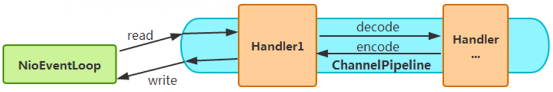

# 分布式基础

## 远程通信协议

### HTTP请求的整个流程

#### 域名解析

> 用户访问一个域名，会经过DNS（Domain Name System）解析。它和HTTP协议一样位于应用层，主要提供域名到IP的解析服务。（域名相比IP地址更容易记住，方便传播）

#### CDN加速静态内容访问速度

> 一些大型网站才会引入。CDN（Content Delivery Network）内容分发网络，其实是一种**网络缓存技术**，能**把一些相对稳定的资源放到距离最终用户较近的地方**，可以**节约广域网的带宽消耗、提升用户访问速度**。一般把静态的文件（图片、脚本、静态页面）放到CDN中。
>
> 解析流程会复杂些。。。。

#### HTTP协议通信

##### 网络模型

> OSI七层模型是理论模型，TCP/IP模型是实现的实际模型。


> 当应用程序用TCP传送数据时，**数据被送入协议栈，然后依次通过每一层（会在首部尾部加信息）直到转换为比特流送入网络**。
>
> 连接过程中服务端建立监听、客户端建立连接。

##### 客户端发送请求

> 关键在于目标机器的MAC地址怎么得到呢？
>
> ARP协议（建立在各个主机互相信任的基础上），已知目标机器的IP，获得目标机器的MAC地址。发送广播消息，询问该IP是谁的，认领IP的机器会发送一个MAC地址的响应。为了避免每次都用ARP请求，机器本地也会进行ARP缓存。但IP是可以变的，所以ARP的MAC缓存地址过一段时间就会过期。
>
> 有了这个目标MAC地址，数据包在链路上广播，MAC 网卡才能发现这个包是给它的。


##### 服务端接收请求

> 该MAC地址的网卡把发给它的包收进去，打开IP包发现IP地址也是自己的，再打开TCP包发现有正在监听的端口（如：开了Nginx监听80端口），于是将请求提交给对应端口的应用，应用处理后返回数据。经过层层封装，到MAC层时因为有源MAC地址，源MAC就变成了目标MAC，再返回给请求的机器。
>
> 当目的主机收到一个以太网数据帧时，数据就开始从协议栈中**由底向上**去掉各层协议加上的报文首部。每层协议都要去检查报文首部中的协议标识，以确定接收数据的上层协议。


##### 为何有MAC层还要走IP层呢？

> MAC地址是唯一的。理论上两个设备之间可以通过MAC地址发数据，为何还需要IP呢？
>
> 通过**IP层寻址**，IP地址表达的是当前机器在网络中的位置，类似城市名+道路号+门牌号的概念。
>
> 全世界存在着各式各样的网络，`它们使用不同的硬件地址`。要使这些异构网络能够互相通信就必须进行`非常复杂的硬件地址转化工作`，但通过IP编址，保证连接到互联网的主机拥有唯一IP就可以很容易相互通信了。
>
> 。。。可继续完善 https://www.zhihu.com/question/21546408/answer/53576595

##### TCP/IP的分层管理

> **复杂的程序都需要分层，这是软件设计的要求**，每一层专注于做当前层的事。如果某些地方需要修改，就只需要把变动的层替换掉就行，一方面改动影响较少，另一方面整个架构的灵活性也更高。 最后，在分层后整个架构的设计也变得相对简单了。


### 分层负载

> 一次HTTP请求过滤，一定会从应用层到传输层完成整个交互。只要是在网络上跑的数据包都是完整的，可以有下层没有上层，但不能有上层没有下层。

#### 二层负载均衡

> 针对MAC（数据链路层），负载均衡服务器对外依然提供一个VIP（虚IP），集群中不同的机器采用相同IP地址，但机器的MAC地址不一样。当负载均衡服务器接受到请求后通过改写报文的目标MAC地址的方式将请求转发到目标机器实现负载均衡。
>
> 二层负载均衡会通过一个虚拟MAC地址接收请求，然后再分配到真实的MAC地址。

#### 三层负载均衡

> 针对IP（网络层），和二层负载均衡类似，负载均衡服务器对外依然提供一个VIP（虚IP），但是集群中不同的机器采用不同的IP地址。当负载均衡服务器接收到请求后根据不同的负载均衡算法，通过IP将请求转发至不同的真实服务器。
>
> 三层负载均衡会通过一个虚拟IP地址接收请求，然后再分配到真实的IP地址。

#### 四层负载均衡

> 针对TCP/UDP协议（传输层），这两种协议处分包含源IP、目标IP还有源端口号、目的端口号。四层负载均衡服务器在接收到客户端请求后通过修改数据包的地址信息（IP+端口）将流量转发到应用服务器。
>
> 四层负载均衡通过虚拟IP+端口接收请求，然后再分配到真实的服务器。

#### 七层负载均衡

> 针对应用层，应用层协议比较多（如：HTTP、DNS、RADIUS ...），可以基于这些协议来做负载均衡。比如**根据URL、浏览器类别来决定是否要做负载均衡**。
>
> 七层负载均衡通过URL或主机名接收请求，然后分配到真实的服务器。


### TCP网络传输的可靠性

> 可靠性主要通过三次握手（建立连接）、流量控制（滑动窗口）、四次挥手（断开连接）保证。

#### 三次握手

> 建立连接
>
> 
>
> 1. **第 一 次 握 手(SYN=1, seq=x)**
>    客 户 端 发 送 一 个TCP 的 SYN 标志位置 1 的包，指明客户端打算连接的服务器的端口，以及初始序号 X ，保存在 包 头 的 序 列 号(Sequence Number)字段里 。发送完毕后，客户端 进 入SYN_SEND 状态。
> 2. **第 二 次 握 手(SYN=1, ACK=1,seq=y,ACKnum=x+1)**
>    服务器发回确认包(ACK) 应 答 。 即SYN 标 志 位 和ACK 标志位均为1。服务器端选择自己 ISN 序列号，放到 Seq 域里，同时将 确 认 序 号(Acknowledgement Number)设置为客户的 ISN 加 1，即 X+1。发送完毕后，服务器 端 进 入SYN_RCVD 状态。
> 3. **第 三 次 握 手(ACK=1 ，ACKnum=y+1)**
>    客户端再次发送确认包(ACK)，SYN 标志位为 0，ACK 标志位为 1，并且把服务器发来 ACK 的序号字段+1，放在确定字段中发送给对方，并且在数据段放写 ISN 发完毕后 ， 客户端进入ESTABLISHED 状态，当服务器端接收到这个包时，也进 入ESTABLISHED 状态，TCP 握手结束。

#### SYN攻击

> 在三次握手过程中，Server 发送 SYN-ACK 之后，收到 Client 的 ACK 之前的 TCP 连接称为半连接（half-open connect），此时 Server 处于 SYN_RCVD 状态，当收到 ACK 后，Server 转入 ESTABLISHED 状态。SYN 攻击就是 **Client 在短时间内伪造大量不存在的 IP 地址，并向Server 不断地发送 SYN 包**，Server 回复确认包，并等待 Client 的确认，由于源地址是不存在的，因此，Server 需要不断重发直至超时，这些伪造的 SYN 包将产时间占用未连接队列，导致正常的 SYN 请求因为队列满而被丢弃，从而引起网络堵塞甚至系统瘫痪。
>
> **SYN 攻击时一种典型的 DDOS 攻击**，检测 SYN 攻击的方式非常简单，当 **Server 上有大量半连接状态且源 IP 地址是随机的**，则可以断定遭到 SYN 攻击了。

#### 四次挥手

> TCP 断开连接，**需要客户端和服务端总共发送 4 个包以确认连接的断开**；客户端或服务器均可主动发起挥手动作(因为 TCP 是一个全双工协议)，在 socket 编程中任何一方执行 close() 操作即可产生挥手操作。
>
> 
>
> 1. **第一次挥手(FIN=1，seq=x)**
>    假设客户端想要关闭连接，客户端发送一个 FIN 标志位置为 1 的包，表示自己已经没有数据可以发送了，但是仍然可以接受数据。发送完毕后，客户端进入 FIN_WAIT_1 状态。
> 2. **第二次挥手(ACK=1，ACKnum=x+1)**
>    服务器端确认客户端的 FIN 包，发送一个确认包，表明自己接受到了客户端关闭连接的请求，但还没有准备好关闭连接。发送完毕后，服务器端进入 CLOSE_WAIT 状态，客户端接收到这个确认包之后，进入 FIN_WAIT_2 状态，等待服务器端关闭连接。
> 3. **第三次挥手(FIN=1，seq=w)**
>    服务器端准备好关闭连接时，向客户端发送结束连接请求，FIN 置为 1。发送完毕后，服务器端进入 LAST_ACK 状态，等待来自客户端的最后一个 ACK。
> 4. **第四次挥手(ACK=1，ACKnum=w+1)**
>    客户端接收到来自服务器端的关闭请求，发送一个确认包，并进入 TIME_WAIT 状态，等待可能出现的要求重传的 ACK 包。服务器端接收到这个确认包之后，关闭连接，进入 CLOSED 状态。
>    客户端等待了某个固定时间（两个最大段生命周期，2MSL，2 Maximum Segment Lifetime）之后，没有收到服务器端的 ACK，认为服务器端已经正常关闭连接，于是自己也关闭连接，进入 CLOSED 状态。
>
> 理解一下重传机制。。。


#### 长短连接

> 短连接：用完后立马释放连接。
>
> 长连接：用完后不着急释放连接，后面用到时就不要再创建连接了。


#### 常见问题

##### 为什么连接的时候是三次握手，关闭的时候却是四次握手？

> 三次握手是因为因为当 Server 端收到 Client 端的 SYN 连接请求报文后，**可以直接一起发送SYN+ACK 报文**。
>
> 但是关闭连接时，当 **Server 端收到 FIN 报文时，可能不会立即关闭连接**（因为可能还有消息没处理完），所以只能**先回复一个 ACK 报文**，告诉 Client 端，"你发的 FIN 报文我收到了"。只有**等到 Server 端所有的报文都处理完了才发送 FIN 报文**，因此不能一起发送。故需要四步握手。

##### 为什么 TIME_WAIT 状态需要经过 2MSL(最大报文段生存时间)才能返回到 CLOSE状态？

> 虽然按道理，四个报文都发送完毕，我们可以直接进入 CLOSE 状态了，但是我们必须假想网络是不可靠的，有可能最后一个 ACK 丢失。所以 TIME_WAIT 就是用来重发可能丢失的 ACK 报文。


#### TCP协议通信过程

> 每个TCP Socket的内核中都有一个**发送缓冲区和接收缓冲区**，TCP的全双工的工作模式及TCP的滑动窗口就是依赖这两个独立的Buffer和该Buffer的填充状态。
>
> 接收缓冲区把数据缓存到内核，若应用进程**一直没有调用Socket的read方法进行读取，那么该数据会一直被缓存在接收缓冲区内**。不管进程是否读取Socket，对端发来的数据都会经过内核接收并缓存到Socket的内核接收缓冲区。若接收缓冲区Buffer满了后会**通知对端TCP 协议中的窗口关闭，保证 TCP 接收缓冲区不会移除**，保证了 TCP 是可靠传输的。若对**方无视窗口大小发出了超过窗口大小的数据，那么接收方会把这些数据丢弃**。
>
> read()：把内核接收缓冲区的数据复制到应用层用户的Buffer中。
>
> send()：将数据从应用层用户的Buffer里复制到Socket的内核发送缓冲区。


#### 滑动窗口协议

> 滑动窗口（Sliding window）是一种流量控制技术。早期网络通信中，双方不会考虑网络的拥挤情况直接发送数据，但由于大家不知道网络拥塞状况，同时发送数据时导致中间节点阻塞掉包，谁也发不了数据，所以就有了滑动窗口机制来解决此问题。**发送和接受方都会维护一个数据帧的序列，这个序列被称作窗口**。
>
> 发送窗口：发送端允许连续发送的帧的序号表，不等待应答而连续发送的最大帧数称为发送窗口的尺寸。
>
> 接收窗口：接收方允许接收的帧的序号表，凡落在接收窗口内的帧都必须处理，之外的帧被丢弃。接收方每次允许接收的帧数称为接收窗口的尺寸。
>
> 发送窗口和接收窗口，完成序列前面的数据发送或接收后序列会往后滑动，在处理数据时只处理窗口内的数据。
>
> [在线演示](https://media.pearsoncmg.com/aw/ecs_kurose_compnetwork_7/cw/content/interactiveanimations/selective-repeat-protocol/index.html)
>
> 


### 请求处理演变过程

#### 阻塞模型

> 网络中的阻塞分为：连接阻塞（监听端口等待连接）、IO阻塞（获取数据时阻塞）。
>
> 当客户端的数据**从网卡缓冲区复制到内核缓冲区**之间服务端会一直阻塞。以socket接口为例，进程空间中调用 recvfrom，进程从调用 recvfrom 开始到它返回的整段时间内都是被阻塞的。
>
> 
>
> 如socket.accept 去接收一个客户端请求，accept 是一个**阻塞的方法**，意味着 TCP 服务器**一次只能处理一个客户端请求**。当一个客户端向一个已经被其他客户端占用的服务器发送连接请求时，虽然在连接建立后可以向服务端发送数据，但是在**服务端处理完之前的请求前，却不会对新的客户端做出响应**，这种类型的服务器称为“**迭代服务器**”。它是按照顺序处理客户端请求，也就是**服务端必须要处理完前一个请求才能对下一个客户端的请求进行响应**。
> 但是在实际应用中需要可以**独立处理每一个连接，并且他们之间不会相互干扰**，而 Java 提供的**多线程**技术可以满足。

#### 多线程处理

> 可通过线程池来实现多个客户端请求的功能，但线程本身数量是有限制的，处理请求的个数达到一定数量依然会阻塞。而且线程数太多会造成CPU上下文切换开销。在JDK1.4后引入了NIO。
>
> 

#### 非阻塞模型

> 为了处理更多连接就引入了非阻塞IO模型。在java中也叫做New IO，也是非阻塞模型（No Blocked IO），它所有通信都是面向缓冲区的。
>
> 连接非阻塞（ServerSocketChannel）、IO非阻塞
>
> 比如在进程空间调用recvfrom时，**通过不断轮询检查内核缓冲区是否有数据**，若有就处理数据，若没有数据就直接返回 EWOULDBLOCK 错误。
>
> 
>
> 这种需要不断轮询，比较消耗性能，能不能当数据可读了就给程序一个通知呢？于是引入了IO多路复用模型。

#### 多路复用模型

> 通过**系统内核缓存IO数据**，让**单个进程可以监视多个文件描述符**，一旦某个描述符**就绪（读或写就绪）就通知程序进行相应的读写操作**。
>
> 常见多路复用方式有：select/poll、epoll。
>
> 优点：**将多个阻塞复用到一个阻塞上**，使得系统**在单线程情况下可以同时处理多个客户端请求**。它的最大优势是系统开销小、不需要创建新的进程或者线程，降低了系统的资源开销。

##### fd

> fd(file descriptor)：文件描述符。在 linux 中内核把所有的外部设备都当成文件来操作，对一个文件的读写会调用内核提供的系统命令，返回一个 fd。而对于一个 socket 的读写也会有相应的文件描述符，称为 socketfd 。

##### select/poll

> 进程可以通过把一个或者多个 fd 传递给 select 系统调用，进程会阻塞在 select 操作上，这样 select 可以帮我们检测多个 fd 是否处于就绪状态。
>
> 
>
> 缺点：
>
> 1. 线性轮询所有fd，监听的fd越多性能开销越大。
> 2. 单个进程中能打开的fd是有限制的（默认1024）。

##### epoll

> 基于**事件驱动方式来代替顺序扫描**，当被监听的 fd 集合中有 fd 就绪时，会告知当前进程具体哪一个 fd 就绪，那么当前进程只需要去从指定的 fd 上读取数据即可。另外，epoll 所能支持的 fd 数量是操作系统的最大文件句柄，这个数字要远远大于 1024。
>
> 由于 epoll 能够通过事件告知应用进程哪个 fd 是可读的，所以我们也称这种 IO 为异步非阻塞 IO，当然它是伪异步的，因为它还需要去把数据从内核同步复制到用户空间中，真正的异步非阻塞，应该是数据已经完全准备好了，我只需要从用户空间读就行。

AIO

> 比epoll 更高级，监听到有变化之后直接处理了，不用通知其他的来处理。


#### 一台机器理论能支持的连接数

##### 系统如何标识一个TCP连接

> 系统用一个四元组来唯一标识一个 TCP 连接：(source_ip, source_port, destination_ip, destination_port)。即(源 IP，源端口，目的 IP，目的端口)四个元素的组合。只要**四个元素的组合中有一个元素不一样就可以**区别不同的连接。

##### 计算最大连接数

> **理论值：**
> 通常server端是固定一个监听端口（如8080），等待客户端的连接请求。在不考虑地址重用的情况下，即使server端有多个ip但本地监听的端口是独立的。所以对于TCP连接的4元组中destination_ip, destination_port是不变的，只有另外两个是可变的。因此最大的TCP连接数应该为**客户端ip数 * 客户端端口数**。在IPV4中不考虑ip分类等因素，**最大ip数为2^32**，客户端**最大端口数为2^16**，服务端单机最大TCP连接数约为**2^48**。
>
> **实际值：**
> 以 linux 服务器为例，实际的连接数还取决于
>
> 1. 内存大小（因为每个 TCP 连接都要占用一定的内存）
>
> 2. 带宽资源的限制
>
> 3. 文件句柄限制
>
>    每一个 TCP 连接都需要占一个文件描述符，一旦这个文件描述符使用完了，新来的连接会返回一个“Can’t open so many files”的异常。调整最大可以打开的文件数限制
>
>    1. 【ulimit -n】得到当前一个进程最大能打开 1024 个文件，此默认配置最多也就可以支持并发上千个TCP连接。
>
>    2. 【vim /etc/security/limits.conf】修改系统最大文件打开数的限制 ？？？貌似没生效
>
>       ```java
>       * soft nofile 2048 
>       * hard nofile 2048
>       // *修改所有用户限制、soft/hard：软限制还是硬限制、2048：修改以后的值
>       ```
>
>    3. 【cat /proc/sys/fs/file-max】查看 linux 系统级最大打开文件数限制，表示当
>       前这个服务器最多能同时打开多少个文件


#### 零拷贝

> 从磁盘上读取到数据后直接到内核空间进行传输，**不经过用户空间**（不用从用户空间拷贝到内核空间）。


> NIO的零拷贝由transferTo()方法实现。transferTo()方法将数据从FileChannel对象传送到可写的字节通道如Socket Channel等）。在内部实现中，由native方法transferTo0()来实现，它依赖底层操作系统的支持。在UNIX和Linux系统中，调用这个方法将会引起sendfile()系统调用。

```java
// NIO 的零拷贝
File file = new File("test.zip");
RandomAccessFile raf = new RandomAccessFile(file, "rw");
FileChannel fileChannel = raf.getChannel();
SocketChannel socketChannel = SocketChannel.open(new InetSocketAddress("", 1234));
// 直接使用了transferTo()进行通道间的数据传输
fileChannel.transferTo(0, fileChannel.size(), socketChannel);
```


## 序列化&反序列化

> 把**对象转化为特定的形态，然后以数据流的方式传输**。可以减少传递对象的大小、实现对象传递的跨平台和跨语言。
>
> 序列化：把**对象转化为字节序列**，让对象的状态信息变为**可存储或传输的形式**。
> 反序列化：序列化的逆向过程，把**字节数组反序列化为对象**。

### 基础认知

#### Java原生序列化

> java.io.ObjectOutputStream：表示**对象输出流** , 它的 writeObject(Object obj)方法可以对参数指定的 obj 对象进行序列化，**把得到的字节序列写到一个目标输出流**中。
>
> java.io.ObjectInputStream：表示**对象输入流** ,它的 readObject()方法从源输入流中读取字节序列，再把它们反序列化成为一个对象，并将其返回。
>
> 被序列化的对象需要实现 java.io.Serializable 接口。


#### serialVersionUID 的作用

> 字面意思是序列化的版本号，凡是实现 Serializable 接口的类都有一个表示序列化版本标识符的静态变量。
>
> 演示步骤
>
> 1. 自定义一个对象，不加 serialVersionUID 字段，序列化到文件中
> 2. 在对象中增加 serialVersionUID 字段，通过反序列化将对象提取出来
> 3. 效果：提示无法反序列化
>
> Java 的序列化机制是通过**判断类的 serialVersionUID 来验证版本一致性**的。在进行反序列化
> 时，JVM 会把传来的字节流中的 serialVersionUID 与本地相应实体类的 serialVersionUID 进
> 行比较，如果相同就认为是一致的，可以进行反序列化，否则就会出现序列化版本不一致的
> 异常，即是 InvalidCastException。
>
> 需要序列化的类中若没有指定 serialVersionUID，那么java编译器会自动给这个 class进行一个摘要算法生成（类似于指纹算法），只要这个文件**有任何改动得到的值就会不同，若没有改动则编译多次也不会变化**，可以保证在这么多类中，这个编号是唯一的。
>
> 所以，由于没有显指定 serialVersionUID，编译器又为我们生成了一个 UID，当然和前面保存在文件中的那个不会一样了，于是就出现了 2 个序列化版本号不一致的错误。
>
> 若类中方法或字段有改动，但是指定的 serialVersionUID 不变，依然能反序列化（新加的字段会为空）而不会抛异常。

#### Transient 关键字

> **控制变量的序列化**，在变量声明前加上该关键字，可以阻止该变量被序列化到文件中，在被反序列化后，transient 变量的值被设为初始值，如 int 型的是0，对象型的是 null。

**绕开Transient 关键字**

> 类中添加两个私有方法writeObject 和 readObject 。可参考HashMap中定义该方法的方式。如果需要加密解密也可通过这两个私有方法来完成。
>
> ```java
> private void writeObject(ObjectOutputStream out) throws IOException {
>     out.defaultWriteObject();
>     // 加密操作可在这儿完成
>     // 写入，有transient关键字修饰的int类型字段
>     out.writeInt(age);
> }
> 
> private void readObject(ObjectInputStream in) throws IOException, ClassNotFoundException {
>     in.defaultReadObject();
>     // 读取，有transient关键字修饰的int类型字段
>     age = in.readInt();
> }
> ```
>
> 


#### 小结

> 1. Java序列化只是针对**对象的状态**进行保存，对象中的方法它不关心
> 2. 当一个父类实现了序列化，那么子类会自动实现序列化，不需要显示实现序列化接口
> 3. 当一个对象的实例变量引用了其他对象，序列化这个对象的时候会自动把引用的对象也进行序列化（实现深度克隆）
> 4. 当某个字段被申明为 transient 后，默认的序列化机制会忽略这个字段。但可添加两个私有writeObject 和 readObject方法就可绕开transient。还可通过这两个私有方法做**加密解密**的需求。


### 分布式架构下的序列化

> 随着分布式架构、微服务架构的普及。服务与服务之间的通信成了最基本的需求。这个时候，
> 我们不仅需要考虑通信的性能，也需要考虑到**语言多元化问题**，所以对于序列化来说，如何去提升序列化性能以及解决跨语言问题，就成了一个重点考虑的问题。


Java自带序列化机制存在的问题

> 1. 序列化的数据比较大，传输效率低
> 2. 其他语言无法识别和对接

发展历程

> 基于XML格式编码的对象序列化机制，兼容了多语言问题、比二进制的序列化方式更容易理解。所以很长一段时间它成了主流，以至于基于XML的SOAP协议及对应的 WebService 框架在很长一段时间内成为各个主流开发语言的必备的技术。
>
> 基于JSON的简单文本格式编码的 HTTP REST 接口又基本上取代了复杂的 WebService 接口，成为分布式架构中远程通信的首要选择。
>
> 但是 JSON 序列化存储占用的空间大、性能低等问题，同时移动客户端应用需要更高效的传输数据来提升用户体验。在这种情况下与语言无关并且高效的二进制编码协议就成为了大家追求的热点技术之一。首先诞生的一个开源的二进制序列化框架-MessagePack。它比 google 的 Protocol Buffers 出现得还要早。

#### 各种序列化技术

##### JSON

> JSON（JavaScript Object Notation）是一种轻量级的数据交换格式，相比XML来说JSON的字节流更小且可读性也非常好。开源框架也非常多
>
> 1. [Jackson](https://github.com/FasterXML/jackson)
>
> 2. 阿里的 [FastJson](https://github.com/alibaba/fastjon)
> 3. Google 的 [GSON](https://github.com/google/gson)
>
> 其中 Jackson 与 fastjson性能比 GSON 好，但 Jackson、GSON 的稳定性比 fastjson 好。fastjson优势在于提供的api非常容易使用。
>
> 对外的接口返回数据一般用它，内部服务于服务间的通信很少用它。

##### Hessian

> Hessian 是一个支持跨语言传输的二进制序列化协议，相对于 Java 默认的序列化机制来说，Hessian 具有更好的性能和易用性，而且支持多种不同的语言。
>
> dubbo 采用的就是 Hessian 序列化来实现，只是 dubbo 对 Hessian 进行了重构，性能更高。

##### Avro

> Avro 是一个数据序列化系统，用于支持大批量数据交换的应用。它的主要特点有：支持二进制序列化方式，可以便捷，快速地处理大量数据；动态语言友好，Avro 提供的机制使动态语言可以方便地处理 Avro 数据。

##### kyro 

> Kryo 是一种非常成熟的序列化实现，不过它不能跨语言。目前已经在 Hive、Storm 中使用得比较广泛，dubbo 已经在 2.6 版本支持 kyro 的序列化机制。它的性能要优于之前的 Hessian2。

##### Protobuf

> Protobuf 是 Google 的一种数据交换格式，压缩率非常高，它独立于语言、独立于平台。Google 提供了多种语言来实现，比如 Java、C、Go、Python，每一种实现都包含了相应语言的编译器和库文件，Protobuf 是一个纯粹的表示层协议，可以和各种传输层协议一起使用。
> Protobuf 使用比较广泛，主要是空间开销小和性能比较好，非常适合用于公司内部对性能要
> 求高的 RPC 调用。 另外由于解析性能比较高，序列化以后数据量相对较少，所以也可以应用在对象的持久化场景中但是要使用 Protobuf 会相对来说麻烦些，因为他有自己的语法，有自己的编译器，如果需要用到的话必须要去投入成本在这个技术的学习中。
>
> 它有个缺点就是要传输的每一个类的结构都要生成对应的 proto 文件，如果某个类发生修改，还得重新生成该类对应的 proto 文件。

> 它的压缩率非常高，压缩算法值得一学。

###### Protobuf 基本应用

> [下载地址](https://github.com/protocolbuffers/protobuf/releases) [protoc-3.14.0-win64.zip](https://github.com/protocolbuffers/protobuf/releases/download/v3.14.0/protoc-3.14.0-win64.zip)
>
> 开发步骤
>
> 1. 配置开发环境，安装 protocol compiler 代码编译器
> 2. 编写.proto 文件，定义序列化对象的数据结构
> 3. 基于编写的.proto 文件，使用 protocol compiler 编译器生成对应的序列化/反序列化工具类
> 4. 基于自动生成的代码，编写自己的序列化应用

###### 压缩算法

> 用到了 varint、zigzag。有时间再看。。。

jute

> zookeeper内部使用的一种序列化形式。


#### 序列化技术的选型

##### 技术层面

> 1. **空间开销**：也就是序列化产生的结果大小，这个影响到传输的性能
> 2. **消耗的时长**：序列化消耗时间过长影响到业务的响应时间
> 3. **是否支持跨平台，跨语言**：因为现在的架构更加灵活，如果存在异构系统通信
>     需求，那么这个是必须要考虑的
> 4. **可扩展性/兼容性**：在实际业务开发中，系统往往需要随着需求的快速迭代来实现快速更新，
>     这就要求我们采用的序列化协议基于良好的可扩展性/兼容性，比如在现有的序列化数据结
>     构中新增一个业务字段，不会影响到现有的服务
> 5. **技术的流行程度**：越流行的技术意味着使用的公司多，那么很多坑都已经趟过并且得到了
>     解决，技术解决方案也相对成熟
> 6. **学习难度和易用性**

##### 选型建议

> 1. 对性能要求不高的场景，可以采用基于 XML 的 SOAP 协议
> 2. 对性能和间接性有比较高要求的场景，那么 Hessian、Protobuf、Thrift、Avro 都可以。
> 3. 基于前后端分离，或者独立的对外的 api 服务，选用 JSON 是比较好的，对于调试、可读
> 性都很不错
> 4. Avro 设计理念偏于动态类型语言，那么这类的场景使用 Avro 是可以的各个序列化技术的性能比较
> 针对不同序列化技术进行性能比较： https://github.com/eishay/jvm-serializers/wiki


## 简易版RPC

- 什么是RPC
- Socket实现RPC
- 通过注解驱动完成RPC通信


RPC（远程过程调用）

常见框架

> - WebService
> - Dubbo
> - Thrift
> - Grpc
>
> Feign是伪代理，不算RPC框架

发展历史


实现几大要素

> - ServerSocket、Socket | NIO
> - 序列化、反序列化
> - 动态代理


> 1. api 模块，作为双方的约定
>
>    暴露的接口（传输的请求接口）、RpcRequest（传输请求的约定）
>
> 2. 供应方
>
>    提供具体的实现，存储中发布的服务实例，通过远程通信将服务暴露给消费者调用
>
>    - 实现BeanPostProcessor的初始化类：在类装载完后把加了服务发布标记的bean远程发布
>
> 3. 客户端
>
>    连接到生产者发布的服务，通过动态代理生成远程连接到生产者发布服务模块。在调用过程就是调用的生产者发布服务的实例内容。


### api

> 服务供应方和客户端都需要依赖本模块。

#### 请求体

> 定义服务端和客户端的请求体

```java
@Getter
@Setter
public class RpcRequest implements Serializable{

    private String className;
    private String methodName;
    private Object[] args;
    /**
     * 参数类型，当方法重载时就需要参数类型来判断具体是哪个方法
     */
    private Class[] types;
}
```

#### 测试接口

> 在服务端和客户端共同约定的接口

```java
public interface ITestService {
    String sayHello();
}
```


### provider

> 需要**依赖 api 模块**

#### 基本类

##### MyRemoteService

> 自定义发布远程服务注解，加了该注解的类将其发布为远程调用的方法

```java
@Target(ElementType.TYPE)
@Retention(RetentionPolicy.RUNTIME)
// 注册成spring组件
@Component
public @interface MyRemoteService {

}
```

##### BeanMethod

> 存储**服务实例Bean和对应方法**的实体

```java
@Getter
@Setter
public class BeanMethod {
    private Object bean;
    private Method method;
}
```

##### Medior

> **存储发布的服务的实例**（服务调用的路由），并**提供调用服务的方法**

```java
public class Mediator {
    // 用来存储发布的服务的实例(服务调用的路由)
    public static Map<String, BeanMethod> map = new ConcurrentHashMap<>();

    private volatile static Mediator instance;

    private Mediator() {}
    public static Mediator getInstance() {
        if (instance == null) {
            synchronized (Mediator.class) {
                if (instance == null) {
                    instance = new Mediator();
                }
            }
        }
        return instance;
    }

    /*
     * 处理远程调用方法的请求
     */
    public Object processor(RpcRequest request) {
        String key = request.getClassName() + "." + request.getMethodName();
        BeanMethod beanMethod = map.get(key);
        if (beanMethod == null) {
            return null;
        }
        Object bean = beanMethod.getBean();
        Method method = beanMethod.getMethod();
        try {
            return method.invoke(bean, request.getArgs());
        } catch (IllegalAccessException | InvocationTargetException e) {
            e.printStackTrace();
        }
        return null;
    }
}
```

##### InitialMerdiator

> 实现BeanPostProcessor的初始化类：在类装载完后把**加了服务发布标记的bean进行远程发布**

```java
@Component
public class InitialMerdiator implements BeanPostProcessor {

    @Override
    public Object postProcessAfterInitialization(Object bean, String beanName) throws BeansException {
        // 加了服务发布标记的bean进行远程发布
        if (bean.getClass().isAnnotationPresent(MyRemoteService.class)) {
            Method[] methods = bean.getClass().getDeclaredMethods();
            for (Method method : methods) {
                // Interface内部路由，动态地通过接口找到对应方法
                // 没考虑方法重载的情况，重载时还需要根据参数类型匹配
                String key = bean.getClass().getInterfaces()[0].getName() + "." + method.getName();
                BeanMethod beanMethod = new BeanMethod();
                beanMethod.setBean(bean);
                beanMethod.setMethod(method);
                Mediator.map.put(key, beanMethod);
            }
        }
        return bean;
    }
}
```


#### 通信系列类

##### ProcessorHandler

> 处理远程方法调用过程，获取远程调用数据，调用方法后返回结果。

```java
public class ProcessorHandler implements Runnable {

    private Socket socket;

    public ProcessorHandler(Socket socket) {
        this.socket = socket;
    }

    @Override
    public void run() {
        ObjectInputStream inputStream = null;
        ObjectOutputStream outputStream = null;
        try {
            // 获取流数据
            inputStream = new ObjectInputStream(socket.getInputStream());
            // 反序列化
            RpcRequest request = (RpcRequest) inputStream.readObject(); 
            // 路由，处理调用方法的请求
            Mediator mediator = Mediator.getInstance();
            Object rs = mediator.processor(request);
            System.out.println("服务端的执行结果：" + rs);
            
            // 返回，将执行结果输出到流
            outputStream = new ObjectOutputStream(socket.getOutputStream());
            outputStream.writeObject(rs);
            outputStream.flush();
        } catch (Exception e) {
            e.printStackTrace();
        } finally {
            // TODO 关闭流
        }
    }
}
```

##### SocketServerInitial

> 发布服务的代理类，开启服务端监听。在spring 容器启动完成之后，发布服务。

```java
@Component
public class SocketServerInitial implements ApplicationListener<ContextRefreshedEvent> {
    private final ExecutorService executorService = Executors.newCachedThreadPool();

    @Override
    public void onApplicationEvent(ContextRefreshedEvent contextRefreshedEvent) {
        // 启动服务
        ServerSocket serverSocket = null;
        try {
            serverSocket = new ServerSocket(8888);
            while (true) {
                // 监听客户端请求（阻塞）
                Socket socket = serverSocket.accept(); 
                // 调用服务处理类
                executorService.execute(new ProcessorHandler(socket));
            }
        } catch (IOException e) {
            e.printStackTrace();
        } finally {
            // TODO 关闭流
        }
    }
}
```

#### 测试类

> 实现某 api 的服务发布类

```java
@MyRemoteService
public class TestServiceImpl implements ITestService{
    @Override
    public String sayHello() {
        return "RETURN SAYHELLO";
    }
}
```

#### 启动类

> 启动容器

```java
@Configuration
@ComponentScan("pers.whz.example")
public class Bootstrap {

    public static void main(String[] args) {
        ApplicationContext applicationContext=
                new AnnotationConfigApplicationContext(Bootstrap.class);
    }
}
```


### client

> 需要**依赖 api 模块**

#### 基本类

##### MyReference

> 自定义注解，加了该注解后能动态代理成可远程调用方法

```java
@Target(ElementType.FIELD)
@Retention(RetentionPolicy.RUNTIME)
@Component
public @interface MyReference {
}

```

#### 通信系列类

##### RpcNetTransport

> 网络传输类，发送请求、接收请求返回的数据

```java
public class RpcNetTransport {

    private String host;
    private int    port;

    public RpcNetTransport(String host, int port) {
        this.host = host;
        this.port = port;
    }

    public Object send(RpcRequest request) {
        ObjectOutputStream outputStream = null;
        ObjectInputStream inputStream = null;
        try {
            Socket socket = new Socket(host, port);
            // 获取输出流，写入请求体
            outputStream = new ObjectOutputStream(socket.getOutputStream());
            outputStream.writeObject(request);
            outputStream.flush();
            
            // 获取输入流，将远程调用方法的数据返回
            inputStream = new ObjectInputStream(socket.getInputStream());
            return inputStream.readObject();
        } catch (IOException e) {
            e.printStackTrace();
        } catch (ClassNotFoundException e) {
            e.printStackTrace();
        } finally {
            // TODO 关闭流
        }
        return null;
    }
}
```

##### RemoteInvocationHandler

> 远程调用处理器，指定主机&端口后建立通信连接，并将远程调用的接口&方法&参数

```java
@Component
public class RemoteInvocationHandler implements InvocationHandler {
    // 在配置文件中指定
    @Value("${host}")
    private String host;
    @Value("${port}")
    private int    port;

    public RemoteInvocationHandler() {}

    @Override
    public Object invoke(Object proxy, Method method, Object[] args) throws Throwable {
        // 建立远程连接
        RpcNetTransport rpcNetTransport = new RpcNetTransport(host, port);
        // 调用哪个接口、 哪个方法、方法的参数
        RpcRequest request = new RpcRequest();
        request.setClassName(method.getDeclaringClass().getName());
        request.setMethodName(method.getName());
        request.setArgs(args);
        // 参数的类型，用于方法重载时需要根据类型找到对应的参数
        request.setTypes(method.getParameterTypes());
        return rpcNetTransport.send(request);
    }
}
```

##### ReferenceInvokeProxy

> 远程方法调用代理类，在完成bean实例化后设置代理类

```java
@Component
public class ReferenceInvokeProxy implements BeanPostProcessor {

    @Autowired
    RemoteInvocationHandler invocationHandler;

    @Override
    public Object postProcessBeforeInitialization(Object bean, String beanName) throws BeansException {
        Field[] fields = bean.getClass().getDeclaredFields();
        for (Field field : fields) {
            if (field.isAnnotationPresent(MyReference.class)) {
                field.setAccessible(true);
                // 针对这个加了MyReference注解的字段，设置为一个代理的值
                Object proxy = Proxy.newProxyInstance(field.getType().getClassLoader(), new Class<?>[]{field.getType()}, invocationHandler);
                try {
                    // 对加了MyReference的注解，设置了一个代理，代理的实现是inovcationHandler
                    field.set(bean, proxy); 
                } catch (IllegalAccessException e) {
                    e.printStackTrace();
                }
            }
        }
        return bean;
    }
}
```


#### 测试类

> 在controller层注入远程调用的服务

```java
@RestController
public class TestController {

    @MyReference
    private ITestService  testService;

    @GetMapping("/get")
    public String get() {
        return testService.sayHello();
    }
}
```

#### 启动类

> 通过springboot启动类启动项目

```java
@SpringBootApplication
public class UserServiceMain {

    // 加了SpringBootApplication注解后默认会扫描本路径所有包及子包加了注解的类
    public static void main(String[] args) {
        SpringApplication.run(UserServiceMain.class, args);
    }
}
```


# 通信框架


Netty：高性能的网络通信框架。

基于事件模型处理的

Spring中WebSocket底层通信用Netty实现


HTTP三大对象

> Request（InputStream封装）、Response（OutputStream封装）、Servlet 

Tomcat

> 接收浏览器传来的内容，然后分发给servlet处理，最后把处理好的结果写回浏览器。


Dubbo 四大核心板块


> 监控中心：监控消费端、服务端各种调用记录。


Netty比传统IO的性能高了8倍多。

> 

传统RPC调用性能差的原因

> 1. 阻塞IO不具备弹性伸缩能力，高并发导致宕机。
> 2. Java序列化编码解码性能问题。
> 3. 传统IO线程模型过多，占用CPU高。

高性能三个主题

> - IO模型
> - 数据协议
> - 线程模型

Netty高性能原因

> 1. 异步非阻塞通信：NioEventLoop 聚合了多路复用器Selector，可以同时并发处理很多客户端Channel，由于读写操作都是非阻塞的，这就可以充分提示IO线程的运行效率，避免由于频繁IO阻塞导致的线程挂起。
>
> 2. 零拷贝：接收和发送ByteBuffer使用堆外直接内存进行Socket读写；提供了组合Buffer对象，可以聚合多个ByteBuffer对象；transferTo()直接将文件缓冲区的数据发送到目标Channel。
>
> 3. 内存池：内存分配池化（重复利用），减少分配内存过程的性能消耗。Pooled与Unpooled（池化与非池化）；UnSafe（底层读写，直接操作内存空间）；Heap和Direct（堆内存与堆外内存）。
>
> 4. 高效的Reactor线程模型：空闲时提前把线程分配好，需要时直接使用。Reactor单线程模型；Reactor多线程模型；主从Reactor多线程模型。
>
> 5. 无锁化的串行设计
>
>    
>
> 6. 高效的并发：通过读写锁提升并发性能。
>
> 7. 高性能的序列化框架
>
> 8. 灵活的TCP参数配置能力


# 缓存技术-Redis

> [Redis（**re**mote **di**ctionary **s**ervice）](https://redis.io/)远程字典服务，非关系性数据库。
>
> 非关系性数据库特点：

## 基础

### Redis特性


几个小问题：

为什么要把数据放在内存？

> 1. 内存速度更快，10w QPS
> 2. 减少计算时间，减轻数据库压力

内存做缓存，为什么不用HashMap或Memcached？

> 1. 更丰富的数据类型
> 2. 支持多种编程语言
> 3. 功能丰富：持久化机制、内存淘汰策略、事务、发布订阅、pipeline、lua
> 4. 支持集群、分布式

> Memcached只能存储KV、没有持久化机制、不支持主从复制、多线程的。


### 基本操作

> ```c
> redis-server // 启动服务端  
> redis-cli // 启动客户端，退出用ctrl+c
> redis-cli -h 127.0.0.1 -p 6379 shutdown // 关闭服务端，可以启动客户端后输入 shutdown 关闭（先断开所有客户端的连接，再根据配置持久化数据，最后关闭redis服务）
> auth myPassword // 启动客户端后，输入密码认证
> ps -ef | grep redis // 检查后台进程是否正在运行
> ps aux | grep redis // 检查后台进程是否正在运行
> netstat -lntp | grep 6379 // 检测6379端口是否在监听
> type key // 查看数据类型
> object encoding key // 查看内部数据类型的内部编码
> ```

> Redis默认有16个库（0-15），可以在配置文件redis.conf中修改。
>
> ```xml
> databases 16
> ```

> 数据库之间没有完全隔离，不适合把不同的库分配给不同的业务使用。默认使用第一个db0，在集群中只能使用第一个db。

> 切换数据库
>
> ```xml
> select 0
> ```
>
> 清空当前数据库
>
> ```xml
> flushdb
> ```
>
> 清空所有数据库
>
> ```xml
> flushall
> ```


> Redis存储的key-value中key的最大长度限制是512M，值的限制不同，有长度限制、个数限制的。

> vim中搜索：
>
> 1. 命令模式下，输入：/字符串
>
> 比如搜索user, 输入/user
>
> 按下回车之后，可以看到vim已经把光标移动到该字符处和高亮了匹配的字符串
>
> 2. 查看下一个匹配，按下n(小写n)
>
> 3. 跳转到上一个匹配，按下N（大写N）
>
> 4. 搜索后，我们打开别的文件，发现也被高亮了，怎么关闭高亮？
>
> ​    命令模式下，输入:nohlsearch  也可以:set nohlsearch； 当然，可以简写，noh或者set noh。


### 数据类型

> 注意是数据类型，不是数据结构
>
> String、Hash、Set、List、Zset（5种常见的）、Hyperloglog、Geo、Streams

#### String

##### 存储类型

> 可以用来存储int（整数）、float（单精度浮点数）、String（字符串）。

##### 操作命令

```xml

```

##### 实现原理

> Redis是KV数据库，它最外层通过hashtable实现（外层的哈希），其他数据结构就在它里面实现的，看[dict.h](https://github.com/redis/redis/blob/unstable/src/dict.h)中dictEntry，它通过指针指向存储结构和value的存储结构，next存储了指向相应键值对的指针。

```c
typedef struct dictEntry {
    void *key; /* key定义 */
    union {
        void *val; /* value定义 */
        uint64_t u64;
        int64_t s64;
        double d;
    } v;
    struct dictEntry *next; /* 指向下一个键值对节点 */
} dictEntry;
```

> 在外层hash数据结构外面，还用redisDb数据结构包裹了一层用来封装公共属性（如过期时间等），看[server.h](https://github.com/redis/redis/blob/unstable/src/server.h)中redisDb，在它里面放的dict就是上面提到的外层hash(dictEntry)。

```c
typedef struct redisDb {
    dict *dict;                 /* 所有的键值对 The keyspace for this DB */
    dict *expires;              /* 设置了过期时间的键值对 Timeout of keys with a timeout set */
    dict *blocking_keys;        /* Keys with clients waiting for data (BLPOP)*/
    dict *ready_keys;           /* Blocked keys that received a PUSH */
    dict *watched_keys;         /* WATCHED keys for MULTI/EXEC CAS */
    int id;                     /* Database ID */
    long long avg_ttl;          /* Average TTL, just for stats */
    unsigned long expires_cursor; /* Cursor of the active expire cycle. */
    list *defrag_later;         /* List of key names to attempt to defrag one by one, gradually. */
} redisDb;
```


存储字符串用 **SDS**（Simple Dynamic String，Redis自己实现的字符串类型）存储，当 value 存储的字符串时并不是直接用 SDS 存储，而是存储在 **redisObject** 中。**5 种常用数据类型的 value 都是用 redisObject 存储**，最终 redisObject 再通过指针指向实际的数据结构（字符串或其他类型）。

> 看[sds.h](https://github.com/redis/redis/blob/unstable/src/sds.h)中sdshdr8，SDS 有多种数据结构sdshdr5、sdshdr8、sdshdr16、sdshdr32、sdshdr64用于存储不同长度的字符串，分别代表2^5=32 byte、2^8=256 byte、2^16=65536 byte、2^32=4 G

```c
struct __attribute__ ((__packed__)) sdshdr8 {
    uint8_t len; /* 当前字符数组的长度 */
    uint8_t alloc; /* 当前字符数组总共分配的内存大小 */
    unsigned char flags; /* 当前字符数组的属性，用来标识是sdshdr8还是sdshdr16。 3 lsb of type, 5 unused bits */
    char buf[]; /* 字符串真正的值 */
};
```

> 看[server.h](https://github.com/redis/redis/blob/unstable/src/server.h)中redisObject

```c
typedef struct redisObject {
    unsigned type:4; /* 对象的类型，包括OBJ_STRING OBJ_LIST OBJ_SET OBJ_ZSET OBJ_HASH */
    unsigned encoding:4; /* 具体的数据结构 */
    unsigned lru:LRU_BITS; /* LRU time (relative to global lru_clock) or
                            * LFU data (least significant 8 bits frequency
                            * and most significant 16 bits access time). */
    int refcount; /* 引用计数，gc相关 */
    void *ptr; /* 指向对象实际的数据结构 */
} robj;
```

> PS：我们使用 type 命令查看到的类型就是 type 的内容。

以 set hello world 为例，String的存储结构如下


###### 为什么要用SDS实现字符串？

> C语言本身没有字符串类型，只能用字符数组char[] 实现。使用字符数组有以下缺陷，SDS就针对这些缺陷做了改进：

| char[]                                                       | SDS                                                |
| :----------------------------------------------------------- | :------------------------------------------------- |
| 必须给目标变量分配足够的空间，否则可能会溢出                 | 可进行动态扩容                                     |
| 获取字符串长度要遍历，时间复杂度O(n)                         | len属性存储了字符串，时间复杂度O(1)                |
| 字符串长度变更会对字符数组内存重新分配                       | 通过“空间预分配”、“惰性空间释放”防止多次重分配内存 |
| 二进制不安全，以'\0'标记字符串的结束，不能保存二进制文件内容（图片、音视频、压缩文件等），字符串内容中只要有'\0'就会出问题 | 通过len判断字符串结束，可保存文本数据、二进制数据  |

###### String内部编码

> 在存储String类型时对外提供的类型都是String，但内部的编码不一样。
>
> 主要分为 3 种：
>
> 1. int：存储 8 个字节的长整形(long 2^63-1)；
> 2. embstr：embstr格式的SDS，存储长度小于44个字节的字符串；
> 3. raw：存储长度大于44个字节的字符串。
>
> 44字节分界点： 将RedisObject 对象头和 SDS 对象连续存在一起，64 - 16（redisObject）- 3（sds头部信息）- 1（\0结束符）=44
>
> 前面提到的float类型一般使用embstr存储


###### embstr和raw区别，为什么要设计不同大小编码？

> **embstr只分配1次内存空间**（redisObject和SDS是**连续**的）而**raw需要分配2次**（分别为redisObject和SDS分配空间）。
>
> embstr优点：创建时少分配一次空间，删除时少释放一次空间，以及对象的所有数据连在一起，寻找方便。
>
> embstr缺点：字符串长度增加需要重新分配内存时整个redisObject和SDS都需要重新分配空间，因此redis中的embstr实现为**只读**，**一旦改动就会为embstr转为raw，再进行修改**。

###### int和embstr什么时候转化为raw？

> 1. int 数据不再是整数——> raw
> 2. int 大小超过了long的范围（2^63-1）——> embstr
> 3. embstr 发生改动——> raw （注意set覆盖值不属于改动）
>
> 转换过程都是**不可逆**的，只能**从小内存编码向大内存编码转换**（**不包括重新set**）。

###### 为啥要用redisObject对底层数据结构进行一层保证？

> 无论是设计 redisObject 还是存储字符串设计SDS，都是为了**根据存储的不同内容选择不同的存储方式**，这样可以尽量**节省内存空间和提升查询速度**的目的。


##### 应用场景

> 1. **缓存**（热点数据、统计报表类数据）
>
> 2. **分布式数据共享**
>
>    Redis是分布式的独立服务，可在多个应用之间共享数据（如分布式Session，spring中有实现，配置好就行）
>
> 3. **分布式锁** 
>
>    String类型的 setnx() 只有不存在时才能添加成功返回true
>
>    set NX EX （单线程的，set有原子性）
>
> 4. **分布式全局ID**
>
>    int 类型的 INCRBY (原子性)。分库分表的场景，一次性拿一段
>
> 5. **计数器**
>
>    int 类型的 INCR 。文章阅读数，微博点赞数，允许一定的延迟，先写入redis再定时同步到数据库
>
> 6. **限流** 
>
>    int 类型的 INCR。以访问者的IP和其他信息作为key，访问一次增加一次计数，超过次数则返回false。

怎么存储一张表的数据？

> 用String存储时将表中数据序列化成json，取数据时再反序列化，这种开销比较大。
>
> 字段比较少的情况下，用String可以存储，存储key时用冒号分层。这种key太长，占用空间多。
>
> 于是Hash存储结构出面了，Hash可以很好解决这种问题。


#### Hash

##### 存储类型

> 用来存储多个无序的键值对，最大存储数量是 2^32-1（40亿左右）
>
> 注意：Hash的value只能是字符串，不能再嵌套其他类型。


**Hash 相比 String 的主要区别：**

> 1. 把所有相关的值聚集在一个key上，节省内存空间
> 2. 只使用一个key，减少key冲突
> 3. 批量获取值时只需要一个命令，减少内存/IO/CPU的消耗

**Hash不适合的场景：**

> 1. Field不能单独设置过期时间
> 2. 需要考虑数据分布的问题（field太多时无法分布到多个节点）


##### 操作命令

```c
hset key realKey realVal; // 添加单个kv
hmset key realKey1 realVal1 realKey2 realVal12; // 添加多个kv

hget key realKey; // 获取单个kv
hmget key realKey1 realKey2; // 获取多个kv
hkeys key;
hvals key;
hgetall key; 

hdel key realKey; // 删除key
hlen key; // 获取hash的长度
```


##### 实现原理

> 内层的哈希底层可以使用两种数据结构实现。
>
> ziplist：OBJ_ENCODING_ZIPLIST（压缩列表）
>
> hashtable：OBJ_ENCODING_HT（哈希表）

###### ziplist

> 经过特殊编码，由**连续内存块组成的双向链表**。它和普通双向链表不一样节点的指针，它存的是**上个节点长度**和**当前节点长度**，（读数据时根据当前地址和上个节点长度计算上个节点或下个节点地址），但可以节省内存，时间换空间的思想。

> 内部结构看 [ziplist.c](https://github.com/redis/redis/blob/unstable/src/ziplist.c) 第16行注释
>
> <zlbytes> <zltail> <zllen> <entry> <entry> ... <entry> <zlend>
>
> `zlbytes` 内存占用：内存重分配或计算 zlend的位置时使用
> `zltail` 到列表尾部的偏移：可直接找到尾结点
> `zllen` 节点数
> `zlend` 末端标记符


> Entry的内部结构看 [ziplist.c](https://github.com/redis/redis/blob/unstable/src/ziplist.c) zlentry

```c
typedef struct zlentry {
    unsigned int prevrawlensize; /* 上个链表节点的长度数值所需要的字节数 Bytes used to encode the previous entry len*/
    unsigned int prevrawlen;     /* 上个链表节点占用的长度 Previous entry len. */
    unsigned int lensize;        /* 当前链表节点长度数值所需要的字节数 Bytes used to encode this entry type/len.
                                    For example strings have a 1, 2 or 5 bytes
                                    header. Integers always use a single byte.*/
    unsigned int len;            /* 当前链表节点占用的长度 Bytes used to represent the actual entry.
                                    For strings this is just the string length
                                    while for integers it is 1, 2, 3, 4, 8 or
                                    0 (for 4 bit immediate) depending on the
                                    number range. */
    unsigned int headersize;     /* 当前链表节点的头部大小（prevrawlensize+lensize），即非数据域的大小 prevrawlensize + lensize. */
    unsigned char encoding;      /* 编码方式 Set to ZIP_STR_* or ZIP_INT_* depending on
                                    the entry encoding. However for 4 bits
                                    immediate integers this can assume a range
                                    of values and must be range-checked. */
    unsigned char *p;            /* 压缩链表以字符串的形式保存，该指针指向当前节点起始位置 Pointer to the very start of the entry, that
                                    is, this points to prev-entry-len field. */
} zlentry;
```

> 保存的同一键值对是紧挨着的，先是键后是值。依次添加的键值对，在ziplist中依次排列。


一张内存描述图片

> 它的编码有
>
> ```c
> #define ZIP_STR_06B (0 << 6) // 长度<=2^6-1
> #define ZIP_STR_14B (1 << 6) // 长度<=2^14-1
> #define ZIP_STR_32B (2 << 6) // 长度<=2^32-1
> ```


###### 什么时候使用ziplist？

> 满足以下两个条件的时候
>
> 1. 哈希对象保存的键值对数量 < 512个
> 2. 所有的键值对的键和值的字符串长度都 < 64 byte
>
> 不过这两个参数可以在 `src/redis.conf` 中设置
>
> ```c
> hash-max-ziplist-value 64 // ziplist中最大能存放的值长度
> hash-max-ziplist-entries 512 // ziplist中最多能存放的entry节点数量
> ```
>
> 如果超过这两个阈值的任何一个，存储结构就会转换成hashtable。
> 总的来说：**字段个数少，字段值小**用ziplist。

> quicklist中的节点用ziplist实现的


###### hashtable(dict)

> 在 redis 中 hashtable 又被称为字典(dictionary)。
>
> 在 hashtable 中对外层字典(dictEntry)进行了封装
>
> 从最底层到最高层 dictEntry——dictht——dict，它是一个数组+链表的结构。
>
> 

```c
typedef struct dict {
    dictType *type; /* 字典类型 */
    void *privdata; /* 私有数据 */
    dictht ht[2];   /* 一个字典有两个哈希表*/
    long rehashidx; /* rehash索引 rehashing not in progress if rehashidx == -1 */
    unsigned long iterators; /* 当前正在使用的迭代器数量 number of iterators currently running */
} dict;
```

```c
/* This is our hash table structure. Every dictionary has two of this as we
 * implement incremental rehashing, for the old to the new table. */
typedef struct dictht {
    dictEntry **table; /* 哈希表数组 */
    unsigned long size; /* 哈希表大小 */
    unsigned long sizemask; /* 掩码大小，用于计算索引值，总是等于size-1 */
    unsigned long used; /* 已有节点数 */
} dictht;
```

> 存储结构如下：
>
> 注意dictht后面是NULL说明第2个ht还没用到，dictEntry*后面是NULL说明没有hash到这个地址，dictEntry后面是NULL说明没有发生哈希冲突。


###### 为什么要定义两个哈希表，其中一个不用呢？

> 方便扩容操作，扩容时才会用到另外一个哈希表。
>
> redis 的 hash 默认使用的是 ht[0] ，ht[1]不会初始化和分配空间。
>
> 哈希表的dictht是用链地址法来解决碰撞问题的，在这种情况下哈希表的性能取决于它的大小(size)和它保存的节点的数量(used)之间的比率：
>
> - 比率在1:1时，性能最好（一个哈希表ht只存储一个节点entry）
> - 若节点数量比哈希表大小要大很多（比率用ratio表示，5表示平均一个ht存储5个entry），那么哈希表就会退化成多个链表
>
> 单个哈希表的节点数量过多时就需要扩容（rehash），rehash的步骤：
>
> 1. 为字符ht[1]哈希表分配空间。ht[1]的大小为第一个大于等于 ht[0].used*2的2的N次方幂。比如已经使用了10000，那就是16384。
> 2. 将所有的ht[0]上的节点rehash到ht[1]上，重新计算hash值和索引，然后放入指定的位置。
> 3. 当ht[0]全部迁移到了ht[1]之后，释放ht[0]的空间，将ht[1]设置为ht[0]表，并创建新的ht[1]，为下次rehash做准备。

###### 什么时候触发扩容？

> 


##### 应用场景

> String能做的，Hash都可以做，除此之外还可以**存对象类型的数据**。
>
> 购物车商品缓存：
>
> key : 用户id（一个用户一个购物车）
>
> field : 商品id（购物车中若干商品）
>
> value : 商品数量（每种商品数量不同）
>
> | 操作             | 命令                 |
> | ---------------- | -------------------- |
> | 商品数量+1       | hintc                |
> | 商品数量-1       | hincrby key field -1 |
> | 删除商品         | hdel                 |
> | 全选商品         | hgetall              |
> | 购物车商品种类数 | hlen                 |


#### List

##### 存储类型

> **有序**的字符串（从左到右），元素可重复，最大存储量2^32-1


##### 操作命令

```c
// 元素增减
lpush queue a
lpush queue b c
rpush queue d e
lpop queue
rpop queue
// 取值
lindex queue 0
lrange queue 0 -1
// 阻塞弹栈
blpop key timeout
brpop key timeout
```


##### 实现原理

> 3.2版本之后统一用quicklist存储，quicklist存储了一个双向链表，每个节点都是一个ziplist（压缩表，极为节省内存的存储结构）。**数组+链表的结构**。

> 看 [quicklist.h](https://github.com/redis/redis/blob/unstable/src/quicklist.h) 中quicklist

```c
/* quicklist is a 40 byte struct (on 64-bit systems) describing a quicklist.
 * 'count' is the number of total entries.
 * 'len' is the number of quicklist nodes.
 * 'compress' is: 0 if compression disabled, otherwise it's the number
 *                of quicklistNodes to leave uncompressed at ends of quicklist.
 * 'fill' is the user-requested (or default) fill factor.
 * 'bookmakrs are an optional feature that is used by realloc this struct,
 *      so that they don't consume memory when not used. */
typedef struct quicklist {
    quicklistNode *head; /* 指向双向列表的表头 */
    quicklistNode *tail; /* 指向双向列表的表尾 */
    unsigned long count;        /* total count of all entries in all ziplists */
    unsigned long len;          /* number of quicklistNodes */
    int fill : QL_FILL_BITS;              /* ziplist最大大小，对应list-max-ziplist-size  fill factor for individual nodes */
    unsigned int compress : QL_COMP_BITS; /* 压缩深度，对应list-compress-depth  depth of end nodes not to compress;0=off */
    unsigned int bookmark_count: QL_BM_BITS; /* 4位，bookmarks数组的大小 */
    quicklistBookmark bookmarks[]; /* 可选字段，quicklist重新分配内存空间时使用，不使用时不占用空间 */
} quicklist;
```

> PS：这儿涉及到几个参数与`redis.conf`配置有关
>
> list-max-ziplist-size (fill)：正数代表单个 ziplist 最多所包含的entry 个数。负数点单个ziplist的大小，默认8k。（-1:4KB; -2:8KB; -3:16KB; -4:32KB; -5:64KB）
>
> list-compress-depth (compress)：压缩深度，默认是0。（1:首位的ziplist不压缩；2:首位第1第2个ziplist不压缩，依此类推）


> 节点的存储结构看 [quicklist.h](https://github.com/redis/redis/blob/unstable/src/quicklist.h) 中quicklistNode

```c
/* quicklistNode is a 32 byte struct describing a ziplist for a quicklist.
 * We use bit fields keep the quicklistNode at 32 bytes.
 * count: 16 bits, max 65536 (max zl bytes is 65k, so max count actually < 32k).
 * encoding: 2 bits, RAW=1, LZF=2.
 * container: 2 bits, NONE=1, ZIPLIST=2.
 * recompress: 1 bit, bool, true if node is temporary decompressed for usage.
 * attempted_compress: 1 bit, boolean, used for verifying during testing.
 * extra: 10 bits, free for future use; pads out the remainder of 32 bits */
typedef struct quicklistNode {
    struct quicklistNode *prev;
    struct quicklistNode *next;
    unsigned char *zl; /* 指向实际的ziplist */
    unsigned int sz;             /* 当前ziplist占用多少字节 ziplist size in bytes */
    unsigned int count : 16;     /* 当前ziplist中存储元素个数，占用16bit count of items in ziplist */
    unsigned int encoding : 2;   /* RAW==1 or LZF==2 */
    unsigned int container : 2;  /* NONE==1 or ZIPLIST==2 */
    unsigned int recompress : 1; /* was this node previous compressed? */
    unsigned int attempted_compress : 1; /* node can't compress; too small */
    unsigned int extra : 10; /* more bits to steal for future usage */
} quicklistNode;
```

> 整体存储结构如下图所示：
>
> 存储时，ziplist能存储下就依次存ziplist中否则新建一个quicklistNode存ziplist。quicklistNode中ziplist长度默认最大为64字节，最多512个实体。可在配置文件配置


##### 应用场景

> 1. **列表**
>
>    用户的消息列表，网站的公共列表、活动列表、博客文章列表、评论列表等。
>
>    存储所有字段，lrange 取出一页，按顺序显示。
>
> 2. **队列&栈**
>
>    当做分布式环境的队列&栈使用。
>
>    两个阻塞的弹栈操作： `blpop queue`、`brpop queue`
>
>    ```c
>    blpop key [timeout] // 移除并获取列表第一个元素，若列表没有元素则会阻塞列表直到等待超时或发现可弹出元素为止
>    lrpop key [timeout] // 移除并获取列表最后一个元素，若列表没有元素则会阻塞列表直到等待超时或发现可弹出元素为止
>    ```
>
>    
>
>    队列：先进先出 rpush blpop，左头右尾，右边进队列，左边出队列
>
>    栈：先进后出 rpush brpop


#### Set

##### 存储类型

> 存储String类型的**无序集合**，最大存储数量2^32-1

##### 操作命令

```c
//添加一个或者多个元素
sadd myset abcdefg
//获取所有元素
smembers myset
//统计元素个数
scard myset
// 随机获取一个元素
srandmember myset
//随机弹出一个元素
spop myset
// 移除一个或者多个元素
srem mysetde f
// 查看元素是否存在
sismember myset a

```


##### 实现原理

> 用 intset 或 hashtable 存储（hashtable中的value存null） ，若元素都是整数类型就用 intset。看 [intset.h](https://github.com/redis/redis/blob/unstable/src/intset.h) 。

```c
typedef struct intset {
    uint32_t encoding; /* 编码类型(int16_t int32_t ...) */
    uint32_t length; /* 长度 最大长度2^32 */
    int8_t contents[]; /* 用来存储成员的动态数组 */
} intset;
```

> 如果**不是整数类型或元素个数超过512个**就用hashtable（数组+链表存储结构），元素超过512个也与`redise.conf`配置有关。
>
> ```c
> set-max-inset-entries 512
> ```


##### 应用场景

> 1. **抽奖**
>
>    随机获取元素 spop myset
>
> 2. **点赞、签到、打卡**
>
>    如微博Id是t666，当前用户id是u999
>
>    | 功能         | 写法                     |
>    | ------------ | ------------------------ |
>    | 点赞         | sadd like: t666 u999     |
>    | 取消点赞     | srem like: t666 u999     |
>    | 是否已点赞   | sismember like:t666 u999 |
>    | 点赞所有用户 | smembers like:t666       |
>    | 微博点赞总数 | scard like: t666         |
>
> 3. **商品标签**
>
>    如某宝商品评价处的标签，用tags:i1001 维护该商品所有标签
>
>    sadd tags:i1001 画面清晰细腻
>    sadd tags:i1001 性能一流
>
> 4. **商品筛选**
>
>    ```c
>    sdiff set1 set2 // 取差集
>    sinter set1 set2 // 取交集
>    sunion set1 set2 // 取并集
>    ```
>
> 5. **用户关注、推荐模型**
>
>    相互关注、可能认识的人


#### Zset

##### 存储类型

> 存储有序元素，每个元素有个score，**按照score从小到大排序，score相同时按照key的ASCII码排序**。

> 数据结构对比：
>
> 


##### 操作命令

```c
// 添加元素
zadd myzset 10 java 20 php 30 ruby 40 cpp 50 python
// 获取全部元素
zrange myzset 0 -1 withscores
zrevrange myzset 0-1 withscores
// 根据分值区间获取元素
zrangebyscore myzset 20 30
// 移除元素也可以根据score rank删除
zrem myzset php cpp
// 统计元素个数
zcard myzset
// 分值递增
zincrby myzset 5 python
// 根据分值统计个数
zcount myzset 20 60
// 获取元素rank
zrank myzset python
// 获取元素score
zscore myzset python
// 也有倒序的rev操作(reverse )

```


##### 实现原理

> 默认使用**ziplist**编码，在ziplist内部按照score排序递增来存储。插入的时候要移动之后的数据。若元素数据 >= 128 或任一member长度 >= 64字节时使用**skiplist+dict**存储。
>
> 这儿也有两个参数在`redis.conf`中指定的
>
> ```c
> zset-max-ziplist-entries 128
> zset-max-ziplist-value 64
> ```

###### skiplist

> 普通有序链表查找某个数据，必须是从头开始逐个比较，直到找到包含数据的节点，平均时间复杂度O(n)。
>
> 若在每两个相邻节点增加一个指针，让指针指向下个节点，这样所有新增加的指针连成了一个新的链表。查询数据时按层次遍历比较。**需要比较的节点数大概只有原来的一半**。时间复杂度O(log n)
>
> 比如下面链表中查询 23 ，查询路径是沿着标红指针指向的方向进行的。
>
> 

> 那么跳表中插入元素时放的层次由什么决定的呢，看 [t_zset.c](https://github.com/redis/redis/blob/unstable/src/t_zset.c) 中。
>
> ```c
> /* Returns a random level for the new skiplist node we are going to create.
>  * The return value of this function is between 1 and ZSKIPLIST_MAXLEVEL
>  * (both inclusive), with a powerlaw-alike distribution where higher
>  * levels are less likely to be returned. */
> int zslRandomLevel(void) {
>     int level = 1;
>     while ((random()&0xFFFF) < (ZSKIPLIST_P * 0xFFFF))
>         level += 1;
>     return (level<ZSKIPLIST_MAXLEVEL) ? level : ZSKIPLIST_MAXLEVEL;
> }
> ```
>
> 因此生成的 level 是随机的，上面举例的链表也可能是这种
>
> 基于概率统计的插入算法也能得到时间复杂度为O(logn)的查询效率，思想是：让L2层元素个数是L1的1/2，L3层元素个数是L2层的1/2，对于1/2的概率用抛硬币的思想做，代码实现中采用随机数。
>
> https://blog.csdn.net/u013709270/article/details/53470428
>
> 

> 看 [server.h](https://github.com/redis/redis/blob/unstable/src/server.h) 中skiplist的存储结构

```c
/* ZSETs use a specialized version of Skiplists */
typedef struct zskiplistNode {
    sds ele; /* zset的元素 */
    double score; /* 排序的分值 */
    struct zskiplistNode *backward; /* 后退指针 */
    struct zskiplistLevel {
        struct zskiplistNode *forward; /* 前进指针，对应level的下一个节点 */
        unsigned long span; /* 从当前节点到下一个节点的跨度（跨越的节点数） */
    } level[]; /* 层 */
} zskiplistNode;

typedef struct zskiplist {
    struct zskiplistNode *header, *tail; /* 指向跳跃表的头节点和尾节点 */
    unsigned long length; /* 跳跃表的节点数 */
    int level; /* 最大的层数 */
} zskiplist;
```

###### 为什么不用AVL树或红黑树实现类似跳表的功能？

> 相比AVL树，红黑树，跳表代码实现更加简洁，另外跳表更加灵活，它可以通过改变索引构建策略，有效平衡执行效率和内存消耗。


##### 应用场景

> 顺序会动态变化的列表。如微博热搜
>
> |                                    |                                       |
> | ---------------------------------- | ------------------------------------- |
> | 增加1次点击数                      | zincrby hotNews:xxx 1 n1001           |
> | More Actions获取今天点击最多的15条 | zrevrange hotNews:xxx 0 15 withscores |


#### BitMaps

> 在字符串类型上定义的位操作，一个字节8位，如`a`的的ASCLL码是97，转为二进制是`01100001`，可直接获取到二进制位上的数据。
>
> ```c
> set k1 a      // 设置k1为a   	     0110 0001
> setbit k1 6 1 // 设置k1的第7位置为1   0110 0011
> setbit k1 7 0 // 设置k1的第8位置为0   0110 0010
> get k1        // 返回 b 因为b的二进制是0110 0010
> ```

```c
bitcount k1 // 统计二进制位中1的个数
bitpos k1 1 //获取第1个1的位置
bitpos k1 0 //获取第1个0的位置
```

> 另外它支持按位与、按位或等操作。
>
> ```c
> BITOP AND destkey key [key...] //对一个或多个key 求逻辑并，并将结果保存到destkey
> BITOP OR destkey key [key...] //对一个或多个key 求逻辑或，并将结果保存到destkey
> BITOP XOR deskey key [key...] // 对一个或多个key求逻辑异或，并将结果保存到destkey
> BITOP NOT dstkey key // 对给定key求逻辑非，并将结果保存到destkey
> ```

> bit非常节省空间，可以用来做大数量的统计。如在线用户统计、用户访问统计。
>
> 计算出7天都在线的用户
>
> ```c
> BITOP AND "7 _days_both_online_users" "'day_1_online_users" "day_2_online_users" ... "day_7_online_users"
> ```


#### Hyperloglogs

> 提供了一种不太精确的基数统计方法， 用来统计一个集合中不重复的元素个数，比如统计网站的UV，或者应用的日活、月活，存在一定的误差。
>
> 特点是内存消耗特别少，只需要12K内存就能统计2^64个数据。

#### Geo

> 存地理位置的经纬度，如获取半径1公里内的门店信息。可以把经纬度存入里面。
>
> 它提供的操作：增加地址位置信息、获取地址位置信息、计算两个位置的距离、获取指定范
> 围内的地理位置集合等等。


#### 数据类型总结

| 对象         | type命令输出 | object encoding        | 特点                     | 应用                                                       |
| ------------ | ------------ | ---------------------- | ------------------------ | ---------------------------------------------------------- |
| 字符串对象   | "string"     | int  embstr  raw       | 常用                     | 缓存、分布式数据共享、分布式锁、分布式全局ID、计数器、限流 |
| 列表对象     | “list”       | skiplist               | 有序                     | 列表（排行榜）、当做栈&队列使用                            |
| 哈希对象     | “hash”       | hashtable              | 无序、                   | string能做的它都能做，还能存实体对象数据集合               |
| 集合对象     | “set”        | intset  hashtable      | 无序、不重复、求交并补集 | 抽奖、点赞、商品标签、商品筛选、推荐模型（可能认识的人）   |
| 有序集合对象 | “zset”       | ziplist、skiplist+dict | 有序、不重复             | 顺序会动态变化的表（热榜）                                 |


## 高级

### 发布订阅模式

> 消息分发时，可以用队列的`rpush`和`blpop`实现消息队列。但这种只能一对一的分发消息，若要**一对多的消息分发**，就可以使用发布订阅功能。

#### 订阅频道

> 消息的生产者和消费者在不同客户端，连接到同一个Redis的服务后通过channel（频道）关联起来。
>
> 订阅者订阅了若干个channel，有新消息到达channel后所有订阅了这个channel的订阅者都会收到这条消息。
>
> 

```c
subscribe channel-1 channelName // 订阅这两个频道，频道不用创建
publish channel-1 "msg" // 发布者向指定频道发送消息
unsubscribe channelName // 取消订阅
```

按规则订阅

> 支持`* ?`占位符，*：0个或多个字符；?：一个字符
>
> 如：现在与3个新闻频道，运动新闻(news-sport)、音乐新闻(news-music)、天气新闻(news-weather)
>
> ```c
> psubscribe *sprot // 订阅运动新闻
> psubscribe news* // 订阅所有新闻
> psubscribe news-weather // 订阅天气新闻
> ```
>
> 

> 一般来说， 考虑到性能和持久化的因素，**不建议使用Redis的发布订阅功能来实现MQ**。Redis 的一些内部机制用到了发布订阅功能。


### Redis事务

https://redis.io/topics/transactions/

#### 为什么要用事务

> Redis 单个命令是原子性的，但涉及到多个命令并且需要把多个命令作为一个不可分割的处理序列时，就需要用Redis事务。
>
> 特点：
>
> 1. 按进入队列的顺序执行
> 2. 不会受到其他客户端的请求的影响
> 3. 事务不能嵌套


#### 事务用法

> 开启事务(multi)、执行事务(exec)、取消事务(discard)、监视(watch)。
>
> 执行流程：通过`multi`开启事务后，客户端可以向服务器发送若干条命令，这些**命令会放在一个队列中不会立即执行**。执行`exec`命令后**队列中的命令才会被执行**。若中途不想执行事务了可以用`discard`**清空事务队列，放弃执行**。
>
> 防止事务过程某个key的值被其他客户端修改，多个客户端更新变量时`watch`为事务提供**CAS乐观锁行为**。用`watch`监视key之后，若开启事务之后至少有一个被监视key**在exec执行前被修改了，那么整个事务都会被取消（key提前过期除外）**。`unwatch`取消监视。

#### 常见问题

##### 在执行exec前发生错误

> 如：入队的命令存在**语法错误**（参数数量、参数名等），**事务会被拒绝执行**。

##### 在执行exec后发生错误

> 如：对string使用了hash的命令，参数个数正确但数据类型错误，是**运行时错误**。**只有错误的命令没有被执行，其他命令不受影响**。
>
> 这个不符合原子性，不能保证数据的一致。
>
> 官方解释：
>
> - Redis 命令只会因为错误的语法而失败，也就是说，从实用性的角度来说，**失败的命令是由代码错误造成的**，而这些错误**应该在开发的过程中被发现，而不应该出现在生产环境**中(程序员的锅)。
> - 因为不需要对回滚进行支持， 所以**Redis 的内部可以保持简单且快速**。 需要知道的是：**回滚不能解决代码的问题**(程序员的锅必须程序员来背)。


### Lua脚本

> lua 是用c语言编写的轻量级脚本语言，和数据的存储过程有点类似。
>
> 使用lua脚本来执行Redis命令的好处：
>
> 1. 一次发送多个命令，减少网络开销
> 2. Redis会将整个脚本作为一个整体执行，不会被其他请求打断，保整**原子性**
> 3. 对于复杂的组合命令，放在脚本中实现命令复用


#### redis中调用Lua脚本

##### 脚本文件（常用）

```c
redis-cli --eval [lua脚本] [key ...] , [args ...]
// 多个key或多个args之间用空格分隔
```

##### 脚本内容（不常用）

```c
eval lua脚本内容 key-num [key1 key2 ...] [value1 value2 ...]
// e.g.
eval "return redis.call('set', KEYS[1], AEGV[1])" 1 whz 666
```

> - eval：执行lua语言的命令
> - lua-script：脚本内容
> - key-num：参数中有多少个key，注意：redis的key是从1开始，若没有key的参数就写0
> - [key1 key2 ...]：作为参数传递给lua，选填，但需要和key-num的个数对应
> - [value1 value2 ...]：作为参数传递给lua，选填


#### lua脚本中调用redis命令

```c
redis.call(command, key [param1, param2 ...])
```

> - comand：redis命令，如 set、get、del等
> - key：被操作的键
> - [param1, param2 ...]：key的参数

#### 案例:对IP限流

##### 需求

>  每个用户在X秒内只能访问Y次。

##### 设计思路

> 1. 确定数据存储方式：
>
>    **用 String 的key记录IP，用value记录访问次数**。**几秒和几次做成入参**。
>
> 2. 处理逻辑：
>
>    第一次访问，**记录IP**并对key设置**过期时间**（入参1）。
>
>    后面访问，判断是否有访问记录，记录是否过期；然后判断访问次数，**超过限定次数**（入参2）返回0；没超过对IP记录次数+1后返回1。

##### 代码

```lua
-- ip_limit.lua
-- IP限流，对某个IP访问频率限制
local num = redis.call('incr', KEYS[1]) -- 计数+1（key不存在会创建）
-- 第1次访问，用第1个参数设置过期时间
if tonumber(num) == 1 then
    redis.call('expire', KEYS[1], ARGV[1])
        return 1
-- 不是第1次访问，和第2个参数比较，是否超出次数限制
elseif tonumber(num) > tonumber(ARGV[2]) then
    return 0
else
    return 1
end
```

```C
// IP限流：最多6s内访问10次
redis-cli --eval ip_limit.lua app:ip:limit:192.168.2.16 , 6 10
// app:ip:limit:192.168.2.16 是key值，后面是两个参数
```

#### 缓存lua脚本

> 在lua脚本比较长且调用比较频繁的情况下，Redis支持缓存lua脚本并生成SHA1摘要码，后序使用可直接通过摘要码来执行lua脚本。

```c
script load "return 'hello world'" // 缓存lua脚本，服务端生成摘要码并返回给客户端
evalsha "那一串摘要码" // 通过摘要码执行缓存的脚本
```

> 缓存脚本貌似只能通过发**脚本内容**的方式（不能脚本文件）缓存，**多行变单行，语句之间使用分号隔开**。

#### 脚本超时

> ```c
> lua-time-limit 5000 // 默认超时时间5s
> ```
>
> 因为redis是单线程的，若lua脚本**执行超时或陷入了死循环**不能让其他客户端无限制等待。
>
> 超过5s后，其他客户端的命令不会等待，会直接返回“BUSY”错误。这个时候可以用 `script kill`终止脚本的执行。
>
> 但不是所有lua脚本都可以kill，当执行的lua脚本对redis数据进行了修改（set del 等），那么通过script kill命令时不能终止的。因为包**保证脚本的原子性**。这种情况只能通过`shutdown nosave`把redis服务停掉。
>
> 正常关机是`shutdown`，`shutdown nosave`的区别在于它不会进行持久化操作，意味着发生在上一次的数据库修改都会丢失。


### “快”原理分析

> 使用redis自带的[benchmark](https://redis.io/topics/benchmarks)脚本测试，
>
> 每秒处理13w+ set请求；13w+ lpush 请求；12w+ lua脚本调用。基本可以说明redis的QPS10w是比较准确的。
>
> 速度这么快，主要有三点：
>
> 1. **纯内存结构**
> 2. **请求处理单线程**
> 3. **多路复用机制**

#### 内存

> KV结构的内存数据库，时间复杂度O(1)。

##### 虚拟存储器

###### 物理寻址访问

> 内存可以看做一个很长的数组，一个字节一个单元，每个字节有一个唯一的地址，称为物理地址（Physical Address）。早期计算机中CPU需要内存，使用**物理寻址直接访问内存**。
>
> 但这个有些弊端：
>
> 1. 一般操作系统都是多用户多任务的，所有的进程共享主存。若每个进程都独占一块物理地址空间，内存很快就会被用完。
> 2. 若不同进程允许共用一块物理地址，那么一个进程就可以修改其他进程的内存数据，导致数据全部乱掉，物理地址空间被破坏。

###### 内存管理单元

> 对于物理内存的使用，应该有一个角色来协调和指挥，于是在CPU和内存之间增加了一个中间层。**CPU不再使用物理地址访问内存，而是访问一个虚拟地址，由这个中间层把虚拟地址转换成物理地址**，最终获取到数据。这个中间层叫做**MMU（Memory Management Unit），内存管理单元**。

> 在每个进程开始创建的时候都会分配一段虚拟地址，然后通过虚拟地址和物理地址的映射来获取真实数据，这样进程就不会直接接触到物理地址。
>
> 目前大多数OS都使用了MMU，如Windows的虚拟内存、Linux的交换空间等。在32位系统上虚拟内存空间时候2^32=4G。64位上最大是：Linux一般用低48位来表示虚拟地址空间，即2^48=256T。
>
> ```c
> cat /proc/cpuinfo
> // 可看到 address sizes	: 43 bits physical, 48 bits virtual
> ```
>
> 实际的物理内存可能远远小于虚拟内存的的大小。
>
> 总结：引入内存管理单元的作用：
>
> 1. 通过把同一块物理内存映射到不同的虚拟地址空间，实现内存共享
> 2. 对物理内存进行隔离，不同的进程操作互不影响
> 3. 虚拟内存可以提供更大的地址空间，并且地址空间时连续的，使得程序编写、链接更加简单？？？

###### 用户空间和内核空间

> Linux/GUN的虚拟内存又进一步划分成了内核空间（Kernel-space）、用户空间（User-space）。
>
> 进程的用户空间中存放的是用户程序的代码和数据，内核空间中存放的是内核代码和数据。不管是内核空间还是用户空间，它们都处于虚拟内存空间中，都是对物理地址的映射。
>
> 当进程运行在内核空间时就处于内核态， 而进程运行在用户空间则处于用户态。进程在内核空间可以访问受保护的内存空间，也可以访问底层硬件设备。也就是**可以执行任意命令**，调用系统的一切资源。在**用户空间只能执行简单的运算**，不能直接调用系统资源，必须通过系统接口(又称system call)， 才能向内核发出指令。
>
> 这样划分的目的是为了**避免用户进程直接操作内核，保证内核安全**。


#### 单线程

> 单线程是指**处理客户端的请求**是单线程的，可以称它为主线程。从4.0版本之后还引入了一些线程处理其他事，如清理脏数据、无用连接的释放、删除大key。
>
> 主线程设置为单线程的好处：
>
> 1. **没有创建线程、销毁线程带来的消耗**
> 2. **避免了上下文切换导致的CPU消耗**
> 3. **避免了线程之间带来的竞争问题**（如加锁、释放锁、死锁等）
>
> 官方解释：
>
> 在Redis中单线程已经够用了，**Redis的瓶颈最可能是机器内存、网络带宽而不是CPU**。
>
> 注意：因为处理请求是单线程，**不要在生产环境运行长命令**，比如`keys  flushall  flushdb`**否则会导致请求被阻塞**。


#### 多路复用机制

> 同步非阻塞IO，多路复用处理并发连接。

先了解几个概念

##### 进程阻塞

> 正在运行的进程由于提出系统服务请求(如I/O操作)， 但因为某种原因**未得到操作系统的立即响应**，该进程只能**把自己变成阻塞状态**，**等待相应的事件出现后才被唤醒**。进程在**阻塞状态不占用CPU资源**。

##### 文件描述符

> Linux系统**将所有设备都当作文件处理**，而Linux用**文件描述符来标识每个文件对象**。文件描述符(File Descriptor)是内核为了**高效管理已被打开的文件所创建的索引**，用于指向被打开的文件，所有执行I/O操作的系统调用都通过文件描述符。
> 文件描述符是一个简单的非负整数，用以表明每个被进程打开的文件。Linux 系统里面有三个标准文件描述符。
> 0:标准输入(键盘) ; 1: 标准输出(显示器) ; 2: 标准错误输出(显示器)。

##### 传统IO数据拷贝

> 以读操作为例:
> 当应用程序执行read 系统调用读取文件描述符(FD) 的时候，若数据已在用户进程的页内存中，则直接读取数据。若数据不存在，则先将数据**从磁盘加载到内核缓冲区**中，**再从内核缓冲区拷贝到用户进程的页内存**中。(两次拷贝，两次user和kernel的上下文切换)。
>
> 
>
> 当使用**read或write**对某个文件描述符进行过读写时，**若当前FD不可读，系统就不会对其他的操作做出响应**。**从硬件设备复制数据到内核缓冲区、从内核缓冲区拷贝到用户空间都是阻塞的**，直到copy complete，内核返回结果，用户进程才解除block的状态。

##### IO多路复用？？

> 这儿IO：**网络IO**；多路：**多个TCP连接**（Socket或Channel）；复用：**复用一个或多个线程**。
>
> 基本原理：**应用程序不用监视连接，内核替应用程序监视文件描述符**。
>
> 客户端操作时会**产生不同事件类型的socket**，服务端的IO多路复用程序会把**消息放入队列**中，然后**通过文件事件分派器（File event Dispatcher）转发到不同的事件处理器**中。
>
> 


> 多路复用有很多的实现，以select为例，当用户进程调用了多路复用器，进程会被阻塞。内核会监视多路复用器负责的所有socket,当任何一个socket的数据准备好了，多路复用器就会返回。这时候用户进程再调用read操作，把数据从内核缓冲区拷贝到用户空间。


> 所以，IO多路复用的特点是通过一种机制**让一个进程能同时等待多个文件描述符**，而这些文件描述符其中的**任意一个进入“读就绪”(readable)状态，select()就可以返回**。

> 多路复用需要操作系统的支持。Redis 的多路复用，提供了 select, epoll, evport,kqueue几种选择，在编译的时候来选择一种。 源码[ae.c](https://github.com/redis/redis/blob/unstable/src/ae.c)

```c
/* Include the best multiplexing layer supported by this system.
 * The following should be ordered by performances, descending. */
#ifdef HAVE_EVPORT
#include "ae_evport.c"
#else
    #ifdef HAVE_EPOLL
    #include "ae_epoll.c"
    #else
        #ifdef HAVE_KQUEUE
        #include "ae_kqueue.c"
        #else
        #include "ae_select.c"
        #endif
    #endif
#endif
```

> evport：Solaris系统内核提供支持的;
> epoll：LINUX系统内核提供支持的;
> kqueue：Mac系统提供支持的;
> select：POSIX提供的，一般的操作系统都有支撑(保底方案) 。

> Redis抽象了一套AE事件模型，将IO事件和时间事件融入一起，同时借助多路复用机制的回调特性(Linux上用epoll)，使得IO读写都是非阻塞的，实现高性能的网络处理能力。


#### 多线程IO

> 严格意义上来说，Redis从4.0之后就引入了多线程用来处理一些耗时长的工作和后台工作，不过这里说的多线程，确切地说，叫做多线程IO。
>
> 在多路复用中，从内核空间复制数据到用户空间，然后回写到socket（write调用），这个过程非常耗时，所以**多线程IO指的就是把结果写到socket这个环节是多线程**的。处理请求依然是单线程的，所以不存在线程并发安全问题。


### 内存回收

> 为什么要内存回收？
>
> 一个内存KV系统，肯定不能无限制地使用内存，应该设定一个上限值，数据应该有过期属性，这样就能清除不再使用的key。

#### 过期策略

##### 立即过期（主动淘汰）

> 每个设置过期时间的key都需要创建一个**定时器**，**到过期时间就会立即清除**。该策略可以立即清除过期的数据，**对内存很友好**，但是会**占用大量的CPU资源**去处理过期的数据，从而**影响缓存的响应时间和吞吐量**。

##### 惰性淘汰（被动淘汰）

> **访问key时才判断该key是否已过期**，过期则清除。该策略可以**最大化地节省CPU资源**，却**对内存非常不友好**。极端情况可能出现大量的过期key没有再次被访问，从而不会被清除，占用大量内存。
>
> 例如所有的查询都会调用expirelfNeeded判断是否过期
>
> 每次写入key时，发现内存不够，调用activeExpireCycle释放一部分内存。

##### 定期过期

> 定时扫描expires字典中一定数量的key，并清除其中已过期的key。该策略是前**两者的一个折中方案**。 通过调整定时扫描的时间间隔和每次扫描的限定耗时，可以在不同情况下使得CPU和内存资源达到最优的平衡效果。

> 过期属性存在如下结构中

```c
typedef struct redisDb {
    dict *dict;                 /* 所有的键值对 The keyspace for this DB */
    dict *expires;              /* 设置了过期时间的键值对 Timeout of keys with a timeout set */
    dict *blocking_keys;        /* Keys with clients waiting for data (BLPOP)*/
    dict *ready_keys;           /* Blocked keys that received a PUSH */
    dict *watched_keys;         /* WATCHED keys for MULTI/EXEC CAS */
    int id;                     /* Database ID */
    long long avg_ttl;          /* Average TTL, just for stats */
    unsigned long expires_cursor; /* Cursor of the active expire cycle. */
    list *defrag_later;         /* List of key names to attempt to defrag one by one, gradually. */
} redisDb;
```


#### 内存淘汰策略

##### 引入原因

> 若所有的key都没有设置过期属性，Redis内存满了怎么办？
>
> 这就是内存淘汰策略存在的意义。当**内存使用达到极限**时，需要**内存淘汰算法来决定清理掉哪些数据**，以保证新数据的存入。

最大内存设置：`redis.conf`参数配置中

```c
# maxmemory <bytes> // 命令模式下输入/maxmemory 查找该字符串，按n查找下一个
```

> 默认没有设置（不限制），没有设置或设置为0，32位系统最多使用3GB，64位系统不限制。

```c
// 通过客户端动态设置
config set maxmemory 2GB
```

##### [LRU淘汰策略](https://redis.io/topics/lru-cache)

> LRU（Least Recently Used）：最近最少使用。最近使用地最少的优先淘汰。


##### LFU淘汰策略

> LFU（Least Frequently Used）：最不常用，按照使用频率删除，4.0版本新增。


### 持久化机制

> Redis提供了两种持久化方案，RDB快照（Redis DataBase），AOF（Append Only File），持久化机制也是Redis与Memcache的区别之一。
>

#### RDB

> **RDB 是默认方案**，**但如果开启了AOF，优先用AOF**。当满足一定条件时会把当前内存中的数据写入磁盘，生成一个快照文件`dump.rdb`。Redis重启会通过加载`dump.rdb`文件来恢复数据。

##### 自动触发

###### 配置触发

> `redis.conf`中配置，若不需要rdb则把save注释或配置成空字符串
>
> ```c
> save 900 1    // 900s 内至少有一个key被修改（或添加）
> save 300 10   // 300s 内至少有10个key被修改
> save 60 10000 // 60s 内至少有10000个key被修改
> ```
>
> 这些配置中只要满足任意一个就会触发。
>
> 用lastsave命令可以查询最近一次生成的快照时间
>
> rdb文件位置默认在安装根目录下

###### shutdown触发

> 服务器正常关闭时触发


##### 手动触发

> 若需要重启服务器或者迁移数据，这个时候就需要手动触发RDB快照。
>
> `save`：save在生成快照的时候会阻塞当前Redis服务器（不能处理其他命令），生产环境不要用这种（内存数据多则会阻塞很久）
>
> `bgsave`：后台异步快照。持久化由子线程负责，它不会记录fork之后参数的数据，阻塞只发生在fork阶段（时间很短）


##### 优势

> 1. 保存某个时间点的数据集，适合备份和灾难恢复
> 2. 生成RDB文件时主线程fork()一个子线程来处理，主线程不需要任何IO
> 3. 恢复大量数据集是速度比AOF快

##### 劣势

> 1. 无法实时持久化/秒级持久化。因为`bgsave`每次运行都需要fork创建子线程，频繁执行成本过高
> 2. 意外down掉，就会丢失最后一次快照之后的所有数据（实时性高的重要数据，可以用AOF持久化）


#### AOF

> 采用**日志形式**记录每个写操作，并追加到文件中。开启后，执行更改Redis数据的命令时都会记录在AOF文件中。
>
> 重启时会根据日志文件内容把写指令全部执行，以完成数据的恢复。

##### 配置

`redis.conf`

```c
appendonly no // 默认关闭的
appendfilename "appendonly.aof" // 默认文件名
```

##### 数据都是实时持久化到磁盘吗？

> 由于OS缓存机制，AOF数据并没有真正写入磁盘，而是进入了系统的硬盘缓存。
> 控制参数：`ppendfsync`，AOF持久化策略，默认everysec
>
> - no：不执行fsync，由OS保证数据同步到磁盘，速度最快但不太安全
> - always：每次写入都执行fsync，效率低
> - everysec：每秒一次

##### 文件越来越大，怎么办？

> **文件重写机制**，当AOF文件大小超过所设定的阈值就会启动文件的内容压缩，只保留恢复数据的最小指令集。（如incr 100w次但结果只有一个，这种压缩就很管用）。也可以使用命令`bgrewriteaof`来触发重写。
>
> AOF文件重写不是对原文件进行重新整理，而是**读取服务器现有的键值对，然后用一条命令取代替之前记录这个键值对的多条命令**，生成一个新的文件取替换原来的文件。

```c
auto-aof-rewrite-percentage 100 // 默认100，当前aof文件大小超过上次重写大小的百分之多少进行重写。设置为100即：当前大小时上次日志冲动得到aof文件大小的二倍时自动重写（比如上次重写后10MB，当前20MB时触发重写）
auto-aof-rewrite-min-size 64mb // 默认64，允许重写的最小aof文件大小，避免了达到约定百分比但尺寸依然很小的情况还要重写
```

##### 优点

> 提供了多种同步频率，使用默认频率每秒同步一次，突然down掉最多也就丢失1s的数据

##### 缺点

> 1. 体积相比RDB文件更大
> 2. 一般情况，高并发时RDB比AOF具有更好的性能保证

### 两种方案比较

> 如果**可忍受一小段时间内数据的丢失就选RDB**，定时生成RDB快照(snapshot) 非常便于进行数据库备份，并且RDB恢复数据集的速度也要比AOF恢复的速度要快。
>
> 否则就使用AOF重写。但是一般情况下**建议两种搭配使用**，在这种情况下，当redis重启的时候会**优先载入AOF**文件来恢复原始的数据，因为在通常情况下**AOF文件保存的数据集要比RDB文件保存的数据集要完整**。


## 分布式(待学习)

### 主从复制


### Sentinel


### 分布式方案对比


## 实战篇

### 客户端

#### 客户端与服务端通信

> 连接建立：Redis默认监听6379端口，可通过TCP方式建立连接。
>
> 消息格式：服务端约定了一种特殊的消息格式，每个**命令都是以`\r\n`结尾**，这种编码格式与AOF文件中的一样，叫**RESP(Redis Serialization Protocol)Redis序列化协议**。发送和接收消息需要按这种格式编解码。
>
> 组装消息：发送和接收的消息内容是把命令、参数、它们的长度用`\r\n`连接起来，比如：`set whz 666`需组装成`*3\r\n$3\r\nSET\r\nwhz\r\n666\r\n`发送。
>
> 知道这些后，可以自己尝试写客户端了。


#### 常用客户端

> 官方推荐的有三个：
>
> 1. Jedis：体积非常小，功能非常完善
> 2. lettuce：高级客户端，支持线程安全、异步、反应式编程、支持集群、哨兵、pipeline、编解码
> 3. Redisson：基于Redis服务实现的分布式可扩展的数据结构

#### Spring的支持

> Spring提供了模板方法(RedisTemplate)它对其他现成的客户端再进行了一层封装、连接工厂接口(RedisConnectionFactory)它有很多客户端类的实现。

#### Jedis

##### 基本使用

> 可以用Jedis创建连接，也可用RedisTemplate。但它在多个线程使用一个连接时线程不安全，可以使用连接池为每个请求创建不同的连接。

> 它提供的功能非常完善，Redis官方的特性全部支持。

##### Sentinel获取连接原理


##### Cluster获取连接原理


##### Jedis实现分布式锁


##### Pipeline


### 数据一致性

#### 基本认识

> 数据最终是以数据库的为准（原则），当Redis缓存和数据库都有同一条记录，而这条记录发生变化时就可能出现一致性问题。
>
> 当数据发生变化时（修改或删除）既要操作数据库还需要操作Redis缓存才能保持一致。但Redis数据库和关系型数据库是不可能通过食物达到统一的，只能根据**不同应用场景和所需要付出的代价**取得一个权衡点。

实时性要求不是很高的，如T+1的报表，可以用**定时任务同步**方案。

给缓存**设置过期时间**，删除Redis的数据，能保证**最终**一致性。


#### 方案选择

##### 更新or删除

> 数据发生变化时Redis缓存数据也需要更新，又两种方案可选。1. 直接更新Redis缓存数据（set操作）；2.删除该Redis数据，下次查询时重新写入。

> 这两种方案的选择主要考虑更新缓存的代价。
>
> 更新缓存之前，是不是要经过其他表的查询、接口调用、计算才能得到最新的数据，而不能直接从数据库拿到的值。如果是的话，建议直接删除缓存，这种方案更加简单，而且避免了数据库的数据和缓存不一致的情况。在一般情况下，我们也**推荐使用删除**的方案。
> 所以，**一般情况更新操作和删除操作，只要数据变化，都用删除**。


##### 在做删除操作时，先删数据库还是缓存？

###### 先更新数据库，再删缓存

> 异常情况：数据库更新成功，缓存删除失败（事务后执行的）。缓存时旧的，发生不一致。

> 重试机制：删除缓存失败，捕获异常，把**需要删除的key发送到消息队列**，之后创建一个消费者，尝试再次删除这个key。（缺点是会对业务代码造成入侵）

> 异步更新缓存：更新数据库会往binlog写入日志，可以通过一个服务来监听binlog的变化（如阿里的canal），然后在客户端完成删除key的操作。若删除失败再发送到消息队列。（不断重试的思想）

###### 先删除缓存，再更新数据库

> 异常情况：并发情况下导致
>
> 


> 由于线程并发造成的问题，能不能让同一条数据的访问串行化呢？
>
> 代码保证不了，因为有多个线程，即使做了任务队列也有可能有多个应用实例（应用做了集群部署）。
>
> 数据库也保证不了，因为会有多个数据库的连接，只要一个数据库提供一个连接的情况下才能保证读写的操作是串行的。或者把所有的读写请求放到同一个内存队列中，但是强制串行操作吞吐量太低了。
>
> **延时双删策略：**
>
> 在数据写入之后再一次删除缓存。A线程操作：1.删除缓存；2.更新数据库；3.休眠500ms（视读取数据的耗时而定）；4.再次删除缓存。


### 高并发问题

#### 热点数据

> Redis存储的所有数据中，有一部分是被频繁访问的
>


#### 缓存雪崩

##### 问题

> Redis的**大量热点数据同时过期（失效）**，因为设置了相同的过期时间，刚好这个时候Redis请求的并发量又很大，就会导致所有的请求落到数据库。

##### 解决方案

> 1. 加互斥锁、使用队列，针对同一个key只允许一个线程到数据库查询
> 2. 缓存定时预先更新，避免同时失效
> 3. 通过加随机数，使key在不同的时间过期
> 4. 缓存永不过期


#### 缓存穿透

##### 问题

> 循环查询查询数据库和缓存中都不存在的数据。


> 若每次请求的key相同，这种可以怎么避免呢？
>
> 1. 缓存空数据
> 2. 韩城特殊字符串
>
> 在缓存中拿到这种空或特殊字符串就知道数据库没有值，就没必要到数据库中查询了。主要这儿需要设置一个过期时间，否则数据库中若新增了这样的特殊记录应用还是拿不到值。


> 若每次请求的key不同，这种就称为**缓存穿透**

> 解决这个问题的关键在于，怎么快速判断请求的key在数据库中是否存在。（如何在海量元素中，如10亿无序、不定长、不重复集合中判断一个元素是否存在）
>
> 为了加快检索速度，我们要把数据放到内存中判断，问题来了：若直接把这些元素的值放到基本的数据结构（List、Map、Tree）中10亿数据大概需要900G，所以不能直接存，应该找打一种省空间的数据结构。
>
> 位图：有序数组，只有两个值 0(存在)和1(不存在)。


> ACLs：权限控制，保证在外网用起来更加安全可控。


项目中使用

配置中心

需求：

> 每个项目的配置文件都在各个项目中配置文件中写死的，不方便管理和更改。使用配置中心方便统一管理配置文件。

设计：

> 配置拆分：将配置拆分成项目模块形式，分为项目模块、公共模块，在项目模块中引入公共模块的配置。
>
> 存储方式：Hash结构存储拆分出的模块，key=模块名（WCC:configuration_dev17_datacenter）,field=单项配置名（mq.url）value=配置的json串{"value":"${common.mq.url}","isConstant":true,"desc":"消息队列url"}、common模块存的：{"value":"failover:(tcp://192.168.2.17:61616)","isConstant":false,"desc":"mq地址"}
>
> 环境信息：key=环境标识（WCC:environment）field=环境名（dev17）value=环境信息（{"value":"17高职开发环境"}）
>
> 模块信息：key=模块标识（WCC:module_dev16）field=模块名（datacenter）value=模块信息（{"value":"数据中心"}）

使用

> 使用时接入配置中心，只需要指定配置中心的信息（保证连接到配置中心）、再指定本项目要接入的环境、模块。
>
> 连接时到配置中心找到对应的数据，载入项目中即可。


# 消息中间件


# 分库分表


# 任务调度