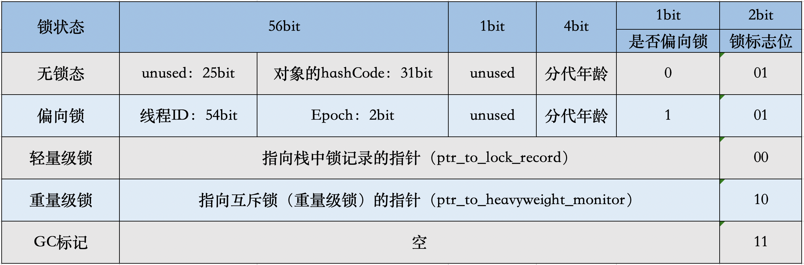
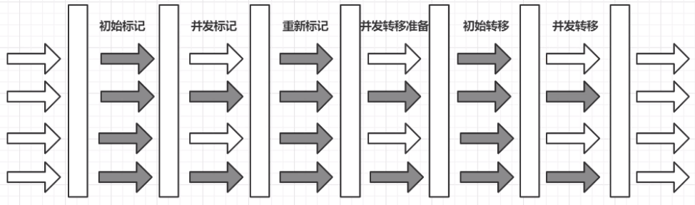

map中可放任何东西

数据下标只能是数字。

数组性能。

可读性不仅仅只是服务端的可读性，还有线上排查时可读性。


官方文档：https://docs.oracle.com/javase/specs/jvms/se8/html/jvms-5.html

openjdk源码包：https://download.java.net/openjdk/jdk8/promoted/b132/openjdk-8-src-b132-03_mar_2014.zip


# JVM类加载

初步认识

> 1. Java虚拟机是Java平台的基石，负责其**硬件和操作系统的独立性**，其编译的代码很小以及保护用户免受恶意程序攻击的能力。
> 2. Java虚拟机是一种抽象计算机， 像真正的计算机一样，它**有一个指令集并在运行时操作各种内存区域**。
> 3. Java虚拟机不承担任何特定的实现技术、主机硬件或主机操作系统，它**本身并没有被解释**。
> 4. Java虚拟机不知道Java编程语言，**只知道特定的二进制格式，即class文件格式**，class 文件包含Java虛拟机指令(或字节码) 和符号表,以及其他辅助信息。
> 5. 出于安全考虑，Java虚拟机对class文件中的代码施加了强大的语法和结构约束，但是任何具有可以用有效class文件表示的功能的语言都可以由Java虚拟机托管，由通用的、与机器无关的平台吸引，其他语言的实现者可以将Java虚拟机作为其语言的交付工具。


### 从.java到.class

#### 编程语言类型

##### 编译型

> 使用专门的编译器，针对特定的平台将高级语言代码一次性编译成该平台硬件执行的机器码，并包装成该平台所能识别的可执行程序的格式。（将源程序编译成二进制代码的可运行程序，可直接执行该程序）
>
> e.g. C、C++、GoLang
>
> 优缺点：执行速度快、效率高；依靠编译器，跨平台性差。

##### 解释型

> 使用专门的解释器对源程序逐行解释成特定平台的机器码，并立即执行。代码在执行时才被解释器一行行动态翻译和执行，而不是在执行之前就完成翻译。（将源程序翻译一句然后执行一句）
>
> e.g. Python、Javascript
>
> 优缺点：执行速度慢、效率低；依靠解释器，跨平台性能差

##### java（编译型 + 解释型）

> 先编译成 *.class文件，然后通过JVM来翻译才能在对应平台上运行。翻译大多数是解释的过程，但也会有编译，称之为运行时编译，即 JIT(Just In Time)。


#### 编译器

> Person.java -> 词法分析器 -> tokens流 -> 语法分析器 -> 语法树/抽象语法树 -> 语义分析器 -> 注解抽象语法树 -> 字节码生成器 -> Person.class文件


#### .Class信息


##### 类文件结构

[官方文档](https://docs.oracle.com/javase/specs/jvms/se8/html/jvms-4.html)

```java
ClassFile {
    u4             magic;
    u2             minor_version;
    u2             major_version;
    u2             constant_pool_count;
    cp_info        constant_pool[constant_pool_count-1];
    u2             access_flags;
    u2             this_class;
    u2             super_class;
    u2             interfaces_count;
    u2             interfaces[interfaces_count];
    u2             fields_count;
    field_info     fields[fields_count];
    u2             methods_count;
    method_info    methods[methods_count];
    u2             attributes_count;
    attribute_info attributes[attributes_count];
}
```

> u2 u4 u8 ……un(n是2的次方)，表示读取几个16进制码

##### 常量池

> 常量池主要存储两方面内容：字面量(Literal)和符号引用(Symbolic References)
>
> **字面量**：文本、字符串，final修饰等
> **符号引用**：类和接口的全限定名、字段名称和描述符、方法名称和描述符

##### 反编译验证

```java
javap -v -p XXX.class
```


### 类加载机制

> 类加载机制是将类的**字节码文件所包含数据读入内存**，同时**生成数据的访问入口**。
>
> 

#### 从哪儿加载class文件

> - 从本地系统加载
> - 从jar、war等归档文件加载
> - 运行时通过动态代理动态编译为class文件
> - 从加密文件中加载，防class文件被反编译的保护措施
> - 从网络下载.class文件、从专有数据库中提取（很少用）


#### 怎么加载-装载（Load）

> 1. 通过一个类的**全限定名**获取定义此类的**二进制字节流**
> 2. 将字节流所代表的静态存储结构转化为**方法区**的运行时数据结构
> 3. 在Java**堆中生成一个代表这个类的java.lang.Class对象**，作为对方法区中这些数据的访问入口
>
> **装载完毕后，运行时数据区的方法区和堆区就有数据了**。
>
> **方法区：类信息、静态变量、常量**
>
> **堆：被加载类的java.lang.Class对象**

> 这个过程是**查找和导入class文件**，可以对类加载器进行操控、可通过Java Agent 对字节码进行增强操作。


#### 链接（Link）

##### 验证（Verify）

> - **文件格式校验**：**确保class文件格式的规范**，并且**能被当前版本的虚拟机处理**。验证过程是**基于二进制字节流**进行的，**验证后字节流才会进入内存的方法区，后面验证都是基于方法区的存储结构**进行的。
>
> - **元数据校验**（Java语法校验，对比javac编译阶段的语义分析）
> - **字节码验证**：确定程序语义是合法的、符合逻辑的（**数据流和控制流的验证**）
> - **符号引用验证**：目的是确保解析动作能正常进行，发生在虚拟机将符合引用转化为直接引用的时候，可看作是对类自身以外的信息进行匹配性校验。
>
> 如果能保证代码肯定没问题，没必要验证，可以添加参数取消验证
>
> ```xml
> -Xverify:none
> ```

> 数据流与控制流：下图中的数据信号与控制信号
>
> 


##### 准备（Prepare）

> - **为类变量（静态变量）分配内存并且设置该类变量的默认初始值**。**不包含用final修饰的static**，因为final在编译时就会分配。（类变量分配在方法区，实例变量分配在java堆中）
>
> 注意：实例变量是在对象实例化时随着对象一起分配在Java堆中的。对于特殊情况，如果类字段属性表中存在ConstantValue属性，那么在准备阶段该变量就会被初始化为ConstantValue属性所指的值。
>
> **ConstantValue属性的作用**：**通知虚拟机自动为静态变量赋值**，只有static修饰的变量才可以使用这项属性。非static类型的变量的赋值是在实例构造器方法中进行的。static类型变量赋值分为两种，在类构造中赋值，或ConstantValue属性赋值。
>
> 在实际程序中，只有**同时被final和static修饰**的字段才有ConstantValue属性，且限于**基本类型和String**、编译时javac将会为该常量生成ConstantValue属性，在类加载准备阶段虚拟机便会根据ConstantValue为常量设置相应的值，如果该变量没有被final修饰，或者并非基本类型或字符串，则选择在构造器中进行初始化。
>
> **为什么ConstantValue的属性值只限于基本类型和String？**
>
> 因为**常量池中只能引用到基本类型和String类型**的字面量。
>
> 比如定义 static final int a = 1;在编译时javac会将为a生成ConstantValue属性，在准备阶段虚拟机就会根据ConstantValue将value赋值为1。可以理解成static final常量在编译期就将其结果放入了调用它的类的常量池中。


##### 解析（Resolve）

> 将常量池内的**符号引用转换为直接引用**，主要针对**类、接口、字段、类方法、接口方法、方法类型、方法句柄、调用限定符**7类符号引用进行。
>
> 符号引用：一组符号来描述目标，可以是任何字面量，引用的目标并不一定已经已经加载到了内存中。
>
> 直接引用：直接指向目标的指针，相对偏移量或一个间接定位到目标的句柄。与虚拟机内存布局实现相关，同一个符号引用在不同虚拟机上翻译出来的直接引用一般不会相同，如果有了直接引用，那么引用的目标必定存在内存中。

缓存解析结果

> 同一符号引用大概率会进行多次解析请求，同一个实体中共用一次解析的缓存。拉姆达表达式不会被缓存


#### 初始化（Initialize）

> 执行类构造器方法的过程。
>
> 对类变量进行初始化值设定有两种方式：
>
> - 声明类变量时指定初始值
> - 使用静态代码块为类变量设定初始值
>
> **初始化步骤**
>
> 1. 该类还没被加载和连接，则程序先加载并连接该类
> 2. 该类父类还没被初始化，则先初始化其直接父类
> 3. 该类中有初始化语句，则系统一次执行这些初始化语句


#### 使用

**类初始化时机是什么呢**？

> **主动引用**（常面）
>
> 只有当对类的主动使用时才会导致类的初始化，类的主动使用分为6种：
>
> 1. 创建类的实例（new的方式）
> 2. 访问某个类或接口的静态变量，或者对该静态变量赋值
> 3. 调用类的静态方法
> 4. 反射
> 5. 初始化某个类的子类，则其父类也会被初始化
> 6. Java虚拟机启动时被标明为启动类的类（JvmCaseApplication，有main()的类），直接使用java.exe命令类运行某个主类
>
> 
>
> **被动引用**（常面）
>
> 1. 引用父类的静态字段，只会引起父类的初始化，而不会引起子类的初始化
> 2. 定义类数组，不会引起类的初始化
> 3. 引用类的static final 常量，不会引起类的初始化（如果只有static修饰，还是会引起该类的初始化）


#### 卸载

> 在类使用完之后，如果满足下面情况就会被卸载：
>
> 1. 该类所有的实例都已经被回收，即java堆中不存在该类的任何实例
> 2. 加载该类的ClassLoader已经被回收
> 3. 该类对应的java.lang.Class对象没有任何地方被引用，无法再任何地方通过反射访问该类的方法
>
> 全部满足上面的条件则JVM在方法区回收的时候对类进行卸载，类卸载过程就是在方法区中清空类的信息，java类的整个生命周期就结束了。但是一般情况下启动类加载器加载的类不会被卸载，而我们的其他两种基础类型的类加载器只有在极少数情况下才会被卸载。
>
> JVM本身会引用这些类加载器，而这些类加载器则会始终引用它们所加载的类的Class对象，因此这些Class对象始终是可触及的。


### 类加载器（ClassLoader）

> - 负责**读取Java字节码**，并**转换成java.lang.Class类的一个实例**的代码模块
>
> - 确定类在JVM中的唯一性
>
> 一个类在**同一个类加载器**中具有**唯一性（Uniqueness）**，**不同类加载器**中是允许同名类（**全限定名相同**）存在的。

#### 类加载器分层

> 三种基础类加载器，一直可自定义类加载器
>
> - Bootstrap ClassLoader
>
>   负责加载**$JAVA_HOME中的 jre/lib/rt.jar** 里面所有的class或 **xbootclassoath选项指定的jar包**。由c++实现，不是ClassLoader子类。（在java层面看不到）
>
> - Extension ClassLoader
>
>   负责加载**java平台中扩展功能的jar包**，包括**$JAVA_HOME中 jre/lib/*.jar 或 -Djava.ext.dirs 指定目录下的jar包**
>
> - App ClassLoader
>
>   负责加载**classpath中指定的jar包**及 **Djava.class.path 所指定目录下的类和jar包**（当前类所在路径及其引用的第三方类库的路径）
>
> - Custom ClassLoader
>
>   **通过java.lang.ClassLoader 的子类自定义加载class**，属于**应用程序根据自身需要自定义的ClassLoader**，如Tomcat、Jboss都会根据j2ee规范自行实现ClassLoader
>
> 


**为什么类加载器要分层**

> 1.2版本的JVM中只有一个类加载器， 就是现在的“Bootstrap"(根类)类加载器。这样会出现一个问题。假如用户调用他编写的java.lang.String类。理论上该类可以访问和改变java.lang包下其他类的默认访问修饰符的属性和方法的能力。也就是说，我们其他的类使用String时也会调用这个类,因为只有一一个类加载器就无法判定到底加载哪个String类。因为Java语言本身并没有阻止这种行为，所以会出现问题。
> 这个时候就想可不可以使用不同级别的类加载器来对我们的**信任级别**做一个区分呢?
> 比如用三种基础的类加载器做为我们的三种不同的信任级别。最可信的级别是**java核心API类**。然后是**安装的拓展类**，最后才是在**类路径中的类(属于本机的类)**。所以，我们三种基础的类加载器由此而生。


#### JVM类加载机制的三种方式

##### 全盘负责

> 也可叫做当前类加载机制。
>
> 当一个类加载器负责加载某个Class时，**该Class所依赖的和引用的其他Class也将由该类加载器负责载入**，除非显示使用另一个类加载器来载入。
>
> 例如，系统类加载器AppClassLoader加载入口类（含有main()的类）时，会把main()所依赖的类和引用的类也载入，依此类推。全盘负责机制也可称为当前类加载器负责机制。入口类所依赖的类及引用的类的当前类加载器就是入口类的类加载器。
>
> 以上步骤只是调用了ClassLoader.classLoad(name)，并没有真正定义类。真正加载class字节码文件生成Class对象由“双亲委派机制”完成。

##### 父类委托

> **永远只加载级别高的，java中推荐的机制也是默认类加载器。**
>
> “双亲委派”是指子类加载器如果没有过该目标类，就先委托父类加载器加载该目标类，只有在父类加载器找不到字节码文件的情况下才从自己的类路径中查找并装载目标类。
>
> 
>
> 父类委托别名就叫做双亲委派机制，它加载Class的具体过程是：
>
> 1. ClassLoader先判断该Class是否已加载，若已加载则返回Class对象，**未加载则委托给父类加载器**
> 2. 父类加载器先判断是否加载过该Class，若已经加载则返回Class对象，若**未加载则委托给祖父类加载器**
> 3. 依次类推，**直到始祖类加载器**（引用类加载器）
> 4. 始祖类加载器判断是否加载该Class，若已加载则返回Class对象，若没有则尝试从其对应的类路径下寻找class字节码文件并载入。若载入成功则返回Class对象，**若载入失败则委托给始祖类加载器的子类加载器**
> 5. 始祖类加载器的子类加载器尝试从其对应的类路径下寻找class字节码文件并载入，若载入成功则返回Class对象，若载入失败则委托给始祖类加载器的孙类加载器
> 6. 依次类推，**直到源ClassLoader**
> 7. 源ClassLoader尝试从其对应的类路径下寻找class字节码文件并载入，若载入成功，则返回Class对象，**若载入失败则源ClassLoader则抛出异常**
>
> 双亲委派机制只是**Java推荐的机制**，并不是强制的机制。我们可以继承java.lang.ClassLoader类实现自己的类加载器，如果想保持双亲委派模型，就应该重写findClass(name)，如果想破坏双亲委派模型，可以重写loadClass(name)。

##### 缓存机制

> 保证所有加载过的Class都在内存的缓存中，当程序中需要使用某个Class时，类加载器先从内存的缓存中寻找该Class，只有缓存区不存在，系统才会读取该类对应的二进制数据，并将其转换成Class对象，存入缓存区。
>
> 这也是**修改了Class后必须重启JVM才会生效的原因**，**相同全类名的类只加载一次**，即loadClass方法不会重复调用。但可以用热加载方式，有改动后自动重新加载修改的类。


#### 打破双亲委派

> 双亲委派模型会带来的问题：比如java.sql.Driver，JDK只能提供一个规范接口而不能提供实现，提供实现的是实际的数据库提供商，而提供商的库不可能放在jdk目录中，于是就需要打破双亲委派机制。

SPI(Service Provider Interface)

> jdk1.6提出的SPI就是为了解决这个问题，JDK提供接口，供应商提供服务。编程人员编码时面向接口编程，然后JDK能够自动找到合适的实现。
>
> [ServiceLoader](https://docs.oracle.com/javase/8/docs/api/java/util/ServiceLoader.html)

OSGI

> 可实现模块化热部署、代码热替换。它实现热部署的关键则是它自定义的类加载器机制实现，**每个程序模块都有一个字节的类加载器**，当需要**更换一个程序模块时把程序模块连同类加载器一起换掉**。


> 自定义类加载器的核心在于**对字节码文件的获取**，如果是加密的字节码则需要在该类中对文件进行解密。
>
> 注意点：
>
> 1. 传递的文件名需要时类的全限定名称。如果没有全限定名，那么需要将类的全路径加载进去。
> 2. 最好不重写loadClass()，这样容易破坏双亲委托模式


# JVM内存结构

### 常量池

> 官方解释：https://docs.oracle.com/javase/specs/jvms/se8/html/jvms-5.html
>
> **为什么需要常量池**：字节码文件中需要很多数据的支持，但数据很大，不能直接保存到字节码文件中，所以使用常量池来**提供一些符号和常量，便于指令的识别**。
>
> 常量池分为静态常量池、运行时常量池、字符串常量池。
>
> 静态常量池：存储字面量、符号引用
>
> 运行时常量池：类和接口在JVM运行时在内存中开辟出，用来存储静态常量池部分数据的一块特殊区域
>
> 字符串常量池：包含在动态常量池中

**JDK1.8中各常量池在内存汇总的划分**

> 


### 运行时数据区

> 官方文档：https://docs.oracle.com/javase/specs/jvms/se8/html/jvms-2.html#jvms-2.5
>
> JVM运行时数据区是一种数据规范，JVM内存模型是对该规范的实现。真正实现的是Metaspace(JDK1.8)、Perm Space(JDK1.7)。


#### 方法区(Method Area)

> 方法区是**各个线程共享**的内存区域，在**JVM启动时创建**。用于**存储已被JVM加载的类信息、常量、静态变量、即时编译器编译后的代码数据**。当方法区无法分配内存时将抛出OutOfMemoryError异常。
>
> 在类加载的装载过程，(1)通过一个类的**全限定名**获取定义此类的**二进制字节流**；(2)将字节流所代表的静态存储结构转化为**方法区**的运行时数据结构，这个过程如下
>
> 


#### 堆(Heap)

> java堆是JVM管理的**最大的一块区域**，在**JVM启动时创建**，被**所有线程共享**，java中的对象实例、数组都在堆中。
>
> 在类装载过程，(3)在Java堆中生成一个代表这个类的java.lang.Class对象，作为对方法区中这些数据的访问入口。在第(3)步将数据载入堆中。


#### 虚拟机栈(Java Virtual Machine Stacks)

> 虚拟机栈是一个**线程执行的区域**，**保存一个线程中方法的调用状态**。Java线程的运行状态由虚拟机栈保存，它是线程**私有的、独有的、随着线程的创建而创建**。**调用一个方法就会向栈中压入一个栈帧；一个方法调用完成就会将该栈帧弹出**。（java方法，不包括native方法，native方法在本地方法栈中）
>
> 每个栈帧中包括**局部变量表**（Local Variables）、**操作数栈**（Operand Stack）**、指向运行时常量池的引用**（A reference to the run-time constant pool）、**方法返回地址**（Return Address）和**附加信息**。
>
> - 局部变量表：存放方法中定义的**局部变量、参数**。里面的变量不可直接使用，必须通过相关指令将其加载至操作数栈中作为操作数使用。
> - 操作数栈：以压栈和出栈的方式**存储操作数**
> - 动态链接：在运行期间将**符号引用转化为直接引用**，如一个方法调用其他方法时，就是通过常量池中指向的方法的符号来表示的，动态链接就是将这儿的符号引用通过常量池转为直接引用。（在类加载阶段将符号引用转为直接引用是静态解析）
> - 方法返回地址：方法执行后有两种方式退出，(1)遇到返回的字节码指令；(2)遇到异常，且异常没在方法体内得到处理
>
> 

结合字节码指令理解

> javap -c X.class > X.txt
>
> ```java
> Compiled from "X.java"
> class X {
> ...    
>  public static int calc(int, int);
>   Code:
>    0: iconst_3   // 将int类型常量3压入[操作数栈]
>    1: istore_0   // 将int类型值存入[局部变量0]
>    2: iload_0    // 从[局部变量0]中装载int类型值入栈
>    3: iload_1    // 从[局部变量1]中装载int类型值入栈
>    4: iadd       // 将栈顶元素弹出栈，执行int类型的加法，结果入栈
>    5: istore_2   // 将栈顶int类型值保存到[局部变量2]中
>    6: iload_2    // 从[局部变量2]中装载int类型值入栈
>    7: ireturn    // 从方法中返回int类型的数据
> ...
> }
> ```
>
> 


#### 本地方法栈(Native Method Stacks)

> 存放执行的native方法


#### 程序计数器

> 多线程间切换时**记录线程执行到的位置**。
>
> 若正在执行java方法，则计数器记录的是**正在执行的虚拟机字节码指令的地址**；
>
> 若正在执行native方法，则这个计数器为空。


附

> 除了上面五块内存之外,JVM还会使用到其他两块内存
>
> - 直接内存(Direct Memory)：不是JVM运行时数据区的一部分，也不是JVM规范中定义的内存区域，但是这部分也被频繁使用，而且也可能导致OOM。。。在JDK1.4中新加入了NIO类，引入了一种基于通道与缓冲区的IO方式，它可以使用native函数库直接分配堆外内存，然后通过一个存储在java堆中的DirectByteBuffer对象作为这块内存的引用进行操作。这样避免了在java堆着native堆中中来回复制数据，能提高性能。
> - 其他内存：JVM本身是个本地程序，还需要其他内存去完成各种基本任务（如:JIT编译器在运行时对热点方法进行编译，就会将编译后的方法存储在Code Cache中；GC等）


#### 栈指向堆

> 栈帧中有一个引用类型的变量，如Object obj=new Object()，这时就是栈中元素指向堆中的对象


#### 方法区指向堆

> 方法区中会存放**静态变量、常量**等数据。如 **static Object obj=new Object()**，这时就是方法区中元素指向堆中对象


#### 堆指向方法区

> 方法区中会包含类的信息，堆中会有对象。比如记录对象是由哪个类创建的


### Java对象内存模型

> 一个java对象在内存中包括3个部分：**对象头、实例数据、对齐填充**
>
> - 对象头：包括了对堆对象的布局、类型、GC状态、同步状态、标识哈希码的对象基本信息。java对象和vm内部对象都有一个共同的对象头格式。
> - 实例数据：主要是存放对象所有成员变量信息，父类的信息，对象字段属性信息。
> - 对齐填充：为了字节对齐，填充的数据。（提升读取效率而生）


#### 对象头

##### Mark Word

> 用于存储对象自身的运行时数据，如哈希码（HashCode）、GC分代年龄、锁状态标志、线程持有的锁、偏向线程ID、偏向时间戳等。存储方式如下图：

\openjdk\hotspot\src\share\vm\oops\markOop.hpp

```c++
//  32 bits:
//  --------
//             hash:25 ------------>| age:4    biased_lock:1 lock:2 (normal object)
//             JavaThread*:23 epoch:2 age:4    biased_lock:1 lock:2 (biased object)
//             size:32 ------------------------------------------>| (CMS free block)
//             PromotedObject*:29 ---------->| promo_bits:3 ----->| (CMS promoted object)
//
//  64 bits:
//  --------
//  unused:25 hash:31 -->| unused:1   age:4    biased_lock:1 lock:2 (normal object)
//  JavaThread*:54 epoch:2 unused:1   age:4    biased_lock:1 lock:2 (biased object)
//  PromotedObject*:61 --------------------->| promo_bits:3 ----->| (CMS promoted object)
//  size:64 ----------------------------------------------------->| (CMS free block)
```

32位


64位



> 虽然长度不一样，但组成的基本内容时一样的。
>
> - **对象的hashCode**：标识当前对象，无锁状态下存储在这儿
> - **分代年龄（age）**：表示对象被GC的次数，当该次数到达阈值的时候，对象就会转移到老年代
> - **线程ID**：偏向模式下，当某个线程持有对象的时候，对象这里就会被置为该线程的ID。 在后面的操作中，就无需再进行尝试获取锁的动作。
> - **epoch**：偏向锁在CAS锁操作过程中，偏向性标识，表示对象更偏向哪个锁
> - **ptr_to_lock_record**：轻量级锁状态下，指向栈中锁记录的指针。当锁获取是无竞争的时，JVM使用原子操作而不是OS互斥。这种技术称为轻量级锁定。在轻量级锁定的情况下，JVM通过CAS操作在对象的标题字中设置指向锁记录的指针
> - **ptr_to_heavyweight_monitor**：重量级锁状态下，指向对象监视器Monitor的指针。如果两个不同的线程同时在同一个对象上竞争，则必须将轻量级锁定升级到Monitor以管理等待的线程。在重量级锁定的情况下，JVM在对象的ptr_to_heavyweight_monitor设置指向Monitor的指针


**注意hashCode采用的大端存储：**

> 存储hashCode采用的大端存储方式，hashCode的值是确定的，不需要做数据转换。
>
> - 小端存储：**正常顺序**存，便于数据之间的**类型转换**，例如：long类型转换为int类型时，高地址部分的数据可以直接截掉。
>
> - 大端存储：**逆序**存，便于数据类型的**符号判断**，因为最低地址位数据即为符号位，可以直接判断数据的正
>   负号。
>
>   小端存储便于数据转换（直接在高位加减位数长度即可），大端存储便于数据类型的符号判断（根据最低位判断符号）。

验证方式

1. **引入工具依赖**

   ```xml
   <dependency>
       <groupId>org.openjdk.jol</groupId>
       <artifactId>jol-core</artifactId>
       <version>0.10</version>
   </dependency>
   ```


2. **使用工具**

   ```java
   public void classLayout() {
       Object obj = new Object();
       System.out.println(obj.hashCode());
       System.out.println(obj);
       System.out.println(ClassLayout.parseInstance(obj).toPrintable());
   }
   ```
   
   **输出内容**
   
```java
   // 64位机器上输出的结果
999661724 // hashcode
   java.lang.Object@3b95a09c // 对象地址
   java.lang.Object object internals:
    OFFSET  SIZE   TYPE DESCRIPTION                               VALUE
         0     4        (object header)                           01 9c a0 95 (00000001 10011100 10100000 10010101) (-1784636415)
         4     4        (object header)                           3b 00 00 00 (00111011 00000000 00000000 00000000) (59)
         8     4        (object header)                           e5 01 00 f8 (11100101 00000001 00000000 11111000) (-134217243)
        12     4        (loss due to the next object alignment)
   Instance size: 16 bytes
   Space losses: 0 bytes internal + 4 bytes external = 4 bytes total
```

> 由上可以看到hashcode为 **999661724** (10进制) 对应16进制为：**3b95a09c**
>
> 按照64位的对象头Mark Work存储格式为 
>
> **01(16进制)** -> 00000001(2进制) 分别是unused(1位) | age(4位) | biased_lock(1位) | lock(2位)；
>
> **9c a0 95 3b(16进制)** -> 10011100 10100000 10010101 **0**0111011 (2进制) 为存储的hashcode，但是采用的大端存储（**逆序存**）。最后一组的8位二进制数中，**首位是属于unused**
>
> 而且由上可知，存储在栈帧中的对象地址也就是对象的hashcode对应的16进制。


##### Klass Pointer

> **指向对象对应的类元数据的内存地址**，JVM通过这个地址来**确定该对象是哪个类的实例**。引用定位到对象的方式有两种，**句柄池访问、直接访问**。

###### 指针压缩

> 类型指针在32位系统中为4字节4 * 8=32位；64位系统中为8字节8 * 8=64位。但是**JVM会默认进行指针压缩**，**压缩之后也是4字节32位**。
>
> **32位**的处理器一次能够处理32bit（**4字节**）的数据，**64位的能处理8字节**，开启指针压缩技术，将8字节的数据压缩成4字节。64位的机器堆内存**大于4G默认开启**指针压缩技术，**小于4G不开启**用32位的方式处理（舍弃高位），**超过了32G无法开启**指针压缩了。
>
> ```xml
> -XX:-UseCompressedOops          <!-- 关闭指针压缩 -->
> ```

> 如上面打印出的内存布局，就只有4字节存储的Klass Pointer。当关闭了指针压缩之后就有**8字节**的存储空间就如下所示
>
> ```java
> java.lang.Object object internals:
>  OFFSET  SIZE   TYPE DESCRIPTION                               VALUE
>       0     4        (object header)                           01 9c a0 95 (00000001 10011100 10100000 10010101) (-1784636415)
>       4     4        (object header)                           3b 00 00 00 (00111011 00000000 00000000 00000000) (59)
>       8     4        (object header)                           00 1c f9 1b (00000000 00011100 11111001 00011011) (469310464)
>      12     4        (object header)                           00 00 00 00 (00000000 00000000 00000000 00000000) (0)
> Instance size: 16 bytes
> Space losses: 0 bytes internal + 0 bytes external = 0 bytes total
> ```


###### 句柄池访问

> 使用句柄访问对象，会在堆中开辟一块内存作为**句柄池**，句柄中储存了**对象实例数据**（属性值结构体）
> 的内存地址，**访问类型数据的内存地址**（**类信息**，方法类型信息），对象实例数据一般也在heap中开
> 辟，类型数据一般储存在方法区中。
>
> 优点：reference存储的是稳定的句柄地址，在对象被移动（垃圾收集时移动对象是非常普遍的行为）
> 时只会改变句柄中的实例数据指针，而reference本身不需要改变。
> 缺点：增加了一次指针定位的时间开销。


###### 直接访问

> 直接指针访问方式指reference中直接储存对象在heap中的内存地址，但对应的类型数据访问地址需要
> 在实例中存储。
> 优点：节省了一次指针定位的开销。
> 缺点：在对象被移动时(如进行GC后的内存重新排列)，reference本身需要被修改。


##### Length

> 数组对象特有的，如下是有4字节Klass Pointer（开启了指针压缩），4字节标识数组长度。

```java
public void classLayout() {
    Object[] obj = new Object[20];
    System.out.println(ClassLayout.parseInstance(obj).toPrintable());
}
```

```java
[Ljava.lang.Object; object internals:
 OFFSET  SIZE               TYPE DESCRIPTION                               VALUE
      0     4                    (object header)                           01 9c a0 95 (00000001 10011100 10100000 10010101) (-1784636415)
      4     4                    (object header)                           3b 00 00 00 (00111011 00000000 00000000 00000000) (59)
      8     4                    (object header)                           f5 22 00 f8 (11110101 00100010 00000000 11111000) (-134208779)
     12     4                    (object header)                           14 00 00 00 (00010100 00000000 00000000 00000000) (20)
     16    80   java.lang.Object Object;.<elements>                        N/A
Instance size: 96 bytes
Space losses: 0 bytes internal + 0 bytes external = 0 bytes total
```

> 可见，对于数据类型的对象在对象头中记录了数组的长度。


#### 实例数据

> 包含了**对象的所有成员变量**，**大小由各个变量类型决定**。如果对象无属性字段，则这里就不会有数据。


#### 对齐填充

> JVM堆中对象的起始地址需要**对齐至8的倍数**。如果一个对象**用不到8N个字节则需要对其填充**。没有对齐就会出现跨内存区域存储的情况，读取速度会比较慢，跨内存存储的需要读多次，但如果进行了对齐填充就只需要在一个里面读就能读完。（**空间换时间**的做法）

> 如下在64位系统中，一次能处理8字节(64位)的数据
>
> 没有对齐填充的情况，读取下面long中数据需要读取两个区域的数据（**2次读取**）
>
> 
>
> 对齐填充后，读取下面long中数据一次即可读完（**1次读取**）
>
> 

> 对齐填充之后，如果又有新读存进来的变量，且填充的空白字节能放下则**放入之前填入的空白字节中**。
>
> **不管是32位还是64位的系统，对齐填充时都是对齐至8的倍数进行填充。**


### JVM内存模型

> JVM运行时数据区是一种规范，而JVM内存模型是对该规范的实现。
>
> 虚拟机栈、本地方法栈、程序计数器都是和线程的生命周期相关，生命周期相对较短，是线程私有的。所以主要关注方法区（非堆）和堆区的生命周期，生命周期较长，需要细分，这两块区域也都是线程共享的。
>
> 

#### 区域划分

> 主要分为以下几个部分：
>
> - 非堆
> - 堆
>   - Old区
>   - Young区
>     - Eden区
>     - Survivor区
>       - S0(From)
>       - S1(To)


##### 对象创建与内存占用

> 一般情况下，新创建的对象都会被分配到Eden区，一些特殊的大的对象会直接分配到Old区。

> java对象的自述：我是一个普通的Java对象,我出生在Eden区,在Eden区我还看到和我长的很像的小兄弟,我们在Eden区中玩了挺长时间。有一天Eden区中的人实在是太多了,我就被迫去了Survivor区的“From”区,自从去了Survivor区,我就开始漂了,有时候在Survivor的“From”区,有时候在Survivor的“To”区,居无定所。直到我18岁的时候,爸爸说我成人了,该去社会上闯闯了。于是我就去了年老代那边,年老代里,人很多,并且年龄都挺大的。


> 分代年龄，每进行一次GC，存活下来的对象age都+1。
>
> young区最大的年龄为15，为16时就改移动到old区了。对象的内存布局那儿存储对象的年龄用的4个二进制位，即存储的数在0-15之间，于是就取最大的15。
>
> 在多次Young GC间隔期间参生了大量对象。


##### GC

> 对于Hotspot来说只有2类GC，Partial GC和Full GC。讲到GC时一定要针对某一个垃圾收集器来讲，不同的垃圾收集器GC和回收策略是不同的。

> - Partial GC（回收部分GC堆），Young GC 和 Old GC 都是属于这种模式。
>   - Young GC(Minor GC)：只回收 Young 区。Eden或S区不够时触发；Full GC时也会触发Young GC
>   - Old GC：只回收 Old 区
>
> - Full GC：整体回收，包括young区、old区、metaspace。young GC触发Full GC（Full GC的悲观策略）、MetaSpace空间不足直接触发Full GC（一般由它触发的Full GC大多是因为内存泄露导致）、System.gc()触发Full GC（这种是通知操作，实际gc操作可能会延缓执行），但也可以传入参数控制禁止调用Full GC。
>
> 悲观策略：
>
> 1. 计算young GC时送往Old 区平均大小，当Old区剩余空间小于计算出的平均大小时，发生young GC就会触发Full GC，因为GC悲观的认为接下来从young区送来的对象大小约在平均值左右，但它装不下了就需要GC
> 2. S区存活的对象总大小大于Old区剩余大小，因为Old区要保证及时下次S区的全过来了，Old区能装得下。
>
> MetaSpace：是方法区的实现，1.7之前是持久代，用的perm Space实现。1.8之后是通过元空间（MetaSpace）实现


##### 为什么需要Survivor区？

> Survivor存在意义是**减少送到老年代的对象**，进而**减少Full GC的发生**，Survivor的预筛选保
> 证只有经历16次Minor GC还能在新生代中存活的对象才会被送到老年代。
>
> 如果没有Survivor区，那么Eden区每进行一次Minor GC存活的对象就会被送到Old区。这样一来Old区很快就会被填满，然后就会触发Major GC（伴随着Minor GC，也可看作Full GC），Old 区内存空间远大于Young区，进行一次 Full GC消耗的时间比Minor GC长得多。会影响大型程序的执行和响应速度。
>
> 假如增加Old 区，更多存活对象才能填满Old 区。虽然降低Full GC频率，但是随着Old 区加大，一
> 旦发生Full GC，执行所需要的时间更长。
> 假如减少Old 区，虽然Full GC所需时间减少，但是Old 区很快被存活对象填满，Full GC频率增加。
>
> 所以最好的策略就是加上Survivor区。


##### 为什么Survivor区要分成2部分？

> 最大的好处是解决了碎片化。
>
> 假设现在只有一个Survivor区：刚刚新建的对象在Eden中，一旦Eden满了则触发一次Minor GC，Eden中的存活对象就会被移动到Survivor区。这样循环下去，下一次Eden满了的时候，问题来了，此时进行Minor GC在Eden和Survivor各有一些存活对象，如果此时把Eden区的存活对象硬放到Survivor区，很明显这**两部分对象所占有的内存是不连续的**，也就导致了内存碎片化。？？？
>
> 分成2部分，且2部分空间大小一样（有些时候可能会自动进行动态调整），则能保证永远有一个Survivor space是空的,另一个非空的Survivor space无碎片。（相互可以腾过来腾过去，保证里面的内存连续）

> 碎片化原因：开始按地址依次填充，之后有些地方的对象被回收了，那么被回收的那些地方就空了，内存空间就不连续了，即导致了内存碎片化。

##### 防S区永远被占用

> 若在S区中有很多个年龄相同的对象，则当又有新对象进来且S区装不下时，会将大于等于那个年龄的所有对象直接放入Old区。目的是为了防止S区永远被占用着，S区有个最大限度的占用大小，当达到设定阈值时，就将部分年龄大的移入Old区。将占用的大小降低到设定阈值之下。

##### 担保机制

> GC担保机制：当来了超大对象，比Eden区的总容量还大时，直接进入Old区（Old区的空间最大，肯定能容纳）


##### Young中Eden:S1:S2为什么是8:1:1？

> 新生代中的可用内存：复制算法用来担保的内存为9:1
> 可用内存中Eden：S1区为8:1
> 即新生代中Eden:S1:S2 = 8:1:1
> 现代的商业虚拟机都采用这种收集算法来回收新生代，IBM公司的专门研究表明，新生代中的对象大概98%是
> “朝生夕死”的


##### 堆内存中都是线程共享的区域吗？

> JVM默认为每个线程在Eden上开辟一个buffer区域，用来加速对象的分配，称之为TLAB，全称:Thread
> Local Allocation Buffer。
> 对象优先会在TLAB上分配，但是TLAB空间通常会比较小，如果对象比较大，那么还是在共享区域分配。
>
> ？？？


#### 溢出演示

> 使用Java VisualVM工具，在命令行中输入 `jvisualvm`打开可视化工具，然后在 工具 => 插件 => 可用插件中安装 **Visual GC**，安装好后看Visual GC就可以看到具体的内存占用信息。


##### 堆内存溢出

> **思路**：
>
> 代码中不断创建对象，并将堆内存设定小些，运行不久后堆内存就会溢出。
>
> 
>
> **代码准备**：
>
> ```java
> public void heapOutOfMemory(){
>     List<Object> list = new ArrayList<>();
>     int i = 0;
>     while (true){
>         list.add(new Object());
>         System.out.println(i++);
>     }
> }
> ```
>
> 
>
> **JVM参数设置**：`-Xmx20M -Xms20M`
>
> - -Xms：heap设置的初始值
> - -Xmx：heap设置的最大堆的值
>
> 
>
> **运行后抛出异常**：java.lang.OutOfMemoryError: GC overhead limit exceeded


##### 方法区内存溢出

> **思路**：
>
> 向方法区不断添加Class的信息。
>
> 
>
> **代码**：
>
> ```xml
> <dependency>
>  <groupId>org.ow2.asm</groupId>
>  <artifactId>asm</artifactId>
>  <version>9.0</version>
> </dependency>
> ```
>
> ```java
> public void nonHeapOutOfMemory() {
>     List<Class<?>> list = new ArrayList<>();
>     int i = 0;
>     while (true) {
>         list.add(MyMetaspace.createClass());
>         System.out.println(i++);
>     }
> }
> 
> private static class MyMetaspace extends ClassLoader {
>     static Class<?> createClass() {
>         ClassWriter cw = new ClassWriter(0);
>         cw.visit(Opcodes.V1_1, Opcodes.ACC_PUBLIC, "Class", null, "java/lang/Object", null);
>         MethodVisitor mw = cw.visitMethod(Opcodes.ACC_PUBLIC, "<init>", "()V", null, null);
>         mw.visitVarInsn(Opcodes.ALOAD, 0);
>         mw.visitMethodInsn(Opcodes.INVOKESPECIAL, "java/lang/Object", "<init>", "()V");
>         mw.visitInsn(Opcodes.RETURN);
>         mw.visitMaxs(1, 1);
>         mw.visitEnd();
> 
>         byte[] code = cw.toByteArray();
> 
>         return
>             new MyMetaspace().defineClass("Class", code, 0, code.length);
>     }
> }
> ```
>
> 
>
> **JVM参数设置**：设置Metaspace的大小，`-XX:MetaspaceSize=500M -XX:MaxMetaspaceSize=500M`
>
> 
>
> **运行后抛出异常**：java.lang.OutOfMemoryError: Metaspace


##### 虚拟机栈溢出

> **思路**：
>
> 方法不断递归调用
>
> 
>
> **代码**：
>
> ```java
> static long count = 0L;
> @Test
> public void stackOverFlow() {
>     System.out.println(count++);
>     stackOverFlow();
> }
> ```
>
> 
>
> **运行结果**：
>
> 栈深度到一定程度就抛出java.lang.StackOverflowError


> Stack Space 用来做方法的递归调用时压入栈帧(Stack Frame)。当递归调用太深时会耗尽Stack Space，抛出StackOverflow的异常。
>
> **-Xss128k：设置每个线程的堆栈大小为128k**（越大则装的栈帧越多，递归深度能更深）。JDK 5以后每个线程堆栈大小为1M，以前每个线程堆栈大小为256K。在相同物理内存下，减小这个值能生成更多的线程。但是**操作系统对一个进程内的线程数还是有限制的，不能无限生成**，经验值在3000~5000左右。
>
> 根据业务场景计算需要设置的参数值：
>
> 1. 确定机器能够分配多少内存给栈，如500M
> 2. 确定需要递归调用的最大深度范围，如3000-5000，取4000
> 3. 计算如下：
>
> **500 (M) * 1024 / 4000 (条线程) = 128 (k)**   
>
> 500 (M) * 1024 是将 M 单位统一成 k ，然后这么多 k 的内存让4000条线程分，1条线程可以分到 128 k
>
> 注意：线程栈的大小若**设置过小，可能会出现栈溢出**，特别是在该线程内有递归、大的循环时出现溢出的可能性更大。若该值**设置过大，会影响创建栈的数量**，如果是多线程的应用，就会出现内存溢出的错误。


> 循环引用，会导致内存泄露。
>
> 引用计数法不能解决循环引用
>
> 


> 可达性分析算法、根搜索算法
>
> 根搜索算法中选择根（GC root）可以是**虚拟机栈**和栈帧局部变量表中的元素；**方法区**内静态方法中的变量、常量；**本地方法栈**中的JNI中的元素。


> 逃逸分析：离开作用域称之为逃逸，逃逸分析就是个方法，判断指针是否作用于方法内。


# JVM GC


### 引用

> 引用(reference)：存储数据指向另一块内存的地址，分为**强引用、软引用、弱引用、虚引用**。
>
> - 强引用：最常见的经常会用到的引用，把一个对象赋给一个引用变量，这个引用变量就是一个强引用。当一个对象被强引用变量引用时，它处于可达状态，它是**不可能被回收**的，即使该对象以后永远都不会被用到 JVM 也不会回收。因此强引用是造成 Java内存泄漏的主要原因之一。
>
> - 软引用：需要用 SoftReference 类来实现，适合做缓存。**内存不够用了才会回收**它。（市面上常见的图片框架基本都可以用软引用）
>
> - 弱引用：要用 WeakReference 类来实现，它比软引用的生存期更短，对于只有弱引用的对象来说**GC运行就会回收**它。
> - 虚引用：需要 PhantomReference 类来实现，它不能单独使用，必须和引用队列联合使用。虚引用的主
>   要作用是跟踪对象被垃圾回收的状态。适合做对象监控通知，平时很少用到。
>
> 引用队列：当对象被回收时，将该对象的信息记录在引用队列中，记录在队列中后在一定时机可以让该对象“活起来”，或者不要改对象了就释放掉。有点回收站的意味。


**软引用的使用**

```java
@Test
public void softReference(){
    // 业务代码……
    // 业务代码使用到了obj实例
    Object obj = new Object();

    // 使用完了 obj 将它设置为软引用类型，并释放强引用
    SoftReference<Object> sr = new SoftReference<>(obj);
    obj = null;

    // 下次使用 obj 时
    if(Objects.nonNull(sr)){
        obj = sr.get();
    }else {
        // 若内存资源不足，GC 可能回收了 obj 的软引用，因此需要重新装载
        obj = new Object();
        sr =  new SoftReference<>(obj);
    }
}
```


### 对象生命周期


#### 创建阶段

> 为对象分配存储空间；开始构造对象；超类到子类对 static 成员初始化；超类成员变量按顺序初始化，递归调用超类构造方法；子类成员变量按顺序初始化，子类构造方法调用；
>
> 一旦对象被创建，并分派给某些变量赋值，这个对象的状态就切换到了应用阶段。


#### 应用阶段(In Use)

> 1. 系统至少维护着这对象的一个强引用
> 2. 所有对该对象的引用都是强引用（除非显示地使用其他类型的引用）
>


#### 不可见阶段(Invisible)

> 一个对象处于不可见阶段时，它依然存在，但**程序**本身不再持有该对象的任何强引用（超出了对象的作用域，如：某代码块内部的对象在代码块外面是不可见的），但是该对象仍可**能被 JVM 等系统下的某些已装载的静态变量、线程、 JNI 等强引用持有**，这些特殊的强引用被称为“GC root”。存在这些GC root会导致**内存泄露**情况。


#### 不可达阶段(Unreachable)

> 该对象不再被**任何**强引用所持有。
>
> 与“不可见阶段”相比，“不可见阶段”是指**程序**不再持有该对象的任何强引用但可能会有**JVM系统级别**的持有，“不可达阶段”是不再被**任何**强引用所持有。


#### 收集阶段( Collected )

> 当 GC 发现该**对象处于“不可达阶段”且 GC 已经对该对象的内存空间重新分配做好准备**时，则该对象进入了“收集阶段”。若该对象**重写了 finally() 则会执行该方法的终端操作**。
>
> 特别说明：**不要轻易重载 finally ()** 
>
> 1. **会影响 JVM 对象分配与回收速度**：在分配对象时 JVM 需要在GC 上注册该对象，以便回收能执行该重载方法；在该方法的执行时需要消耗 CPU 时间且在执行完成该方法后才会重新执行回收操作，即**至少需要对该对象执行 2 次 GC**。？？？
> 2. **可能造成该对象的再次“复活”**：在 finally() 中若有其他强引用再次持有该对象，则会导致该对象的状态由“收集阶段”变为“应用阶段”。这样就破坏了对象的生命周期进程，且“复活”对象不利于后序代码管理。
>
> 


#### 终结阶段

> 当对象**执行完 finalize() 后仍然处于不可达状态**时，则该对象进入终结阶段。在该阶段是**等待 GC 回收**。


#### 重新分配阶段

> GC 对该对象所占用的内存空间进行**回收或再分配**，则该对象彻底消失了。


### 何时 GC

> GC 由 **JVM 自动完成**的，根据JVM系统环境而定，所以时机是不确定的。
> 还可以通过调用 System.gc() 通知 JVM 进行一次 GC，但是具体什么时候 GC 由JVM决定。但是**不建议手动 GC**，因为GC消耗的资源比较大。

**如下时机会触发 GC**

> 1. Eden 区、S 区不够用了
> 2. Old 区不够用了
> 3. 方法区空间不够用了
> 4. System.gc()


### GC 算法

> 内存回收的**方法论**，后面垃圾收集器是它的具体实现。

#### 标记-清除(Mark-Sweep)

##### 标记

> 找出内存中需要回收的对象，并将其标记出来。
>
> 堆中所有的对象都会被扫描一遍，才能确定需要回收的对象，很耗时。


##### 清除

> 清除标记出需要回收的对象，释放对应的内存空间。


##### 缺点

> - 标记清除后，**会产生大量不连续的内存碎片**，空间碎片太多可能会导致以后需要分配较大对象时，无法找到足够的连续内存而不得不提前触发一次 GC。
> - 整个过程比较耗时，效率不高。


#### 标记-复制(Mark-Copying)

##### 思想

> 将内存分为两块区域，**每次只使用其中一块**。当其中一块内存使用完了，就将还存活的对象复制到另外一块上面，然后把已经使用过的内存空间一次清除掉。

##### 标记


##### 复制


##### 优缺点

> **这种方式解决了标记清除中产生太多内存碎片的问题，同时扫描范围缩小了。**
>
> **缺点：**空间利用率较低、当对象存活率较高时会有更多复制操作，效率会降低。
>
> 以应对被使用的内存中所有对象都有100%存活的极端情况，所以老年代一般不能直接选用这种算法。


#### 标记-整理(Mark-Compact)

##### 思想

> 在整理过程，让所有存活的对象都向一端移动，然后直接清理掉端边界以外的内存。
>
> 整理过程可以用双指针。除此之外还有其他实现方式。
>
> 

##### 标记


##### 整理


### 分代收集算法

> **Young **区：**标记复制**(对象在被分配之后，可能生命周期比较短，Young区复制效率比较高)
>
> **Old** 区：**标记清除或标记整理**(Old区对象存活时间比较长，复制来复制去没必要，不如做个标记再清理)


### 垃圾收集器

> 内存回收的**具体实现**，前面GC 算法是方法论。不同JVM中的垃圾回收机差异较大，以下是**Hotspot VM的**。

览概

> 新生代都用的标记复制算法。


#### Serial

> 它是最基本、发展历史最悠久的收集器，曾经（在JDK1.3.1之前）是虚拟机**新生代**收集的唯一选择。
> 
>它是一种**单线程**收集器，且满足STW(Stop-The-World)机制（全局停顿），其在进行垃圾收集的时候需要暂停其他线程。

| **适用范围** | **新生代**                             |
| ------------ | -------------------------------------- |
| **算法**     | **标记-复制算法**                      |
| **应用**     | **Client模式下的默认新生代收集器**     |
| **优点**     | **简单高效，拥有很高的单线程收集效率** |
| **缺点**     | **收集过程需要暂停所有线**             |


####  Serial Old

> Serial Old收集器是**Serial收集器的老年代版本**，不同的是采用**"标记-整理算法"**，运行过程和Serial收集器一样。


#### ParNew

> 可以把这个收集器理解为**Serial收集器的多线程版本**。

| **适用范围** | **新生代**                             |
| ------------ | -------------------------------------- |
| **算法**     | **标记-复制算法**                      |
| **应用**     | **运行在Server模式下的虚拟机中首选的新生代收集器**     |
| **优点**     | **在多CPU时，比Serial效率高** |
| **缺点**     | **收集过程暂停所有应用程序线程，单CPU时比Serial效率差**             |


#### Parallel Scavenge

> Parallel Scavenge收集器是一个**新生代**收集器，它也是使用**标记-复制**算法的收集器，又是**并行的多线程收集器**，看上去和ParNew一样，但是Parallel Scanvenge更**关注系统的吞吐量**。

> 吞吐量 = 运行用户代码的时间 / (运行用户代码的时间 + 垃圾收集时间)
> 比如虚拟机总共运行了100分钟，垃圾收集时间用了1分钟，吞吐量=(100-1)/100=99%。
> 若吞吐量越大，意味着垃圾收集的时间越短，则用户代码可以充分利用CPU资源，尽快完成程序的运算任务。

> -XX:MaxGCPauseMillis     控制最大的垃圾收集停顿时间，停顿时间越短GC越频繁（相当于允许一次GC的最长时间，时间越短则一次GC收集得越少，GC就会变频繁）
> -XX:GCTimeRatio   值在0-100之间   直接设置吞吐量的大小


#### Parallel Old

> Parallel Old收集器是**Parallel Scavenge收集器的老年代版本**，使用**多线程**和**标记-整理算法**进行垃圾回
> 收，也是更加**关注系统的吞吐量**。


#### CMS

> [CMS(Concurrent Mark Sweep)](https://docs.oracle.com/javase/8/docs/technotes/guides/vm/gctuning/cms.html#concurrent_mark_sweep_cms_collector)收集器是一种以获取**最短回收停顿时间**为目标的收集器。
> 采用的是**"标记-清除算法"**,整个过程分为4步：
>
> 1. 初始标记（CMS initial mark）：标记GC Roots直接关联对象，不用Tracing，速度很快
> 2. 并发标记（CMS concurrent mark）：进行GC Roots Tracing
> 3. 重新标记（CMS remark）：修改并发标记因用户程序变动的内容
> 4. 并发清除（CMS concurrent sweep）：清除不可达对象回收空间，同时有新垃圾产生，留着下次清理称为浮动垃圾
>
> CMS收集器的内存回收过程是与**用户线程一起并发地执行**的。
>
> 优点：并发收集、低停顿
> 缺点：产生大量空间碎片、并发阶段会降低吞吐量，还会并发失败、单线程或单核效率会很低。

##### 多种模式

> CMS有两种模式：常规模式(**background**)、切换其他垃圾收集器的模式(**foreground**)
>
> 常规模式下，并发收集过程，若收集过程产生的垃圾导致内存不足会导致应用程序STW，这种称之为**“并发模式失败”**。此后就会**由background模式转为foreground模式**，同时会**启用 Serial Old代替 CMS进行垃圾回收**

##### **常规模式下的一些问题**

###### 什么时候开始回收？

> 主要有以下参数决定
>
> ```java
> CMSInitiatingOccupancyFraction = -1       // 设定回收阈值百分比范围，默认-1
> UseCMSInitiatingOccupancyOnly  = false	  // 辅助参数，如果不开着那么就意味着上面设定的回收阈值只能用一次。开着则表示可以用多次
> CMSTriggerRatio  = 80
> MinHeapFreeRatio = 0 
> ```
>
> 指定默认值时算出来是100%（不同版本可能不同）。意味着在background模式下，老年代的默认**内存占用率达到100%情况才会回收**。计算公式如下所示：
>
> 
>
> CMS 后台扫描线程 2s/次 判断是否该进行垃圾回收了。

###### 内存碎片过多怎么办？

> 采用“标记-清除算法”必定会产生内存碎片，在background在特定模式下用MSC(Mark Sweep Compact)算法，进行压缩，整理内存碎片。可由以下参数控制：
>
> ```java
> UseCMSCompactAtFullCollection = true   // 是否开启full gc之后整理内存（让不连续的内存空间连续，相当于压缩）
> 
> CMSFullGCsBeforeCompaction   = 0  // 在上次CMS并发GC执行后，需执行多少次full GC才会做压缩
> ```
>
> 注意：内存压缩整理的过程是没法并发执行的，所以难免要停顿，要尽量合理设置该产参数。

###### Eden区引用Old区的怎么处理？

> **并发预清理**（在并发标记后面）：可能会有Eden区的对象指向Old 区的对象，但由于CMS只是Old 区的垃圾回收器，那么CMS只能遍历Eden区标记是否有指向Old区的对象。遍历Eden区之前进行一次预清理（等待Minor GC），减轻重新标记的工作量，然后再遍历标记
>
> ```java
> CMSScheduleRemarkEdenSizeThreshold = 2M // Eden区的内存使用量大于设定值才预清理，反正对象太少就没必要预清理
> 
> CMSScheduleRemarkEdenPenetration = 50  //Eden区使用率大于等于它设定的值，才进行预清理，否则就中断
> 
> CMSMaxAbortablePrecleanTime = 5    // 预清理阶段就是等待Minor GC ，但有个最长等待时间，就是通过它设定，到了它设定的值就不等了，即终止预清理阶段，进入remark
> ```

###### OId区引用Eden区的怎么处理、并发标记过程中发生的引用变化怎么处理？

> 堆空间汇总划分成了一系列的**卡页（Card Page）**，每块512字节。卡页里面有若干**卡表（Card Table）**用于标记卡页的状态，卡表（Card Table）被实现为一个简单的字节数组，即卡表的每个标记项为1个字节。
>
> Old区引用了Eden区的对象，会使用**卡标记（Card Marking）**技术跟踪从Old区到Eden区的所有引用，从而避免每次Minor GC时扫描整个老年代，减少开销。
>
> 并发标记过程，当对一个对象引用进行写操作时（对象引用改变），写屏障逻辑将会**标记对象所在的卡页为dirty**，表示引用发生了变化，该对象的引用为可达。然后在重新标记阶段，标记在并发标记阶段才加入对象，同时清除在card table中做的标识。


> 初始标记阶段，在1.7之前是串行的（下图所示），1.8之后就是并行的。


##### 相关参数

```java
// 开启CMS垃圾收集器
-XX:+UseConcMarkSweepGC
    
// 默认开启，与-XX:CMSFullGCsBeforeCompaction配合使用
-XX:+UseCMSCompactAtFullCollection 
    
// 默认0 几次Full GC后开始整理
-XX:CMSFullGCsBeforeCompaction=0
    
// 辅助CMSInitiatingOccupancyFraction的参数，不然CMSInitiatingOccupancyFraction只会使用一次就恢复自动调整，也就是开启手动调整。
-XX:+UseCMSInitiatingOccupancyOnly
    
// 设定回收阈值，取值0-100，按百分比回收，默认-1
-XX:CMSInitiatingOccupancyFraction 
```

> 注意：CMS并发GC不是“full GC”。HotSpot VM里对concurrent collection和full collection有明确的区分。所有带有“FullCollection”字样的VM参数都是跟真正的full GC相关，而跟CMS并发GC无关的。


慢速分配，在堆中分配；快速分配在TLAB中分。

临界区行为会产生全局锁，访问线程时用本地线程访问缓冲区。


#### G1(Garbage-First)

> JVM实战篇（下）没怎么听懂。。。。。。。。
>
> 稀疏表、细粒度位图、粗粒度位图、Point Out、Point In


> 三色标记，三色代表3种状态，标记已扫描、正在扫描、未扫描


> 可设置一个可预期的停顿时间，其他并发类垃圾回收器做不到这点。
>
> CMS的停顿时间只是尽可能小，但不能控制。
>
> CMS在GC时追求快，CPU性能在所不惜。
>
> G1 避免并发，降低了CPU负担。？？？


> [Garbage-Frist](https://docs.oracle.com/javase/8/docs/technotes/guides/vm/gctuning/g1_gc.html#garbage_first_garbage_collection)，是优先回收垃圾最多的Region区域。
>
> JDK 7开始使用，JDK 8非常成熟，JDK 9默认的垃圾收集器，适用于新老生代。
>
> 使用G1收集器时，Java堆的内存布局与就与其他收集器有很大差别，它**将整个Java堆划分为多个**
> **大小相等的独立区域（Region）**，**新生代和老年代不再是物理隔离的了，它们都是一部分Region（不需要连续）的集合**。
>
> Region大小是1M到32M之间的数值，且必须是2的n次幂。一共划分成2048个Region，Region可以转换角色。如果对象太大，一个Region放不下[超过Region大小的50%]，那么就会直接放到H中。
>
> 

**特别适合以下情况**

> 1. 50%以上的堆被存活对象占用
> 2. 对象分配和晋升的速度变化非常大
> 3. 垃圾回收时间比较长

##### 工作步骤

> 1. 初始标记（Initial Marking）：**标记GC Roots能够关联的对象，并且修改TAMS的值**，需要暂
>    停用户线程
> 2. 并发标记（Concurrent Marking）：**从GC Roots进行可达性分析，找出存活的对象**，与用户线程并发
>    执行
> 3. 最终标记（Final Marking）：**修正在并发标记阶段因为用户程序的并发执行导致变动的数据**，需
>    暂停用户线程
> 4. 筛选回收（Live Data Counting and Evacuation）：**对各个Region的回收价值和成本进行排序，根据**
>    **用户所期望的GC停顿时间制定回收计划**


##### TLAB

> G1在并发收集时访问临界区，临界区会加全局锁，那么访问时效率就会较低，然后就引入了TLAB，需要内存时就在线程本地分配。TLAB和CPU中的高速缓冲区类似，不用TLAB就是慢速分配，用它就是快速分配。


> TLAB(Thread Local Allocation Buffer)：线程本地分配缓存区，这是一个线程专用的内存分配区域。如果设置了虚拟机参数 -XX:UseTLAB，在线程初始化时，同时也会申请一块指定大小的内存，只给当前线程使用，这样每个线程都单独拥有一个空间，如果需要分配内存，就在自己的空间上分配，这样就**不存在竞争的情况**，可以大大提升分配效率。
>
> TLAB空间的内存非常小，缺省情况下仅占有整个Eden空间的1%，也可以通过选项-XX:TLABWasteTargetPercent设置TLAB空间所占用Eden空间的百分比大小。
>
> TLAB的本质其实是三个指针管理的区域：start，top 和 end，每个线程都会从Eden分配一块空间，例如说100KB，作为自己的TLAB，其中 start 和 end 是占位用的，标识出 eden 里被这个 TLAB 所管理的区域，卡住eden里的一块空间不让其它线程来这里分配。
>
> TLAB只是让每个线程有私有的分配指针，但底下存对象的内存空间还是给所有线程访问的，只是其它线程无法在这个区域分配而已。从这一点看，它被翻译为 线程私有分配区 更为合理一点
>  当一个TLAB用满（分配指针top撞上分配极限end了），就新申请一个TLAB，而在老TLAB里的对象还留在原地什么都不用管——它们无法感知自己是否是曾经从TLAB分配出来的，而只关心自己是在eden里分配的。
>
> https://www.jianshu.com/p/8be816cbb5ed


##### RSet

> 全称Remembered Set，记录维护Region中对象的引用关系。（可理解成卡表的升级版）
>
> 试想，在G1垃圾收集器进行新生代的垃圾收集时，也就是Minor GC，假如该对象被老年代的Region中所引
> 用，这时候新生代的该对象就不能被回收，怎么记录呢？
> 不妨这样，用一个类似于hash的结构，key记录region的地址，value表示引用该对象的集合，这样就能知
> 道该对象被哪些老年代的对象所引用，从而不能回收。

##### 相关参数

```java
-XX: +UseG1GC // 开启G1垃圾收集器
-XX: G1HeapReginSize // 设置每个Region的大小，是2的幂次，1MB-32MB之间
-XX:MaxGCPauseMillis // 最大停顿时间
-XX:ParallelGCThread // 并行GC工作的线程数
-XX:ConcGCThreads // 并发标记的线程数
-XX:InitiatingHeapOcccupancyPercent // 默认45%，代表GC堆占用达到多少的时候开始垃圾收集
```


> young GC、mixed GC、Full GC

young GC 流程

> 1. STW（young区都遵循STW机制）
> 2. 选择Eden区所有Region
> 3. 进行根扫描
> 4. 更新Rset，记录引用变化
> 5. 复制对象（标记-复制算法）
> 6. 重构Rset
> 7. 释放第2步选择的所有的Region
> 8. 大对象的回收
> 9. 动态的扩展内存，调整Region数量
> 10. 启动并发标记

Mixed GC 流程

> young GC + 收益高的 old region
>
> MixedGCCountTarget = 8
>
> 逻辑上将old 区分为8块，每次只收取1/8

Full GC 流程

> 没有足够的Region才进行


#### ZGC

> [The Z Garbage Collector](https://docs.oracle.com/en/java/javase/11/gctuning/z-garbage-collector1.html#GUID-A5A42691-095E-47BA-B6DC-FB4E5FAA43D0)是JDK11新引入的ZGC收集器，不管是物理上还是逻辑上，ZGC中已经不存在新老年代的概念了会分为一个个page，当进行GC操作时会对page进行压缩，因此没有碎片问题只能在64位的linux上使用，目前用得还比较少。
>
> 1. 可以达到10ms以内的停顿时间要求
> 2. 支持TB级别的内存
> 3. 堆内存变大后停顿时间还是在10ms以内
>
> 实现并发转移的关键：读屏障（读前后都能拿到数据）、指针染色技术（拿到数据后判断是否被转移）
>
> 在Linux64位操作系统下前18位不能用，再减去4bit用来保存指针染色的位，64-18-4=42  2^42 = 4TB。所以它能够存储4TB的数据





#### 垃圾收集器分类

| 分类                     | 特点                                                         | 实例                             | 适用场景                       |
| ------------------------ | ------------------------------------------------------------ | -------------------------------- | ------------------------------ |
| 串行收集器               | 只能有一个垃圾回收线程执行，用户线程暂停                     | Serial、Serial Old               | 内存比较小的嵌入式设备         |
| 并行收集器[吞吐量优先]   | 多条垃圾收集线程并行工作，但此时用户线程仍然处于等待状态     | Parallel Scanvenge、Parallel Old | 科学计算、后台处理等弱交互场景 |
| 并发收集器[停顿时间优先] | 用户线程和垃圾收集线程同时执行(但并不一定是并行的，可能是交替执行的)，垃圾收集线程在执行的时候不会停顿用户线程的运行 | CMS、G1                          | 相对时间有要求的场景，比如Web  |


#### 常见问题

##### 吞吐量和停顿时间

> 停顿时间->垃圾收集器 进行 垃圾回收终端应用执行响应的时间
> 吞吐量->运行用户代码时间/(运行用户代码时间+垃圾收集时间)
>
> 停顿时间越短就越适合需要和用户交互的程序，良好的响应速度能提升用户体验；
> 高吞吐量则可以高效地利用CPU时间，尽快完成程序的运算任务，主要适合在后台运算而不需要太多交互
> 的任务。


##### [如何选择合适的垃圾收集器](https://docs.oracle.com/javase/8/docs/technotes/guides/vm/gctuning/collectors.html#sthref28)

> - 优先调整堆的大小让服务器自己来选择
> - 如果内存小于100M，使用串行收集器
> - 如果是单核，并且没有停顿时间要求，使用串行或JVM自己选
> - 如果允许停顿时间超过1秒，选择并行或JVM自己选
> - 如果响应时间最重要，并且不能超过1秒，使用并发收集器


##### 如何开启需要的垃圾收集器

（1）串行

> -XX：+UseSerialGC
> -XX：+UseSerialOldGC


（2）并行(吞吐量优先)

>  -XX：+UseParallelGC
>  -XX：+UseParallelOldGC


（3）并发收集器(响应时间优先)

> -XX：+UseConcMarkSweepGC
> -XX：+UseG1GC


# JVM 参数

### 标准参数

> 不会随着java版本升级而改变的参数（除此之外都是非标准参数），如下：

```java
-version
-help
-server
-cp
```


### -X参数

> 它是非标准参数，在jdk各个版本中可能会变动

```java
-Xint   // 解释执行
-Xcomp  // 第一次使用就编译成本地代码
-Xmixed  // 混合模式，JVM自己来决定
```


### -XX参数

> 它是非标准参数，主要用于 JVM 调优和 Debug

#### 布尔类型

> 格式: -XX:[+-]<name>          **+或-表示启用或者禁用name属性**
>
> e.g. : -XX:+UseConcMarkSweepGC  表示启用CMS类型的垃圾回收器
>
> ​         -XX:+UseG1GC                           表示启用G1类型的垃圾回收器

#### 非布尔类型

> 格式: -XX<name>=<value>         **表示name属性的值是value**
> e.g. : -XX:initialHeapSize = 100M      表示设置初始堆大小为100M   


### 其他参数(简写)

> -Xms1000M     等价于     -XX:InitialHeapSize=1000M
>-Xmx1000M     等价于     -XX:MaxHeapSize=1000M
> -Xss100             等价于    -XX:ThreadStackSize=100


### 查看参数

```java
java -XX:+PrintFlagsFinal -version > flags.txt     // 将参数输出到flags.txt文件中
```

输出结果中有如下

```
intx CMSTriggerInterval          = -1                                  {manageable}
uintx InitialCodeCacheSize       = 2555904                             {pd product}
uintx InitialHeapSize           := 268435456                           {product}
```

> "="表示默认值，":="表示被用户或JVM修改后的值
>
> manageable，可实时修改的参数
>
> 一般要设置参数，可以先查看一下当前参数是什么，然后进行修改

##### 单位换算

```java
1Byte(字节)=8bit(位)
1KB=1024Byte(字节) [2^10 = 1024]
1MB=1024KB
1GB=1024MB
1TB=1024GB
1(MB) = 1024 (KB) = 1048576(Byte)
```

> 像上面参数中268435456就是**以Byte作为基本单位**， 268435456 / 1048576 = 256 MB


### 设置参数方式

> - 开发工具中设置比如IDEA，eclipse
> - 运行jar包的时候:java -XX:+UseG1GC xxx.jar
> - web容器比如tomcat，可以在脚本中的进行设置
> - 通过jinfo实时调整某个java进程的参数(参数只有被标记为manageable的flags可以被实时修改)


> Seaial：单线程STW，复制算法。
>
> CMS和Serial Old都是等会老年代的回收。
>
> ParNew 多线程收集器
>
> 新生代都是用复制算法。
>
> 单棵CPU上的运算核心数 = CPU核数


> 吞吐量：单位时间内能干更多的事。 = 业务代码时间 / (业务代码的时间 + 垃圾收集的时间)
>
> Parallel Scavenge 复制算法，吞吐量优先收集器。
>
> 停顿时间

> Parallel Old 多线程收集器，标记整理算法


> CMS 标记清除算法，有多种垃圾收集器
>
> 单核和双核都不建议用CMS，多核才用CMS有较高效率
>
> background 1.7串行，1.8之后并行
>
> -XX:+CMSParallelInitialMarkEnabled
>
> foreground 切换为其他垃圾收集器
>
> -XX:CMSInitiatingOccupancyFraction = 80（默认是-1，不开启，开启范围值的范围是0-100），用来设定回收阈值，达到这个阈值后就切换为其他垃圾回收器

> 卡表，在老年代收集时标记的引用放在卡表中记录，在后面需要将其复原清理。


# 常用命令

官方文档：https://docs.oracle.com/javase/8/docs/technotes/tools/index.html

### jps

> 查看java进程
>
> ```vbscript
> C:\Users\lenovo>jps
> 16100 Jps
> 23652 Bootstrap
> 22296 Launcher
> ```


### jinfo

##### 实时查看和调整JVM配置参数

> The jinfo command prints Java configuration information for a specified Java
> process or core file or a remote debug server. The configuration information
> includes Java system properties and Java Virtual Machine (JVM) command-line
> flags.


查看用法

> jinfo -flag name PID 查看某个java进程的name属性的值

> ```java
> jinfo -flag MaxHeapSize PID
> ```
>
> ```vbscript
> C:\Users\lenovo>jinfo -flag MaxHeapSize 23652
> -XX:MaxHeapSize=4271898624
> ```

修改

> 被标记为manageable的flags才可以被实时修改
>
> ```java
> jinfo -flag [+|-] PID
> jinfo -flag <name>=<value> PID
> ```

查看曾经赋过值的一些参数

> ```java
> jinfo -flags PID
> ```


### jstat

> 查看VM性能统计信息
>
> 查看类装载信息
>
> ```java
> jstat -class PID 1000 10  // 查看某个java进程的类装载信息，每1000毫秒输出一次，共输出10次
> ```
>
> 
>
> 3、查看垃圾收集信息
>
> ```java
> jstat -gc PID 1000 10
> ```
>
> 


### jstack

> 查看线程堆栈信息
>
> 用法：
>
> ```java
> jstack PID
> ```
>
> 可用来排查死锁案例
>
> 


### jmap

> 生成堆转储快照
>
> 打印堆内存相关信息：
>
> ```java
> jmap -heap PID
> ```
>
> 
>
> dump出堆内存相关信息
>
> ```java
> jmap -dump:format=b,file=heap.hprof PID
> ```
>
> 
>
> 设置在堆内存溢出时自动dump
>
> ```java
> -XX:+HeapDumpOnOutOfMemoryError -XX:HeapDumpPath=heap.hprof
> ```
>
> dump下来的文件可结合工具分析。


# JVM 执行引擎

> 最终 JVM 把字节码指令转换为机器码，这个过程就是由执行引擎来完成。


#### 解释执行

> Interpreter，解释器逐条把字节码翻译成机器码并执行，跨平台的保证。
> 刚开始执行引擎只采用了解释执行的，但是后来发现某些方法或者代码块被**调用执行的特别频繁**时，就会把这些代码认定为**“热点代码”**。


#### 即时编译器

> Just-In-Time compilation(JIT)，即时编译器**先将字节码编译成对应平台的可执行文件**，运行速度快。
> 即时编译器会把这些热点代码编译成与本地平台关联的机器码，并且进行各层次的优化，保存到内存中。

##### 即时编译器类型

> HotSpot虚拟机里面内置了两个JIT：C1和C2。
>
> C1也称为Client Compiler，适用于**执行时间短或者对启动性能有要求**的程序。（带界面的程序）
> C2也称为Server Compiler，适用于**执行时间长或者对峰值性能有要求**的程序。（bootStrapt）

##### 分层编译

> Java7开始，HotSpot会使用**分层编译**的方式（默认开启），也就是会**结合C1的启动性能优势和C2的峰值性能优势**，**热点方法会先被C1编译，然后热点方法中的热点会被C2再次编译**。
>
> 关闭之后就直接用C2，就不用C1。(-XX:-TieredCompilation                         )。只打开C1(-XX:TieredStopAtLevel =4)
>
> JDK7 各层次的优化 5个级别
>
> 1. 解释器级别
> 2. C1，不开profiling(性能监控)，简单的优化
> 3. C1，开profiling，只监控部分，只监控执行方法的调用次数或循环的回边次数（性能高）
> 4. C1，开profiling 全监控
> 5. C2，很耗时，但优化的性能比C1高30%
>
> 
>
> 方法1：大多数的正常编译情况
>
> 方法2：是方法体特别小的情况，没有监控的数据，在C1中直接到full profiling优化级别，跑完后回到no profiling 就终止了？？？
>
> 方法3：C1忙碌的情况下会直接到C2

##### 热点代码

> 多次被调用的代码、被多次执行的循环体（用OSR编译——栈上编译）
>
> 怎么判断是不是热点代码？
>
> 热点探测，采样分析的热点探测、计数器的热点探测（方法调用计数器、回边计数器）
>
> 热点代码太多会导致Code Cache

##### 方法内联

> 比较小的方法，如a()中调用b()，编译后将b()合在a()中。有个阈值限制，只要小于指定阈值就会方法内联优化。
>
> 不做优化的话，会多出函数调用栈的使用空间

##### 逃逸分析

> 逃逸分析（默认开启 DoEscapeAnalysis）：针对方法而言的编译器的优化，分析对象的作用域，若有些对象的作用域很小很有限（临时使用一会儿），就做栈上分配，避免在堆中分配。
>
> 原理：判断指针的作用域是否落在方法内，若对象可能被外部方法引用，例如作为调用参数传递到其他地方，称为方法逃逸。
>
> 另外有锁可达到锁消除，因为加锁就是为了同时只让一个县城访问，而栈上分配本身就只有当前线程才能访问，所以就达到了锁消除。


#### JVM采用哪种方式

> JVM采取的是混合模式，也就是**解释+编译**的方式，对于大部分不常用的代码，不需要浪费时间将其编译成机器码，只需要**用到的时候再以解释**的方式运行；对于**小部分的热点代码，可以采取编译**的方式，追求更高的运行效率。


# JVM常用工具

### jconsole

> JDK自带的可视化监控工具。可查看java应用的运行概况、监控堆信息、永久区使用情况、类加载情况等。
>
> 打开方式：在命令行输入    jconsole

### jvisualvm

> 比jconsole强大，但也不太适合做线上分析。
>
> 打开方式：在命令行输入   jvisualvm 。Visual GC插件通过工具->插件里面添加，不用手动添加。


### arthas

> Alibaba开源的Java诊断工具，采用命令行交互模式，是排查jvm相关问题的利器。
>
> github ：https://github.com/alibaba/arthas

##### 下载安装

```
curl -O https://alibaba.github.io/arthas/arthas-boot.jar
java -jar arthas-boot.jar
or
java -jar arthas-boot.jar -h
# 然后可以选择一个Java进程
```

##### 常用命令

> version:查看arthas版本号
> help:查看命名帮助信息
> cls:清空屏幕
> session:查看当前会话信息
> quit:退出arthas客户端
>
> dashboard:当前进程的实时数据面板
> thread:当前JVM的线程堆栈信息
> jvm:查看当前JVM的信息
> sysprop:查看JVM的系统属性
>
> sc:查看JVM已经加载的类信息
> dump:dump已经加载类的byte code到特定目录
> jad:反编译指定已加载类的源码
>
> monitor:方法执行监控
> watch:方法执行数据观测
> trace:方法内部调用路径，并输出方法路径上的每个节点上耗时
> stack:输出当前方法被调用的调用路径
> .....


## 内存分析

### MAT

> Memory Analyzer，eclipse出品的Java堆分析器，用于查找内存泄漏。
> Heap Dump，称为堆转储文件，是Java进程在某个时间内的快照。
> 它在触发快照的时候保存了很多信息：Java对象和类信息。
> 通常在写Heap Dump文件前会触发一次Full GC。
> 下载地址 ：https://www.eclipse.org/mat/downloads.php

#### 获取dump文件

##### 手动

```java
jmap -dump:format=b,file=heap.hprof PID
```

##### 自动

```java
-XX:+HeapDumpOnOutOfMemoryError -XX:HeapDumpPath=heap.hprof
```


#### Dump的信息

> - All Objects
>   Class, fields, primitive values and references
> - All Classes
>   Classloader, name, super class, static fields
> - Garbage Collection Roots
>   Objects defined to be reachable by the JVM
> - Thread Stacks and Local Variables
>   The call-stacks of threads at the moment of the snapshot, and per-frame information about
>   local objects


#### 使用

##### Histogram

> 列出内存中的对象、对象的个数及其大小

> - Class Name:类名称，java类名
> - Objects:类的对象的数量，这个对象被创建了多少个
> - Shallow Heap:一个对象内存的消耗大小，不包含对其他对象的引用
> - Retained Heap:是shallow Heap的总和，即该对象被GC之后所能回收到内存的总和

查看类所有实例

> 右击类名--->List Objects--->with incoming references--->列出该类的实例

找对象没被回收的原因

> 右击Java对象名--->Merge Shortest Paths to GC Roots--->exclude all ...--->找到GC Root以及原因

###### JVM中GC Roots的大致分类

> - **Class** 由System Class Loader/Boot Class Loader加载的类对象，这些对象不会被回收。需要注意的是其它的Class Loader实例加载的类对象不一定是GC root，除非这个类对象恰好是其它形式的GC root；
>
> - **Thread** 线程，激活状态的线程；
> - **Stack Local** 栈中的对象。每个线程都会分配一个栈，栈中的局部变量或者参数都是GC root，因为它们的引用随时可能被用到；
> - **JNI Local** JNI中的局部变量和参数引用的对象；可能在JNI中定义的，也可能在虚拟机中定义
> - **JNI Global** JNI中的全局变量引用的对象；同上
> - **Monitor Used** 用于保证同步的对象，例如wait()，notify()中使用的对象、锁等。
> - **Held by JVM** JVM持有的对象。JVM为了特殊用途保留的对象，它与JVM的具体实现有关。比如有System Class Loader, 一些Exceptions对象，和一些其它的Class Loader。对于这些类，JVM也没有过多的信息。

##### Leak Suspects

> 查找并分析内存泄漏的可能原因。
>
> Reports--->Leak Suspects--->Details

##### Top Consumers

> 列出大对象


### Tprofiler

> 阿里出品的工具
>
> github: https://github.com/alibaba/arthas

Athus


## GC 日志分析

### 获得GC日志

> 如在Windows中的catalina.bat中第一行加上
>
> ```java
> set CATALINA_OPTS=-XX:+PrintGCDetails -XX:+PrintGCTimeStamps -XX:+PrintGCDateStamps -Xloggc:%CATALINA_HOME%/logs/gc.log
> ```
>    
> 这样使用startup.bat启动Tomcat后就能在当前目录下拿到gc.log文件。

日志格式：

```verilog
2020-12-31T16:24:23.728+0800: 10.570: [GC (Metadata GC Threshold) [PSYoungGen: 520692K->36565K(880640K)] 589689K->106307K(1055744K), 0.0261409 secs] [Times: user=0.03 sys=0.02, real=0.03 secs] 
2020-12-31T16:24:23.754+0800: 10.596: [Full GC (Metadata GC Threshold) [PSYoungGen: 36565K->0K(880640K)] [ParOldGen: 69741K->45089K(145408K)] 106307K->45089K(1026048K), [Metaspace: 20735K->20735K(1069056K)], 0.0508116 secs] [Times: user=0.13 sys=0.00, real=0.05 secs] 
```


### 不同收集器日志

#### Parallel GC

> 【吞吐量优先】,默认GC
>
> 如果回收的差值中间有出入，说明这部分空间是Old 区释放出来的。


#### CMS

> 【停顿时间优先】
>
> 参数设置：-XX:+UseConcMarkSweepGC -Xloggc:cms-gc.log
>
> 重启 Tomcat 获取gc日志，这儿日志格式和上面差不多


#### G1

> 【停顿时间优先】
>
> 参数设置：-XX:+UseG1GC -Xloggc:g1-gc.log

[日志格式参考](https://blogs.oracle.com/poonam/understanding-g1-gc-logs)

```xml
-XX:+UseG1GC  # 使用了G1垃圾收集器
# 什么时候发生的GC，相对的时间刻，GC发生的区域young，总共花费的时间，0.00478s，
# It is a stop-the-world activity and all
# the application threads are stopped at a safepoint during this time.
2019-12-18T16:06:46.508+0800: 0.458: [GC pause (G1 Evacuation Pause)
(young), 0.0047804 secs]
# 多少个垃圾回收线程，并行的时间
[Parallel Time: 3.0 ms, GC Workers: 4]
# GC线程开始相对于上面的0.458的时间刻
[GC Worker Start (ms): Min: 458.5, Avg: 458.5, Max: 458.5, Diff: 0.0]
# This gives us the time spent by each worker thread scanning the roots
# (globals, registers, thread stacks and VM data structures).
[Ext Root Scanning (ms): Min: 0.2, Avg: 0.4, Max: 0.7, Diff: 0.5, Sum: 1.7]
# Update RS gives us the time each thread spent in updating the Remembered
GCViewer
java -jar gcviewer-1.36-SNAPSHOT.jar
gceasy
http://gceasy.io
Sets.
[Update RS (ms): Min: 0.0, Avg: 0.0, Max: 0.0, Diff: 0.0, Sum: 0.0]
...
# 主要是Eden区变大了，进行了调整
[Eden: 14.0M(14.0M)->0.0B(16.0M) Survivors: 0.0B->2048.0K Heap:
14.0M(256.0M)->3752.5K(256.0M)]
```

### 工具

#### GCViewer

#### [gceas](https://gceasy.io/)

#### [gcplot](https://it.gcplot.com/)


# 性能优化

> JVM性能优化可以分为**代码层面和非代码层面**。先要优化好代码，再考虑从非代码层面优化。
>
> 非代码层面：可考虑从**内存、GC、CPU占用率**等方面考虑。但**很多情况是不需要优化**的，因为JVM本身已经做了很多内部优化操作。**不能为了调优而调优**。


### 内存

#### 内存分配

> 正常情况下不需要设置，但在**促销、秒杀场景**就需要了。


#### 内存溢出（OOM）

> 一般有两个原因可能导致线上OOM
>
> 1. 大并发
> 2. 内存泄露

##### 大并发（秒杀）

> 浏览器缓存、本地缓存、验证码
>
> CDN静态资源服务器
>
> 集群+负载均衡
>
> 动静态资源分离、限流（令牌桶、漏桶算法）
>
> 应用级别缓存、接口防刷限流、队列、Tomcat性能优化
>
> 异步消息中间件
>
> Redis热点数据对象缓存
>
> 分布式锁、数据库锁

##### 内存泄露

> ThreadLocal引起的内存泄露，最终导致内存溢出
>
> ```java
> public class TLController {
>     @RequestMapping(value = "/tl")
>     public String tl(HttpServletRequest request) {
>       ThreadLocal<Byte[]> tl = new ThreadLocal<Byte[]>();
>       // 1MB
>       tl.set(new Byte[1024*1024]);
>       return "ok";
>     }
> }
> ```
>
> 1. 上传到云服务器后启动，并设置JVM参数
>
>    ```java
>    java -jar -Xms1000M -Xmx1000M -XX:+HeapDumpOnOutOfMemoryError -
>    XX:HeapDumpPath=jvm.hprof jvm-case-0.0.1-SNAPSHOT.jar
>    ```
>
> 2. 使用jmeter模拟10000次并发
>
> 3. top命令查看
>
>    ```java
>    top -Hp PID
>    ```
>
> 4. jstack查看线程情况，排查是否有死锁或IO阻塞情况
>
>    ```java
>    jstack PID
>    java -jar arthas.jar
>    ```
>
> 5. 查看堆内存的使用情况，发现堆内存使用率高达80%+
>
>    ```java
>    jmap -heap PID
>    java -jar arthas.jar
>    ```
>
> 6. 此时可以大体判断出发生了内存泄露从而导致内存溢出，接下来可获取到dump文件
>
>    ```java
>    jmap -histo:live PID | more
>    获取到jvm.hprof文件，上传到指定的工具分析，如heaphero.io
>    ```


young区极限使用率是90%，有一个s区必须空着，腾空间。

压测之前要计算需要多大内存，用工具测一条链路下来要占用多少内存，预估要顶多少流量，大流量冲过来时内存够不够，本来内存多少，GC能用到多少，流量冲过来时能抗多久。有多少QPS，TPS需要多少内存


TPS和QPS一般都是运营提出的（提需求）。然后根据这个搭建集群。


P0级别事故


G1是JDK9使用的垃圾回收器

[https://docs.oracle.com/javase/8/docs/technotes/guides/vm/G1.html#use_%20cases](https://docs.oracle.com/javase/8/docs/technotes/guides/vm/G1.html#use_ cases)