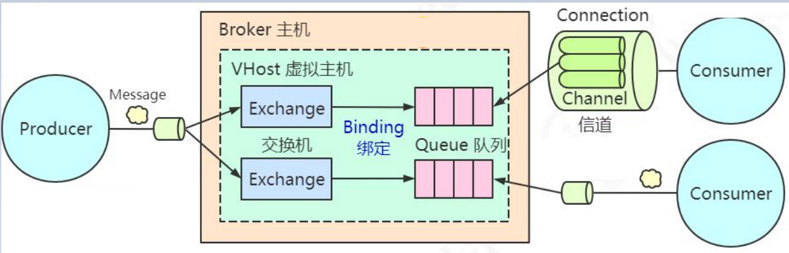

# 微服务

微服务：是指**按服务粒度**将**业务的核心模块独立出来**，形成**若干可复用、解耦合的服务**。每种应用程序都在自己的进程中运行，并与轻量级机制（通常是HTTP资源API）进行通信。这些服务是围绕业务功能构建的，可以通过全自动部署机制独立部署。这些服务的集中管理最少，可以用不同的编程语言编写，并使用不同的数据存储技术。

SOA（面向服务的架构）：面向服务编程，是服务的开始。而微服务强调的是服务的粒度。

Spring Cloud是以SpringBoot为框架的微服务应用的集合。它利用 Spring Boot 的开发便利性，巧妙地简化了分布式系统基础设施的开发，如服务注册、服务发现、配置中心、消息总线、负载均衡、断路器、数据监控等，这些都可以用 Spring Boot 的开发风格做到一键启动和部署。


> 分布式的两个条件：服务之间远程通信
>
> 集群：高可用（防止单点故障）、提高性能

注册中心：服务地址的管理

服务动态感知（上线、下线、恢复、扩容）

配置中心：管理数据库配置、常量配置、线程池大小、服务降级开关、阈值（限流阈值、线程池阈值）、密钥等。

API网关：统一授权、日志的收集、权限认证、限流、熔断。（filter、route）


# SpringBoot

## 为什么用它

基于Spring，对配置进行轻量化。

没有SpringBoot时，用springMVC构建项目

1. 创建项目结构（maven/gradle）
2. spring依赖，相关技术栈用到的依赖
3. 配置web.xml，DispatcherServlet.xml
4. 发布到容器

思考将这些提取成**通用模板，脚手架工程**。于是就诞生了springboot。


SpringBoot

> 约定优于配置理念下的产物。
>
> 按约定编程，是一种软件设计范式，旨在减少软件开发人员需做决定的数量，获得简单的好处，而又不是灵活性。约定好一些定义，默认按照这样的定义去加载。除非是这些默认的定义的无法满足，才会去写配置。约定也可以看做是一种规范，大家都遵守这样的规范，便于可读和维护。
> 如：spring-boot-starter-web，默认就已经把相关的配置和jar包全部已经整合好了，可以快速的构建web项目。
>
> 体现：
>
> spring-boot-starter-web默认支持tomcat容器，可选容器有tomcat、jetty、undertow。
>
> - 只要依赖了spring-boot-starter-web的jar就会自动内置一个Tomcat容器
> - 默认的项目结构
> - 默认的配置文件application.properties/yml
> - starter启动依赖，如果是webstarter则默认构建一个spring MVC的应用


## SpringBoot特性

> - EnableAutoConfiguration 自动装配
> - Starter 启动依赖，依赖于自动装配技术
> - Actuator 监控，提供了一些Endpoint、http、jmx形式去访问，health信息、metric信息
> - Spring Boot CL（命令行操作的功能，groovy脚本）


**springboot特性实现依赖的主要注解演化**

Spring3.x版本

> @Confignation
>
> 去xml化，核心是把bean对象以更加便捷的方式注入到IOC容器中。能够代替用xml配置实现的功能。
>
> @Import 替代xml中impart标签

> @Enable
>
> 模块驱动，启动一个模块，把相关组件的bean自动装配到IOC容器中。（比如定时任务模块的加上EnableSchedule注解就会将定时任务相关注解扫描装配到IOC容器，就不用手动配置了，之前这种是需要在xml中配置的）
>
> 支持自定义EnableXX

spring4.X

> @Condition
>
> 在某个条件下装载

spring5.X

> @Indexed
>
> 在性能上做的优化

## 核心原理——自动装配

要达到开箱即用的效果，就需要把相关bean自动装配到IOC容器中，spring只是个IOC容器，得通过一定的方式将组件动态的自动装配到IOC容器中才可达到引入组件之后即可使用（开箱即用）。

如何实现批量扫描？

### 动态bean的装载：

> ImportSelector：DeferredImportSelector
>
> Registator：ImportBeanDefinitionRegistrar

通过实现ImportSelector接口，在重新的方法中写需要导入的配置类或bean的getName()（动态装载），然后返回该字符串数组。

```java
public class MyDefineImportSelector implements ImportSelector{
    @Override
    public String[] selectImports(AnnotationMetadata importingClassMetadata) {
        //动态导入bean, 告诉了Spring  ， 两个配置类在哪里

        //TODO 在这里去加载所有的配置类就行？
        // 通过某种机制去完成指定路径的配置类的扫描就行？
        //package.class.classname
        return new String[]{MySqlSessionFactory.class.getName(), RedisConfiguration.class.getName()};
    }
}
```

这儿用ComponentScan(basePackage)不能实现，因为并不知道配置类在哪儿。用Import是因为有这个api动态加载bean（动态读取配置后加载），而ComponentScan不能动态加载。

标准规范：扫描classpath:MATA-INF/spring.factories文件

```c
org.springframework.boot.autoconfigure.EnableAutoConfiguration=\
  配置类全路径
```


通过扫描该文件得到配置信息，在加载过程通过SpringFactoriesLoader来加载。

SpringFactoriesLoader是一种SPI机制的思想。

看源码类：SpringBootApplication -> EnableAutoConfiguration -> AutoConfigurationImportSelector


### SPI机制

Service provider interface

满足以下条件：

- 在classpath目录下创建一个META-INF/services目录
- 在该目录下创建一个扩展点的全路径名
  - 文件中添加这个扩展点的实现（在扫描时通过该全路径名就能找到里面有那些扩展点）
  - 文件编码格式是UTF-8
- 使用时用ServiceLoader去进行加载


### 条件控制

对于官方的starter组件

- 官方包 spring-boot-starter-xxx
- 第三方包 xxx-spring-boot-starter

对于官方包的starter中的配置文件在spring-boot-autoconfigure中，没有在单独的starter配置文件中。官方包这种配置是一种条件触发（ConditionXXX）

条件装配有两种表现方式：

1. 加注解指定，内容是 `ConditionOnClass(XX.class)` 表示本类要满足XX.class存在的情况下再加载本类
2. 通过spring-autoconfigure-metadata.properties配置文件指定，内容是：`配置类全路径.ConditionalOnClass=XXX` 表示本配置类要满足XXX存在的情况下再加载本类


### springboot处理流程

> 有一个实现了ImportSelector接口的类专门处理spring.factories中的配置信息，动态将bean加载到容器中，通过该配置信息将starter组件注册到IOC容器。其中用到了SPI机制的思想，另外官方的starter和三方的starter有一定区别，官方的配置信息统一在一个地方指定的，这儿还用到了条件控制；三方的配置信息就写在该spring.factories中的。

几个关键词

> - ImportSelector（动态配置类）
> - SpringFactoriesLoader（获取spring/factories配置文件内容）
> - @Configuration（配置类）
> - @Conditional（条件控制）


## 编写Starter

### 编写要点

> - 配置类（@Configure和@Bean注解）
>
> - MATA-INF/spring.factories配置文件，里面指定了配置类的路径
>
>   若有需要定义的配置文件（如定义Redis的IP地址、端口等）配置文件提示可以用`spring-boot-configuration-processor`组件来实现（需要在MATA-INF/additional-spring-configuration-metadata.json文件中添加内容）

### 编写过程

#### 目标

编写基于redisson的自定义连接Redis的组件

#### 代码

##### 依赖

```xml
<dependencies>
    <dependency>
      <groupId>org.springframework.boot</groupId>
      <artifactId>spring-boot-starter</artifactId>
      <version>2.3.1.RELEASE</version>
      <!-- 是否传递依赖 -->
      <optional>true</optional>
    </dependency>
    <!-- redisson -->
    <dependency>
      <groupId>org.redisson</groupId>
      <artifactId>redisson</artifactId>
      <version>3.13.1</version>
    </dependency>
    <!-- 用于配置文件提示 -->
    <dependency>
        <groupId>org.springframework.boot</groupId>
        <artifactId>spring-boot-configuration-processor</artifactId>
        <version>2.3.1.RELEASE</version>
    </dependency>
  </dependencies>
```

##### 类

###### 实体

```java
/**
 * 配置属性实体类
 **/
@ConfigurationProperties(prefix = "my.redisson")
@Data
public class RedissonProperties {
    private String host="localhost";
    private int port=6379;
    private int timeout;
    private boolean ssl;
}
```

###### 配置类

```java
// 条件装配
@ConditionalOnClass(Redisson.class)
// 模块驱动，加载属性配置，且注入的属性时RedissonProperties时启用，因为下面注册本bean依赖这个属性
@EnableConfigurationProperties(RedissonProperties.class)
// 声明为配置类
@Configuration
public class RedissonAutoConfiguration {

    @Bean
    RedissonClient redissonClient(RedissonProperties redissonProperties){
        Config config=new Config();
        String prefix="redis://";
        if(redissonProperties.isSsl()){
            prefix="rediss://";
        }
        config.useSingleServer().
                setAddress(prefix+redissonProperties.getHost()+":"+redissonProperties.getPort()).
                setConnectTimeout(redissonProperties.getTimeout());

        return Redisson.create(config);
    }
}
```

###### 配置文件

META-INF/spring.factories文件内容

```xml
org.springframework.boot.autoconfigure.EnableAutoConfiguration=\
  com.my.redisson.RedissonAutoConfiguration
```

additional-spring-configuration-metadata.json文件内容（配置提示类）

```json
{
  "properties": [
    {
      "name": "my.redisson.host",
      "type": "java.lang.String",
      "description": "redis的服务器地址",
      "defaultValue": "localhost"
    },{
      "name": "my.redisson.port",
      "type": "java.lang.Integer",
      "description": "redis服务器的端口",
      "defaultValue": 6379
    }
  ]
}
```

##### 结语

这样就编写好了，在使用时按照常规的starter使用即可。


## [Actualor](https://docs.spring.io/spring-boot/docs/current/reference/html/production-ready-features.html#production-ready-endpoints)

springboot中的应用监控机制

依赖

```xml
<dependency>
  <groupId>org.springframework.boot</groupId>
  <artifactId>spring-boot-starter-actuator</artifactId>
</dependency>
```

两种形态的监控

> - http（web）
> - jmx

#### JMX

> JXM全称是 Java Management Extensions（Java管理扩展），提供了对Java应用程序和JVM的监控及管理。通过JMX可以监控
>
> 1. 服务器中的各种资源的使用情况、CPU、内存
> 2. JVM内存使用情况、线程使用情况

SpringBoot的系列监控信息可以发布到Prometheus+Grafana中


#### Prometheus

开源的监控系统

##### 安装

> 1. 下载Prometheus，https://github.com/prometheus/prometheus/releases
>
> 2. tar -zxvf prometheus-2.19.1.linux-amd64
>
> 3. 修改prometheus.yml，增加需要监控的应用节点
>
>    ```yml
>    scrape_configs:
>     # The job name is added as a label `job=<job_name>` to any timeseries
>    scraped from this config.
>    - job_name: 'prometheus'
>      # metrics_path defaults to '/metrics'
>      # scheme defaults to 'http'.
>     static_configs:
>     - targets: ['localhost:9090']
>    - job_name: 'spring-actuator'
>     metrics_path: '/actuator/prometheus'
>     scrape_interval: 5s
>     static_configs:
>     - targets: ['192.168.8.174:8080']  #需要监控的应用节点
>    ```
>
>    参数解释：	
>
>    1. job_name：任务名称
>    2. metrics_path： 指标路径
>    3. targets：实例地址/项目地址，可配置多个
>    4. scrape_interval： 多久采集一次
>    5. scrape_timeout： 采集超时时间
>
> 4. 执行 ./prometheus --config.file=prometheus.yml 启动prometheus应用，访问：http://HOST_IP:9090
>
> 5. nohup prometheus &

##### SpringBoot集成

```xml
<dependency>
  <groupId>io.micrometer</groupId>
  <artifactId>micrometer-registry-prometheus</artifactId>
</dependency>
```

增加上述的依赖，Spring Boot会自动配置一个 PrometheusMeterRegistry 和CollectorRegistry 来收集和输出格式化的metrics数据，使得Prometheus服务器可以爬取。所有应用的metrics数据是根据一个叫 http://localhost:8762/actuator/prometheus 的endpoint来设置是否可用。

```c
prometheus: {
 href: "http://localhost:8762/actuator/prometheus",
 templated: false
}
```

Prometheus服务器可以周期性的爬取这个endpoint来获取metrics数据。


#### Grafana

##### 安装

> 下载Grafana:https://grafana.com/grafana/download
> 启动Grafana， service grafana-server start
> 访问Grafana , http://localhost:3000 , 默认的帐号密码 admin/admin


##### 配置

> 菜单选择 Configuration -> Data Source -> Add Data Source
> 配置Prometheus作为数据源。
>
> 
>
> Grafana的面板配置过程还是比较繁琐的，如果我们不想自己去配置，那我们可以去Grafana官网上去下载一个dashboard。
> 推荐： https://grafana.com/grafana/dashboards/6756
> 下载完成后，在"+"这个菜单中，点击"import"，导入下载好的json文件即可。

##### 根据ID进行load

> 模板地址：https://grafana.com/dashboards
> 在搜索框中搜索 Spring Boot 会检索出相关的模板，选择一个自己喜欢。
> 这里可以采用: https://grafana.com/grafana/dashboards/10280 这个，看起来比较清晰
> 复制dashboard的ID号


# 分布式概要

分片

对存储和计算分片。存储分片有mycat、sharding-jdbc框架


为了满足高可靠性，就得有“冗余（replication）副本机制”，但又引出了“副本一致性问题”，于是又有很多理论和算法来保证副本一致性。


# 消息队列


### 简介

以前计算机传递数据时通信都是点对点的，而且要实现相同的协议（如HTTP、TCP、WebService），思考能不能发明一种专门用来通信的中间件，就像主板一样将不同的软件集成起来。

消息队列，又称消息中间件。用高效可靠的消息传递机制进行与平台无关的数据交流，并基于数据通信来进行分布式系统的集成。


#### 特点

1. 是一个独立运行的服务。发送和接收消息需要跟服务器建立连接。
2. 采用队列作为数据结构，先进先出。
3. 有发布订阅模型，消费者可以获取自己需要的消息。


#### 场景优势

1. 异步通信：比如公司中各个业务系统与数据中心间的数据同步就需要用异步通信的方式来实现。以及银行转账，相当于各个系统间的异步调用操作同样需要异步通信。

2. 系统解耦：在分布式系统中，一个业务流程涉及到多个系统时他们之间就会形成一个依赖关系（如：订单系统依赖于：库存系统、支付系统、通知系统）。订单系统中一个订票成功的操作，对于其他系统都会有相应的动作，而其他系统之间的动作没有直接的依赖关系和先后顺序。这种情况就可以用并行方式去处理，可以引入多线程处理，但这种方式会让有依赖关系的系统间耦合度很高，后期如果增减业务系统就必定会调整代码。如果用MQ则只需要修改MQ相关配置即可。

3. 流量削锋：防止突然大量流量冲过来业务服务器处理不了而宕机。引入MQ后，可以把流量承接下来，转换成MQ消息发送到消息队列服务器上排队，业务层服务器根据自己的消费速率处理这些消息即可。（若需要处理更快，增加消费者即可。就像双11时会多加服务器）
4. 广播通信：一对多的通信，和上面系统解耦差不多的例子。

总结起来:

1. 对于数据量大或者处理耗时长的操作，引入MQ实现异步通信，减少客户端的等待，提升响应速度，优化客户体验。
2. 对于改动影响大的系统之间, 引入MQ解耦，减少系统之间的直接依
   赖，提升可维护性和可扩展性。
3. 对于会出现瞬间的流量峰值的系统，引入MQ实现流量削峰,达到保
   护应用和数据库的目的。
4. 一对多的广播通信。


#### 带来的问题

1. 运维成本增加：用MQ就必须要分配资源部署MQ，还要保证它时刻正常运行。
2. 系统可用性降低：正常情况MQ都是由很高的可靠性和低延迟，但一旦网络或MQ服务器出现问题，就会严重影响业务。
3. 系统复杂性增加：要考虑消息丢失、消息重复消费的问题。一旦消息没有被正确地消费，就会带来数据一致性问题。


#### AMQP协议

初期有很多MQ产品，但每个厂商的的产品都是孤立的都有自己的技术壁垒。2001年sun公司发布了JMS规范，想要各大厂商的MQ在上面统一包装一层Java的规范，只需要针对API编程就可以了。但JMS只适用于Java语言，它和语言绑定的。

2006年几个大公司发布了AMQP（Advanced Message Queuing Protocol）规范，本质上是进程间传递异步消息的网络协议，它是跨语言跨平台的，工作于应用层的协议。


### RabbitMQ


RabbitMQ和Spring家族属于同一家公司: Pivotal。它除了AMQP之外，RabbitMQ 支持多种协议，STOMP、MQTT、 HTTP、WebSockets。它使用Erlang开发的，天生适合分布式和高并发。


#### 工作模型

> RabbitMQ实现了AMQP协议,所以RabbitMQ的工作模型也是基于AMQP。




##### Broker

> MQ服务器。使用RabbitMQ收发消息，必须有一个服务器，这个服务器就叫做Broker（代理/中介）。


##### Connection

> 生产者和消费者与服务器建立的连接，这是个TCP长连接。


##### Channel

> 虚拟连接，称为“通道”或“消息信道”。直接创建和释放TCP长连接会造成很大性能损耗，使用Channel可以保持在TCP的长连接里面去创建和释放Channel，可减少资源的消耗。
>
> 不同的Channel是相互隔离的，每个Channel都有自己的编号。另外，Channel是RabbitMQ原生API里面的最重要的编程接口，定义的交换机、队列、绑定关系、发送消息、消费消息，调用的都是Channel接口中的方法。


##### Queue

> 存储消息的对象。实际上RabbitMQ是用数据库（Mnesia数据库）来存储消息的。生产者和消费者通过这个队列作为纽带存取数据。


##### Consumer

> 支持2种模式将消息给消费者。
>
> Pull：对应的方法是basicGet，需要消费者主动去服务器拿消息。每隔一段时间获取一次消息，实时性会降低，但好处是可以根据自己的消费能力决定获取消息的频率。
>
> Push：对应的方法是basicConsume，只要生产者发送消息到服务器就马上推送给消费者，实时性很高，但若消费不过来会造成消息积压。（spring AMQP就是push方式）
>
> RabbitMQ中pull和push都有实现，kafka和RocketMQ只有pull。
>
> 由于队列有FIFO特性，只有确定前一条消费被消费者接受后Broker才会把这条消息从数据库删除，继续投递下一条消息。
>
> 消费者和队列之间是多对多关系，但生产环境中一般建议一个消费者只处理一个队列的消息。若需要提升消息处理能力可以增加消费者。


##### Exchange

> 消息路由。场景：若把一条消息发送给多个队列，被多个消费者消费，就意味着生产者必须调用多次basicPublish()依次发送给多个队列，若出现成千上万队列则生产者压力很大。于是就设计了消息路由。将消息发送给Exchange，由Exchange根据规则将消息分发到队列。
>
> 


计划：

整理springboot笔记（周一上午）、学习MQ和整理MQ笔记（r周二、k周四、周五看activeMQ在公司项目中的应用）

在复习时，每个知识点都争取结合在项目中的应用来记忆（优先说公司中参与过的项目，再是学习到的应用例子）


时间够可了解：分库分表；spring cloud-feign、授权登录、全局id；spring cloud alibaba-分布式授权OAuth2.0