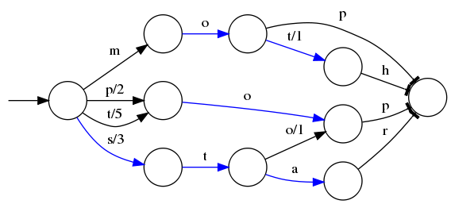
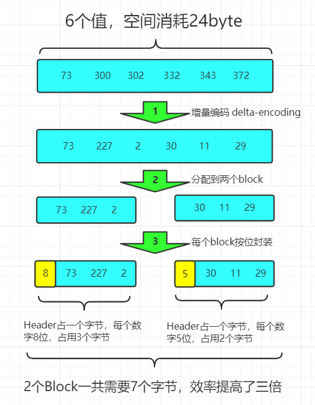
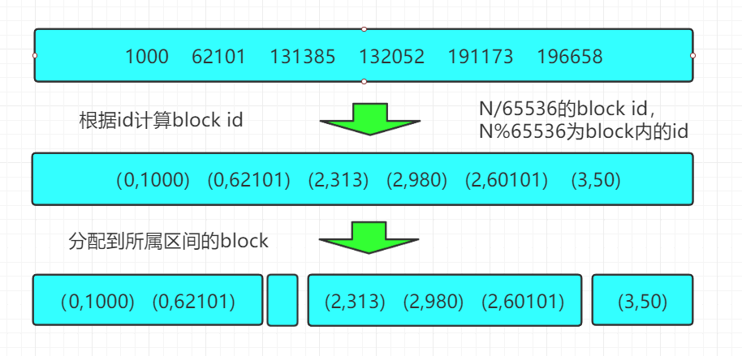
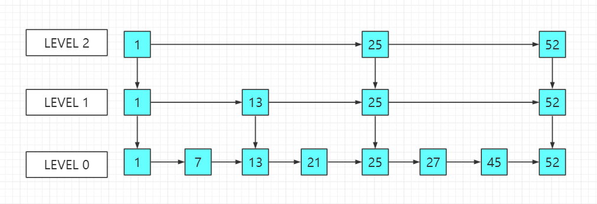

### 为什么需要搜索引擎？

> 数据量太大时，从数据库搜索满足不了业务需求。比如淘宝上搜索商品、百度上搜资料等。

对搜索内容分词，中文总共约27w分词。

lucene 单实例的全文搜索引擎，不支持集群

elasticSearch 基于Lucene的分布式全文搜索引擎

Luecene单机的，如果是分布式场景可以尝试做集群，java程序中控制如准备3台机器，取模为0放第1台机器，取模为1放第二台机器。做搜索时，依次从每台机器上搜索。。。后期扩展时还需要改变java业务代码，而且之前存放的数据还得重新做，另外数据备份和单点故障等常见问题处理起来会比较繁琐。

ES中思想是，将每个ES实例都可看成对Luecene的封装，同一个ES集群中数据互通（即客户端通过任何一个ES实例都能搜索到同集群中存储的数据，集群中ES内部会进行交互），属于P2P(peer to peer)架构。另外ES支持配置备份策略，不用手动搞

## [ElasticSearch](https://www.elastic.co/cn/elasticsearch/)

### 功能

**分布式的搜索引擎和数据分析引擎**

> 1. 搜索：互联网搜索、电商网站站内搜索
> 2. 数据分析：电商网站最近热门商品、舆情分析

**全文检索、结构化检索、日志数据分析**

**对海量数据进行近实时的处理**

> 近实时：数据库上亿条数据查询，搜索一次耗时几个小时， 是批处理(batch-processing)。而es只需秒级即可查询海量数据，所以叫近实时（秒级）。

### 特点

> 1. 可拓展性：大型分布式集群(数百台服务器)技术，处理PB级数据，大公司可以使用。小公司数据量小，也可以部署在单机。大数据领域使用广泛。
> 2. 技术整合：将全文检索、数据分析、分布式相关技术整合在一起lucene (全文检索)，商用的数据分析软件(BI软件)，分布式数据库(mycat)。
> 3. 部署简单：开箱即用，很多默认配置不需关心，解压完成直接运行即可。拓展时，只需多部署几个实例即可，负载均衡、分片迁移集群内部自己实施。
> 4. 接口简单：使用restful api进行交互， 跨语言。
> 5. 功能强大：Elasticsearch作为传统数据库的一个补充，提供了数据库所不不能提供的很多功能，如全文检索，同义词处理，相关度排名。

### 核心概念

1. NRT(Near Realtime) 近实时：写数据时过1秒才会被搜索到（内部分词、索引录入），读秒级（搜索和分析数据秒出结果）

2. 集群Cluster：同一网络下集群名一样的ES自动组成集群

3. Node：节点，每个es实例称为一个节点，节点名自动分配也可手动分配

4. index：索引，存储有相似结构的文档数据

   > 索引创建规则：仅限小写字母，不能包含\ / * ? " < > | # 空格等特殊符号；不能以- _ + 开头；不能超过255个字节；7.0版本开始不再包含冒号

5. Document：文档，es中最小的数据单元，相当于一条数据库数据（通常以json格式显示），多个文档存储于一个索引（index）中

6. field：字段，相当于数据表的列，定义文档中的字段

7. type：（7.7之后被去除了）

8. shard：分片

   > index数据过大时，将index里面的数据，分为多个shard，分布式的存储在各个服务器上面。可以支持海量数据和高并发,提升性能和吞吐量，充分利用多台机器的cpu。

9. replica：副本

   > 如果宕机，index的一 个分片没有，会导致此index不能搜索。所以,为了保证数据的安全，我们会将每个index的分片进行备份。能正常提供查询和插入的分片我们叫做主分片(primary shard)，其余的我们就管他们叫做备份的分片(replica shard)。

### es与mysql核心概念对比

| 关系性数据库（如mysql） | 非关系数据库(es)    |
| ----------------------- | ------------------- |
| 数据库Database          | 索引Index           |
| 表Table                 | 索引ndex (原为Type) |
| 数据行Row               | 文档Document        |
| 数据列Column            | 字段Field           |
| 约束Schema              | 映射Mapping         |

### 核心原理

#### 文件存储

ES是文档型数据库，1条数据就是1个文档，采用Json作为文档序列化的格式。

树形结构，插入和删除不用移动全部数据，兼顾增删查的效率（）

#### 索引建立

##### Term

分类索引（会为每个字段都建立，它的名字就是字段名，存储的值就是字段值）

##### Posting List

倒排索引（建立分词与文档之间的关系，存放的是int数组，存储的所有符合某个term的文档id）

##### Term Dictionary

词典，为了快速找到某个term名称，将所有term排序通过二分查找

##### Term Index

词典索引，B树通过减少寻道数提高查询性能，ES想将词典放内存中查询，但若词典很大放内存则不现实，于是就有了词典索引。就像字典中a开头的分别在某个页范围。存储成一棵树的形式，树中是term名称的一些前缀和block之间的映射关系，再结合FST(Finish State Transducers)压缩技术。查询时通过term index可以快速定位到term dictionary的block位置后再从这个位置往后查询。

###### block（块）

> 文件系统中逐个扇区挨着读太慢了，于是有了block概念，逐个block块挨着读高效很多，block是文件存取的最小单位。
>
> Selector（扇区）：磁盘的最小存储单元。
>
> 每个扇区（Selector）存储512字节，一个块一般是8个扇区，占4KB。
>
> 比如一个1B的文件，实际会占用4KB的空间。就是因为block是最小存取单元，存数据最少得占用4KB。

###### FST(Finish State Transducers)

> 有穷状态转换器或者有限状态传感器，这儿用来将字节序列映射到block，可以极致压缩数据。
>
> 比如：将mop, moth, pop, star, stop and top(term index里的term前缀)映射到序号：0，1，2，3，4，5(term dictionary的block位置)，最简单的做法就是定义Map<string, integer>，用FST可极致利用内存，构建下图。
>
> 
>
> ⭕ 表示一种状态；
> -->表示状态的变化过程；
> 上面的字母/数字表示状态变化和权重；
> 将单词分成单个字母通过⭕ 和-->表示出来，0权重不显示。如果⭕ 后面出现分支，就标记权重，最后整条路径上的权重加起来就是这个单词对应的序号。
>
> 但是这个树并不会包含所有的term名称，而是很多term名称的前缀，通过这些前缀快速定位到该前缀所属磁盘的block，再从这个block去找文档列表。为了压缩词典的空间，实际上每个block都只会保存block内不同的部分，比如 mop 和 moth 在同一个以 mo 开头的block，那么在对应的词典里面只会保存 p 和 th ，这样空间利用率提高了一倍。
>
> 使用FST在内存消耗上面要比远比 SortedMap 少，但在查询时需要更多的CPU资源。维基百科的索引就是使用的FST，只使用了69MB的空间，花了大约8秒钟，就为接近一千万个词条建立了索引，使用的堆空间不到256MB。

###### ES中的模糊查询

> 根据搜索词和字段之间的**编辑距离**来判断是否匹配。在ES4.0之前，模糊查询会先**让检索词和所有的term计算编辑距离筛选出所有编辑距离内的字段**；在ES4.0之后，采用了由Robert开发的，**直接通过有限状态转换器就可以搜索指定编辑距离内的单词**的方法，将模糊查询的效率提高了超过100倍。

##### 压缩技巧之索引帧（Frame Of Reference）

压缩存储Posting List。若不采用它，当有1亿文档，每个文档10个字段，保存这posting list就需要消耗10亿个int空间，磁盘消耗非常大。

为了方便压缩，ES要求**posting list是有序的**，所有id都会进行dalta-encoding（刀塔编码），可理解为**增量编码**。

如：现在有id列表 [73, 300, 302, 332, 343, 372] ，**转化成每一个id相对于前一个id的增量值**（第一个id的前一个id默认是0，增量就是它自己）列表是 [73, 227, 2, 30, 11, 29] 。在这个新的列表里面，所有的id都是小于255的，所以每个id只需要一个字节存储。
实际上ES会做的更加精细，它会把所有的文档分成很多个block，**每个block正好包含256个文档**，然后单独对每个文档进行增量编码，**计算出存储这个block里面所有文档最多需要多少位来保存每个id**，并把这个**位数作为头信息（header）放在每个block 的前面**。

> 这种压缩算法的原理就是通过增量，将原来的大数变成小数仅存储增量值，再精打细算按bit排好队，最后通过字节存储，而不是直接使用int(4个字节)来存储。压缩过程如下所示：

**返回结果时**，其实也并不需要把所有的数据直接解压后全部返回，可以直接返回一个迭代器 iterator ，直接通过迭代器的 next 方法逐一取出压缩的id，这样也可以极大的节省计算和内存开销。
通过以上的方式可以极大的节省posting list的空间消耗，提高查询性能。不过ES为了提高filter过滤器查询的性能，还做了更多的工作，那就是缓存。

##### 缓存技巧之咆哮位图(Roaring Bitmaps)

ES会缓存频率比较高的filter查询，其中的原理也比较简单，即生成 (fitler, segment数据空间) 和id列表的映射，filter放到内存中，映射的posting list在磁盘中。filter缓存使用了roaring bitmap的数据结构，在查询的时候相对于上面的Frame of Reference方式CPU消耗要小，**查询效率更高，代价就是需要的存储空间（磁盘）更多**。

###### 传统Bitmap

> Bitmap是一种数据结构，假设有某个posting list：
> [1,3,4,7,10] 对应的bitmap就是：[1,0,1,1,0,0,1,0,0,1]，用0/1表示某个值是否存在，比如10这个值就对应第10位，对应的bit值是1，这样用一个字节就可以代表8个文档id，旧版本(5.0之前)的Lucene就是用这样的方式来压缩的。
>
> 但这样的压缩方式仍然不够高效，如果有1亿个文档，那么需要12.5MB的存储空间，这仅仅是对应一个索引字段(我们往往会有很多个索引字段)。于是有人想出了Roaring bitmaps这样更高效的数据结构。
> Bitmap的缺点是存储空间随着文档个数线性增长，Roaring bitmaps需要打破这个魔咒就一定要用到某些指数特性

###### Roaring Bitmap

> 1. Roaring Bitmap首先会**根据每个id的高16位分配到对应的block**，比如第一个block里面id应该都是在0到65535之间，第二个block的id在65536和131071之间
>
> 2. block中的数据根据id数量分成两类，**数量小于4096，就是用short数组保存**；**数量大于等于4096，就使用bitmap保存**。
> 在每一个block里面，一个数字只需要2个字节(16位)来保存就行了，block id和文档的id都用short保存。
>
> **4096分界线**：因为当数量小于4096的时候，若用bitmap则需要8KB的空间（每个值占2B，4096个则占2*4096=8KB；65535对应32位？？？没懂8KB怎么算来的），而使用2个字节的数组空间消耗就要少一点。比如只有2048个值，每个值2字节，一共只需要4KB就能保存，但是bitmap需要8KB。
>
> 

> 注意：一个Lucene索引（也就是一个elasticsearch分片）不能处理多于21亿篇文档，或者多于2740亿的唯一词条。但达到这个极限之前，我们可能就没有足够的磁盘空间了！

##### 倒排索引如何做联合索引

利用**跳表**(Skip list)的数据结构**快速做“与”运算**，或者利用**bitset按位“与”**

###### 跳表

> 将一个有序链表level0，挑出其中几个元素到level1及level2，每个level越往上，选出来的指针元素越少，查找时依次从高level往低查找。比如查找45，先找到level2的25，最后找到45，查找效率与二叉树的相当。

使用跳表，对最短的posting list中的每个id，逐个在另外两个posting list中查找看是否存在，最后得到交集的结果。

###### bitset

bitset（基于bitMap），就很直观了，直接按位与，得到的结果就是最后的交集。

> 注意，这是我们倒排索引实现联合索引的方式，不是我们ES就是这样操作的。

### 思考总结

#### ES的索引思路

将磁盘里的东西尽量搬进内存，减少磁盘随机读取次数(同时也利用磁盘顺序读特性)，结合各种奇技淫巧的压缩算法，用及其苛刻的态度使用内存。

#### ES索引注意点

> - 不需要索引的字段，一定要明确定义出来，因为默认是自动建索引的
> - 对于String类型的字段，不需要analysis（分词）的也需要明确定义出来，因为默认也是会analysis的
> - 选择有规律的ID很重要，随机性太大的ID(比如java的UUID)不利于查询

### 拓展

#### 磁盘物理结构

(1) 盘片：硬盘的盘体由多个盘片叠在一起构成。
在硬盘出厂时，由硬盘生产商完成了低级格式化(物理格式化)，作用是将空白的盘片(Platter)划分为一个
个同圆心、不同半径的磁道(Track)，还将磁道划分为若干个扇区(Sector)，每个扇区可存储128×2的N次
方（N=0.1.2.3）字节信息，默认每个扇区的大小为512字节。通常使用者无需再进行低级格式化操作。

(2) 磁头：每张盘片的正反两面各有一个磁头。
(3) 主轴：所有磁片都由主轴电机带动旋转。
(4) 控制集成电路板：复杂！上面还有ROM（内有软件系统）、Cache等。

#### 磁盘如何完成单次IO操作

(1) 寻道
当控制器对磁盘发出一个IO操作命令的时候，磁盘的驱动臂(Actuator Arm)带动磁头(Head)离开着陆区
(Landing Zone，位于内圈没有数据的区域)，移动到要操作的初始数据块所在的磁道(Track)的正上方，
这个过程被称为寻道(Seeking)，对应消耗的时间被称为寻道时间(Seek Time)；

(2) 旋转延迟
找到对应磁道还不能马上读取数据，这时候磁头要等到磁盘盘片(Platter)旋转到初始数据块所在的扇区
(Sector)落在读写磁头正下方之后才能开始读取数据，在这个等待盘片旋转到可操作扇区的过程中消耗
的时间称为旋转延时(Rotational Delay)；

(3) 数据传送
接下来就随着盘片的旋转，磁头不断的读/写相应的数据块，直到完成这次IO所需要操作的全部数据，
这个过程称为数据传送(Data Transfer)，对应的时间称为传送时间(Transfer Time)。完成这三个步骤之
后单次IO操作也就完成了。

根据磁盘单次IO操作的过程，可以发现：
单次IO时间 = 寻道时间 + 旋转延迟 + 传送时间

#### 数据库中的磁盘读写

1. 随机访问和连续访问
  (1) 随机访问(Random Access)
  指的是本次IO所给出的扇区地址和上次IO给出扇区地址相差比较大，这样的话磁头在两次IO操作之间需
  要作比较大的移动动作才能重新开始读/写数据。也就是遍历的东西比较多。

  (2) 连续访问(Sequential Access)
  相反的，如果当次IO给出的扇区地址与上次IO结束的扇区地址一致或者是接近的话，那磁头就能很快的
  开始这次IO操作，这样的多个IO操作称为连续访问。也就是遍历的东西比较少。

  (3) 以SQL Server数据库为例
  数据文件，SQL Server统一区上的对象，是以extent(8*8k)为单位进行空间分配的，数据存放是很随机
  的，哪个数据页有空间，就写在哪里，除非通过文件组给每个表预分配足够大的、单独使用的文件，否
  则不能保证数据的连续性，通常为随机访问。
  另外哪怕聚集索引表，也只是逻辑上的连续，并不是物理上。
  日志文件，由于有VLF的存在，日志的读写理论上为连续访问，但如果日志文件设置为自动增长，且增
  量不大，VLF就会很多很小，那么就也并不是严格的连续访问了。

2. 顺序IO和并发IO
  (1) 顺序IO模式(Queue Mode)
  磁盘控制器可能会一次对磁盘组发出一连串的IO命令，如果磁盘组一次只能执行一个IO命令，称为顺序
  IO；

  (2) 并发IO模式(Burst Mode)
  当磁盘组能同时执行多个IO命令时，称为并发IO。并发IO只能发生在由多个磁盘组成的磁盘组上，单块
  磁盘只能一次处理一个IO命令。

  (3) 以SQL Server数据库为例
  有的时候，尽管磁盘的IOPS(Disk Transfers/sec)还没有太大，但是发现数据库出现IO等待，为什么？通
  常是因为有了磁盘请求队列，有过多的IO请求堆积。
  SSD是没有所谓的盘片的所以省去了寻道时间以及旋转延迟的，所以使用起来时间消耗较小。但
  是他还是存在顺序读以及随机读。
  所以，当我们的IO请求次数过多的时候，我们就会想到采用多路查找树，也就是我们的B树，或者他的
  优化版，B+树。

B Tree/B+Tree的结构在存储数据时，将多个值作为一个数组通过连续的区间存放，通过一次寻道读取多个数据，同时降低树的高度。

分片和副本：面试重点

多个分片之间可以并行，多加个分片意味着处理性能成倍提升。

副本机制是为了数据安全性，副本与主分片数据一致。