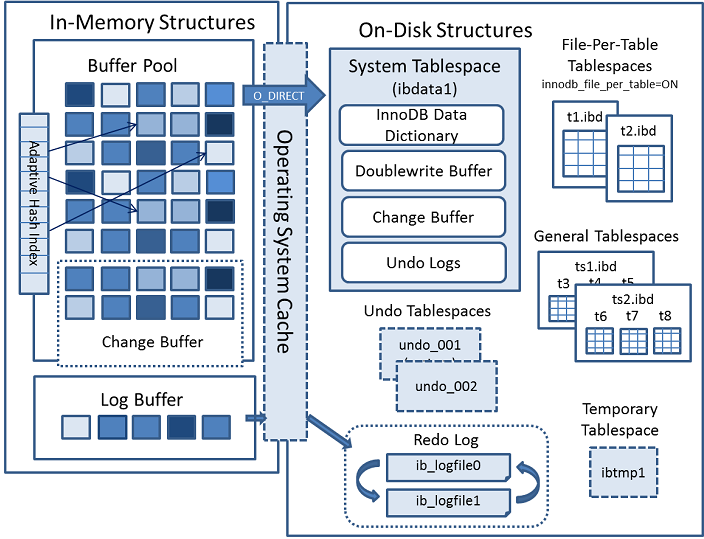
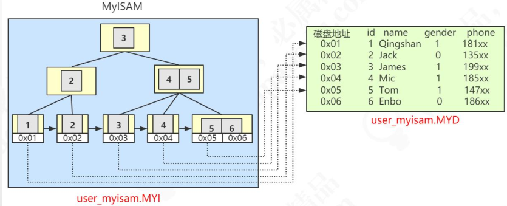

MySQL 中文文档：https://www.mysqlzh.com/

官方文档：https://dev.mysql.com/doc/refman/5.7/en/sql-statements.html

SQL函数官方API：https://dev.mysql.com/doc/refman/5.7/en/sql-function-reference.html

# MySQL架构与SQL执行流程

### 查询SQL是如何执行的


##### 1.1连接

> 在开发系统跟三方系统对接时必须清楚的两件事：
>
> 1. 通信协议，比如用的HTTP、WebService
> 2. 消息格式，比如用的xml、json、定长格式（报文头长度多少，包含什么内容，每个字段的详细含义等）
>
> 
>
> MySQL服务默认监听3306端口，客户端连接服务端的方式有多种。可以是**同步**、**异步**的**通信类型**；**长连接**（减少创建销毁资源，连接池中会使用长连接）、**短连接**（操作完毕后就close）的**连接方式**；**TCP/IP**、**Unix Socket**的**通信协议**等，MySQL有专门处理连接的模块，连接的时候还需要验证权限。
>
> **通信类型**：
>
> 同步：它依赖于被调用方，会受限于被调用方的性能，只能做到一对一，很难做到一对多通信。
>
> 异步：可以避免阻塞等待，但不能节省SQL执行时间，而且如果异步存在并发会给服务器带来很大压力且可能导致数据混乱。所以一般不用异步方式，要用则需要用连接池管理，排队从连接池中获取而不是创建新的连接。
>
> 
>
> **通信协议**：
>
> 在Linux服务器上，连接时不指定 -h 参数，就会使用socket方式登录，它不用通过网络协议，用到服务器上的一个物理文件（/var/lib/mysql/mysql.sock）。
>
> 指定 -h 参数就会使用TCP/IP协议，使用Navicat工具、编程语言连接模块（mysql-connector-java-x.x.xx.jar）都是以TCP/IP协议连接到MySQL服务器的。
>
> ```sql
> mysql -h 192.168.2.10 -uroot -p 123456;
> ```
>
> 
>
> MySQL使用自定义的消息格式进行数据传输，可参考 https://www.cnblogs.com/songhaibin/p/13725598.html
>
> 
>
> **客户端每产生一个连接或会话，就会在服务端创建一个线程来处理**，所以可以通过查询线程数可知道当前有多少个连接。可以使用 show status 命令查询当前有多少个连接
>
> ```sql
> SHOW GLOBAL STATUS LIKE 'Thread%'
> ```
>
> | 字段              | 含义                                 |
> | ----------------- | ------------------------------------ |
> | Threads_cached    | 缓存中线程连接数                     |
> | Threads_connected | 当前打开的连接数                     |
> | Threads_created   | 为处理连接创建的线程数               |
> | Threads_running   | 非睡眠状态的连接数，通常值并发连接数 |
>
> 既然是分配线程，保持连接肯定会消耗服务端的资源，MySQL会把那些长时间不活动的（Sleep）连接自动断开。有两个阈值
>
> ```sql
> SHOW GLOBAL VARIABLES LIKE 'wait_timeout'; -- 非交互式超时时间，如jdbc程序。默认28800(s) (8h)
> SHOW GLOBAL VARIABLES LIKE 'interactive_timeout'; -- 交互式超时时间，如数据库工具。默认28800(s) (8h)
> ```
>
> 既然连接消耗资源，MySQL服务运行的最大连接数（并发数）默认是151，最大可以设置成100000
>
> ```sql
> SHOW GLOBAL VARIABLES LIKE 'max_connections';
> ```
>
> **参数级别说明**
>
> MySQL中参数（变量）分为session（当前会话）和global（全局）级别。


##### 1.2查询缓存

> MySQL内部自带了一个缓存模块，但**缓存默认关闭**（不推荐使用）。不推荐使用主要是因为MySQL自带的缓存应用场景有限，1.要求SQL语句必须一模一样（空格大小写都不会忽略）；2.表汇总任何一条数据发生变化，这张表所有缓存都会失效（不适合有数据更新的）。
>
> 所以缓存交给orm框架（如mybatis默认开启一级缓存）或者独立的缓存服务（Redis），在**MySQL8.0中查询缓存已经被移除**了。


##### 1.3语法解析和预处理

###### 1.3.1 词法解析

> 将一个完整的**SQL语句拆成一个个的单词**

###### 1.3.2 语法解析

> 语法解析会**对SQL做一些语法检查**，如单引号、括号是否闭合等。再根据MySQL定义的语法规则根据SQL语句生成一个数据结构，这个数据解析称为“解析树（select_lex）”。
>
> 
>
> 词法语法分析是一个非常基础的功能，Java 的编译器、百度搜索引擎如果要识别语句，必须也要有词法语法分析功能。
> 任何数据库的中间件，要解析SQL完成路由功能，也必须要有词法和语法分析功能，比如Mycat, Sharding-JDBC (用到了Druid Parser)。在市面。上也有很多的开源的词法解析的工具(比如LEX, Yacc)。


###### 1.3.3 预处理器

> 预处理器会检查生成的解析树，解决解析器无法解析的语义。比如，它会**检查表和列名是否存在**，检查名字和别名，保证没有歧义。
> 预处理之后得到一个新的解析树。


##### 1.4 查询优化与查询执行计划

> 查询优化器的目的是根据解析树生成不同的执行计划（execution plan），然后选择一种最优的执行计划，MySQL里面使用的是基于开销（cost）的优化器，哪种执行计划开销最小就选用哪种。
>
> ```sql
> SHOW STATUS LIKE 'Last_query_cost'; -- 查看查询开销
> ```
>
> **优化器做的事**
>
> 通过复杂的算法尽可能优化查询效率的目的，但一些与数据表结构设计有关的、部分SQL语句相关的它并不能优化。（比如没有表设计时没建索引，某些查询SQL导致有索引也不能走索引）
>
> 比如：
>
> 1. 当我们对多张表进行关联查询的时候，以哪个表的数据作为基准表。
> 2. 有多个索引可以使用的时候，选择哪个索引。
>
> 做完优化后最终把解析树变成一个**查询执行计划**（一个数据结构）。我们在SQL语句前加上 **EXPLAIN** 就可看到执行计划的信息。如果要得到详情信息，还可以用 **EXPLAIN FORMAT = json** 或者开启 optimizer trace (http://blog.itpub.net/28218939/viewspace-2658978/)


##### 1.5 存储引擎

> 官方文档：https://dev.mysql.com/doc/refman/5.7/en/storage-engines.html
>
> **基本概念**：它是用来**组织存储数据**的，不同存储引擎存储管理数据文件的方式不同，提供的特性也也不同，但为上层操作提供了相同的接口。之所以会提供不同的存储，是为了满足不同的业务需求。
>
> **默认存储引擎**：在建表时没有指定存储引擎则会使用默认的存储引擎，5.5.5之前默认的存储引擎是MyISAM，5.5.5之后默认的是InnoDB。
>
> 若所有的存储引擎都不能满足某个业务需求，那么可以自己根据官网内部手册用c语言开发一个存储引擎。
>
> 插件式存储引擎。
>
> 一个数据库中的表可以有多种不同的存储引擎
>

###### MyISAM

> **应用**：应用范围比较小，**表级锁限定了读写性能**，通常用于**只读或以读为主**的工作。（数据分析类项目）
>
> **特点**：
>
> 1. 支持表级别锁（插入和更新会锁表），不支持事务。
> 2. 较高的插入（insert）和查询（select）速度。
> 3. 存储了表的行数，count速度更快。
>
> 如何快速向数据库中插入100w条数据？先用MyISAM插入数据，再修改为InnoDB。
>
> 存储时会存储3个文件：表结构( *.frm)、表记录( *.MYD)、索引( *.MYI)。

###### InnoDB

> 事务安全（与ACID兼容）的存储引擎，有提交、回滚、崩溃恢复功能来保护用户数据。InnoDB行级锁（不升级为更粗粒度的锁）提高了多用户并发性能。InnoDB将用户数据存储在聚集索引中，以减少主键的常见查询的I/O。为了保持数据完整性，InnoDB还支持外键引用完整性约束。
>
> **应用**：经常更新的表，存在并发读写或者有事务处理的业务系统。
>
> **特点**：
>
> 1. 支持事务，支持外键，因此数据的完整性、一致性更高
> 2. 支持行级锁和表级锁
> 3. 支持读写并发，写不阻塞读（MVCC）
> 4. 特殊的索引存放方式，可以减少IO提升查询效率
>
> 存储时会存储2个文件：表结构( *.frm)、表记录和索引( *.ibd)。


##### 1.6 执行引擎

> **功能：拿着执行计划去操作存储引擎得到执行结果。**
>
> 执行引擎利用存储引擎提供的api来完成操作，因为不同存储引擎提供给上层操作的接口是相同的，所以即使修改了表的存储引擎，执行引擎执行的操作也并不需要改变。


### 更新SQL是如何执行的

> 在数据库中update操作其实包括了更新、插入、删除。更新流程和查询流程的区别在于**拿到符合条件的数据之后的操作**。

#### Buffer Pool（缓冲池）

> 数据都是放在磁盘上的，存储引擎要操作数据就必须先将磁盘上的数据加载到内存中。在操作数据时用到了**缓存思想**，将读取的数据页缓存到内存的缓冲区。写入数据时也用到了缓存，这个缓冲区的名字就叫做 **Buffer Pool**。
>
> 另外对于操作系统和存储引擎都有个**预读取**的概念，也就是当磁盘上的一块数据被读取到时候，很可能它附近的位置也会马上被读取到（局部性原理）。
>
> 修改数据的时候也是先将修改的数据写到buffer pool，内存的数据也和磁盘数据不一致的时候称为**脏页**，InnoDB里面有专门的后台线程将Buffer Pool的数据写到磁盘，每隔段时间就一次性把多个修改写入磁盘，这个动作称为**刷脏**。
>
> InnoDB设定了一个存储引擎**从磁盘读取数据到内存的最小单位**，叫做**页**。操作系统也有页的概念。操作系统的页大小 4 KB，InnoDB里面存储页**默认大小 16KB**（修改这个值需要清空数据重新初始化服务）。

#### Redo log

> 问题：因为刷脏不是实时的，如果Buffer Pool中的脏页还没刷入磁盘时数据库宕机就会导致这些数据丢失。这个问题怎么解决？
>
> 避免这个问题，InnoDB把**所有对页面的修改操作专门写入一个日志文件，这个日志叫做redo log(重做日志)**，如果遇到没有同步到磁盘的数据，在数据库启动的时候就会根据这个日志文件进行恢复操作（实现 **crash-safe**）。**事务中的持久性就是用它来实现**。
>
> 

> 刷盘是随机IO，记录日志时顺序IO（连续写），顺序IO效率更高，本质上是数据集中存储和分散存储的区别。因此先把修改写入日志文件，在保证了内存数据的安全性后可以延迟刷盘时机，进而提升系统吞吐。
>
> redo log位于MySQL数据当前目录下的ib_logfile0和ib_logfile1，默认2个文件，每个48 MB。
>
> ```sql
> -- 查看日志文件存储信息
> SHOW VARIABLES LIKE 'innodb_log%';
> -- 查看数据存放位置
> SHOW VARIABLES LIKE 'datadir';
> ```

**redo log 特点**

> 1. redo log是InnoDB存储引擎实现的，并不是所有存储引擎都有。支持崩溃恢复是InnoDB的一个特性。
> 2. redo log不是记录数据页更新之后的状态，而是记录“在某个数据页上做了什么修改”，属于**物理日志**。
> 3. redo log 的大小是固定的，前面的内容会被覆盖，一旦写满就会触发buffer pool到磁盘的同步，以便腾出空间记录后面的修改。
>
> 除了redo log之外，还有一个跟修改有关的日志，叫做 undo log（用来事务回滚的）。redo log和undo log与事务密切相关，统称为事务日志。

**附：磁盘寻址**

> 下图是磁盘的构造，磁盘的盘片不停地旋转，磁头会在磁盘表面画出一个圆形的区域，这个叫**磁道**。从内到外不同半径有很多磁道，还有半径线把磁道分割成了**扇区**。如果要读写数据，必须找到数据对应的扇区，找对应扇区这个过程就叫做**寻址**。
>
> 
>
> 随机IO：需要的数据是随机分散在磁盘上不同页的不同扇区中，那么找到相应的数据需要等到磁臂旋转到指定的页，然后盘片寻找到对应的扇区才能找到需要的一块数据，一次进行此过程直到找完所有数据，因此它速度较慢。
>
> 顺序IO：当我们找到了第一块数据，并且其他所需的数据就在这一块数据后面，那么就不用重新寻址，因此它速度较快。

##### 总结

> 作用：保证了内存数据的安全性，延迟刷盘时机，进而提升系统吞吐。
>
> 1. 为InnoDB提供了崩溃恢复的特性，实现持久性
> 2. redo log记录的是“在某个数据页上做了什么修改”，属于物理日志
> 3. redo log的大小是固定的，前面的内容会被覆盖，一旦写满，就会触发buffer pool到磁盘的同步，以便腾出空间记录后面的修改


#### undo log

> 记录了事务发生之前的数据状态，分为 insert undo log和update undo log。如果修改数据时出现异常，可以用undo log来实现回滚操作（实现原子性）。
>
> undo log记录的是反向操作，比如 insert会记录delete，update会记录update原来的值，叫做**逻辑格式日志**。

> 查看
>
> ```sql
> SHOW VARIABLES LIKE '%undo%';
> ```
>
> | 参数                         | 含义                                                         |
> | ---------------------------- | ------------------------------------------------------------ |
> | innodb_undo_directory        | undo文件的路径                                               |
> | innodb_ _undo_log_truncate   | 设置为1，即开启在线回收(收缩) undo log日志文件               |
> | innodb_ max_ _undo_ log_size | 如果innodb_ undo_ log_ _truncate 设置为1,超过这个大小的时候会触发truncate回收(收缩)动作，如果page大小是16KB，truncate 后空间缩小到10M。默认1073741824字节=1G |
> | innodb_undo_logs             | 回滚段的数量，默认128，这个参数已经过时                      |
> | innodb_undo_tablespaces      | 设置undo独立表空间个数，范围为0-95，默认为0， 0表示表示不开启独立undo表空间且) undo 日志存储在ibdata文件中。这个参数已经过时 |


#### 更新过程

> 现在将id为666的数据，name=whz，修改成name=whz666。
>
> ```sql
> update user set name = 'whz666' where id=666;
> ```
>
> 1. 事务开始，从内存（buffer pool）或磁盘（data file）取到包含这条数据的数据页，返回给Server的执行器；
> 2. Server的执行器修改数据页的这一行数据的值为whz666；
> 3. 记录name = whz到 undo log；
> 4. 记录name =whz666到 redo log；
> 5. 调用存储引擎接口，记录数据页到buffer pool（修改 name=whz666）;
> 6. 事务提交。


### 架构分层

#### 体系结构

> 总体上可以把MySQL分为三层，跟客户端对接的连接层、真正执行操作的服务层、和硬件打交道的存储引擎层。


> - 连接层：客户端连接到MySQL服务器3306端口，必须跟服务端建立连接，管理所有的连接，验证客户端的身份和权限这些功能就在连接层完成。
> - 服务层：连接层会把SQL交给服务层，服务层对SQL进行处理后调用存储引擎的接口查询数据，然后返回结果。
> - 存储引擎：存放数据的地方，在MySQL中支持不同的存储引擎，存储引擎将数据存放磁盘上，以及通过内存缓存数据。

**MySQL整体架构**


1. **Connector**：用来支持各种语言和Sql交互，如Java、Python、PHP的驱动程序。

2. **Management Services & Utilities**：系统管理和控制工具，包括备份恢复、MySQL复制、集群等。
3. **Connection Pool**：连接池，管理需要缓冲的资源，包括用户密码权限线程等。
4. **SQL Interface**：用来接收用户的SQL命令，返回用户需要的查询结果。
5. **Parser**：用来解析SQL语句。
6. **Optimizer**：查询优化器。
7. **Cache and Buffer**：查询缓存，除了行记录的缓存外还有表缓存、key缓存、权限缓存等。
8. **Pluggable Storage Engines**：插件式存储引擎，它提供api给服务层使用，跟具体的文件打交道。

##### InnoDB架构图

> 主要分为内存结构、磁盘结构两大模块。
>
> 内存结构分为：Buffer Pool(缓冲池)、日志缓冲。
>
> 磁盘结构分为：系统表空间、独占表空间、通用表空间、临时表空间、undo 表空间。



https://dev.mysql.com/doc/refman/5.7/en/innodb-architecture.html

#### 内存结构

> Buffer Pool主要分为3个部分：Buffer Pool、Change Buffer、Adaptive Hash Index、（redo）log buffer。

##### Buffer Pool

> Buffer Pool缓存的是页面信息，包括**数据页、索引页**。
>
> 默认大小是128 M(134217728 b)，可调整。
>
> ```sql
> -- 查看buffer pool相关信息
> SHOW VARIABLES LIKE '%innodb_buffer_pool%';
> ```
>
> 当缓冲池写满后，InnoDB用LRU算法来管理缓存池（非传统LRU，分了young和old），经过淘汰的数据就是热点数据。
>
> 传统LRU一般通过Map+链表实现，value存的是在链表中的地址。有数据访问时，将最近访问的数据移动到head，链表到指定长度了就从tail淘汰。
>
> 

**预读取**

> InnoDB的数据页并不是都在访问时才缓存到buffer pool的，它有个预读机制（read ahead），当访问某个page时相邻的一些page可能会很快被访问到，所以先把这些page放到buffer pool中缓存起来。
>
> 预读机制与分为两种类型：
>
> 线性预读（Linear read-ahead）（异步的）：为了便于管理，InnoDB中把64个相邻的page叫做一个extent（区）。如果顺序地访问了一个extent的56(默认大小)个page，这个时候InnoDB就会把下个extent（区）缓存到buffer pool中。顺序访问多少个page才缓存下一个extent由一个参数控制：
>
> ```sql
> SHOW VARIABLES LIKE '%innodb_read_ahead_threshold%';
> ```
>
> 随机预读（Random read-ahead）：如果buffer pool已经缓存了同一个extent（区）的数据页的个数超过13时就会把这个extent剩余的所有page全部缓存到buffer pool中。（默认关闭）
>
> ```sql
> SHOW VARIABLES LIKE '%innodb_random_read_ahead%';
> ```
>
> 很明显，使用预读取将可能即将用到的数据提前加载到buffer pool中，肯定能提升IO性能，但是它会占用更多空间，而且可能将真正的热点数据挤出buffer pool。

**改造LRU算法**

> 将LUR中的list分成两部分，一部分放热数据（New Sublist 热区）、一部分放冷数据（Old Sublist 冷区），中间有个分割线。
>
> 
>
> **冷热区数据移动策略**
>
> - 所有新数据加入到buffer pool时，一律先放到冷数据的head，不管是预读还是普通的读操作。所以预读没用到的会在冷区直接淘汰。
>
> - 那些在LRU list中的数据再次被访问到时就移动到热区的head。
>
> - 热区的数据长时间没被访问，会被移动到冷区的head，最后从冷区的tail淘汰。
>
> 默认情况下，热区占5/8，冷区3/8，由innodb_old_blocks_pct的值控制，可自行调整。
>
> **访问时间控制**
>
> 如果遇到dump全表备份数据，先被加载到冷区，然后短时间内访问后就再也不会用到的数据，如果采用上面的策略会导致将它们全表移到热区的head，会导致很多热点数据被淘汰，造成缓冲池的污染。
>
> 针对这个问题设置了一个时间窗口，对于加载到冷区然后被访问的数据，只有超过这个时间之后被访问才认为它是有效的访问。通过innodb_old_blocks_time来控制，默认是1秒。（加载到冷区后1s内被访问的依然待在冷区，只有1s后被访问的才从冷区移到热区）
>
> **并发对它的影响**
>
> 为了避免并发问题，会对LRU链表加锁。也就是每次链表的异动都会带来资源的竞争和等待。为了保证效率，就要尽量减少LRU链表的移动。
>
> 优化方式：如果一个缓存页处于**热区的前1/4区域**，那么访问这个缓存页时就不用把它移动到热区头部；
>
> https://dev.mysql.com/doc/refman/5.7/en/innodb-buffer-pool.html


##### Change Buffer

> 写缓冲，若这个数据页不是唯一索引，不存在数据重复的情况，也就不需要从磁盘加载索引页判断数据是不是重复（唯一性检查）。这种情况下可以先把修改记录在内存的缓冲池中，从而提升更新语句（Insert Delete Update）的执行速度。
>
> 最后把Change Buffer记录到数据页的操作叫做merge。merge时存在几种情况，在访问这个数据页时，通过后台线程或数据库shut down、redo log写满时触发。
>
> 如果数据库大部分所以都是非唯一索引，并且业务是写多读少，不会在写数据后立刻读取，就可以使用Change Buffer。
>
> 优化过程中，可以通过调大这个值来扩大Change的大小，以支持写多读少的业务场景。
>
> ```sql
> SHOW VARIABLES LIKE '%innodb_change_buffer_max_size%';
> ```


##### Redo Log Buffer

> Buffer Pool中有一块内存区域（Log Buffer）专门用来保存即将要写入日志文件的数据，默认16 M，目的是为了节省磁盘IO。
>
> log buffer写入磁盘的时机控制。刷盘越快越安全，但性能消耗越高。
>
> ```sql
> SHOW VARIABLES LIKE '%innodb_flush_log_at_trx_commit%';
> ```
>
> | 值                      | 含义                                                         |
> | ----------------------- | ------------------------------------------------------------ |
> | 0(延迟写)               | 每秒一次写入log file，并flush。提交事务不会主动触发写入磁盘。 |
> | 1(默认，实时写，实时刷) | 每次事务提交是都将log buffer的数据写入log file，并且执行flush刷到磁盘。 |
> | 2(实时写，延迟刷)       | 每次事务提交都将log buffer的数据写入log file，每秒钟执行一次flush。 |
>
> 


#### 磁盘结构

> 表空间是InnoDB存储引擎逻辑结构的最高层，**所有的数据都存放在表空间中**。

##### 系统表

> 默认情况InnoDB存储引擎有个共享表空间(ibdata1)，也叫做系统表空间。它包括了**数据字典、双写缓冲区、Change Buffer、Undo Logs**，如果没有指定file-pertable也包含用户创建的表和索引数据。
>
> 数据字典：由内部系统表组成，**存储表和索引的元数据**（定义信息）。
>
> 双写缓冲（InnoDB的特性）：因为InnoDB的页和操作系统的页大小不一致，**InnoDB的一个页写入到磁盘时需要分4次写**。如果存储引擎正在写入页的数据发生了宕机就可能出现只写了部分页的情况，这种叫做**部分写失效**，可能会导致数据丢失。（如果页本身损坏了，用redo log做崩溃恢复也恢复不了）。所以**在应用redo log前需要建一个页的副本**，如果出现了写入失效就用页的副本来还原这个页，然后再应用redo log。这个页的副本就是double write，InnoDB的双写技术，通过它实现了数据页的可靠性。
>
> 简单理解：解决部分写失效问题，这个问题怎么来的呢？OS和InnoDB页大小不一致那么在写的过程中如果宕机就可能损坏页，所以在写之前生成个备份数据。称之为双写缓冲。
>
> 
>
> 和redo log一样，double write由两部分组成，一部分是内存的double write，一部分是磁盘上的double write。因为double write是顺序写入的，所以不会带来很大的开销。在默认情况下，所有的表共享一个系统表空间，这个文件会越来越大，而且它的空间不会收缩。


##### 独占表

> 可以设置让每张表独占一个表空间，开启后每张表会开辟一个表空间，这个文件就是目录下的ibd文件，存放表的索引和数据。
>
> 但其他数据，如回滚信息、插入缓存索引页、系统事务信息、二次写缓存（double write buffer）等还是存放在原来的共享表空间内。


##### 通用表空间

> 通用表空间也是一种共享的表空间，和ibdata1类似，可以创建一个通用的表空间来存储不同的数据库的表，数据路径和文件可以自定义。


##### 临时表空间

> 存储临时表的数据，包括用户创建的临时表、磁盘内部的临时表。对应数据目录下的ibtmp1文件。当数据服务器正常关闭时该表空间被删除，下次再重新产生。


#### 后台线程

> 后台线程的主要作用是负责刷新内存池中的数据和把修改的数据页刷新到磁盘。后台线程分为：master thread、IO thread、purge thread、page cleaner thread。
>
> master thread：负责刷新缓存数据到磁盘并协调调度其他后台线程；
>
> IO thread：分为insert buffer、log、read、write进程分别用来处理insert buffer、重做日志、读写请求的IO回调；
>
> purge thread：用来回收undo 页；
>
> page cleaner thread：用来刷新脏页。
>
> 除了InnoDB架构中的日志文件，在MySQL的Server层也有一个日志文件，叫做binlog，它可以被所有存储引擎使用。

#### binlog

> 以事件的形式记录了所有的DDL和DML语句（记录的是操作而不是数据值，属于**逻辑日志**），可以用来做主从复制和数据恢复。它和redo log不一样，它的文件内容时可以追加的，没有固定大小限制。在开启了binlog功能的情况下，我们可以把binlog导出成SQL语句，把所有的操作重放一遍来**实现数据的恢复**。

> binlog还可以用来实现**主从复制**，它的原理就是从服务器读取主服务器的binlog，然后执行一遍。

> 加上binlog，更新过程的日志写入时机如下：
>
> 
>
> 先记录到内存，再写日志文件。记录redo log分为两个阶段。存储引擎和Server记录不同的日志。先记录redo 再记录binlog。
>
> **为什么需要分两个阶段提交**？
>
> 如果我们执行的是把name改成盆鱼宴，如果写完redo log但还没写binlog时MySQL重启了。此时用binlog去恢复或者同步到主库就会出现数据不一致的情况。
>
> 所以在写两个日志的情况下，binlog就充当了一个事务的协调者，通知InnoDB来执行prepare或者commit或者rollback。
>
> 如果第6步写入binlog失败就不会提交。
>
> 简单说：这里两个写日志的操作类似于分布在事务，不分两阶段提交就不能保证都成功或者都失败。
>
> **崩溃时判断事务是否需要提交**
>
> 1. binlog无记录，redo log无记录：在redo log写之前crash；恢复操作：回滚事务
> 2. binlog无记录，redo log状态prepare：在binlog写完之前的crash，恢复操作：回滚事务
> 3. binlog有记录，redo log状态prepare：在binlog写完提交事务之前crash，恢复操作：提交事务
> 4. binlog有记录，redo log状态commit：正常完成的事务，不需要恢复

##### 区别binlog和redolog

> bin log 数据恢复
>
> redo log崩溃恢复
>
> 如果存储页(page)坏了，也恢复不了，还需要双写缓冲，buffer log，double buffer write。所以崩溃恢复需要 redo log + double buffer write。


# 索引

**概要**

> 数据库索引是数据库管理系统中一个**排序的数据结构**，以协助快速查询、更新数据表中数据。
>
> 数据是以文件形式存放在磁盘上的，每一行数据都有它的磁盘地址。如果没有索引就需要依次遍历这张表的全部数据，直到找到数据。
>
> 有了索引之后就先在索引里面检索这条数据，索引中保存了数据存放磁盘的地址，然后直接访问该地址就可以拿到数据了。

**索引类型**

> 普通索引（Normal）：非唯一索引，没有任何限制。
>
> 唯一索引（Unique）：要求**键值不能重复**。**主键索引**是一种特殊的唯一索引，它还多了个限制条件，**还要求键值不能为空**。
>
> 全文索引（Fulltext）：只有文本类型的字段才可以创建全文索引，如char、varchar、text。用来解决like在全文匹配时效率低的问题，这个一般都是针对比较大的数据，现在好的解决方案是用es做这种搜索。

### 索引模型推演

#### 数据结构可视化网站

https://www.cs.usfca.edu/~galles/visualization/Algorithms.html

#### 二分查找

> 折半思想，对于有序的等值查询非常高效，时间复杂度是O(log n)。
>
> 但是数据更新时就可能挪动大量的数据（改变index），所以它只适合存储静态的数据。
>
> 但是，有没有可能使用二分查找的链表呢？为了解决这个问题二叉查找树诞生了。

#### 二叉查找树(BST Binary Search Tree)

> 在二分查找的思想之上实现了能够支持快速插入。
>
> 树形结构，左子树所有的节点都小于父节点，右子树所有的节点都大于父节点。投影到平面后就算一个有序的线性表。
>
> 这样就实现了在 O(log n) 的查询时间复杂度上也能快速插入。
>
> 、
>
> 但是，它的查询耗时与这棵树的深度相关，最坏情况下（插入的数据是有序的会变成链表，这种树又叫做斜树）时间复杂度会退化成O(n)。造成它倾斜的原因是左右子树深度差太大，于是平衡二叉树诞生了。

#### 平衡二叉树(AVL Tree)

> 平衡二叉树定义的：左右子树深度差绝对值不能超过1，超过1时通过左旋和右旋来保持平衡。
>
> AVL树名字是以发明这个数据结构的两位作者的名字简写定义的。
>
> 平衡问题虽然解决了，但是用树结构来存储索引时，访问一个节点就要跟磁盘之间发生一次IO操作。InnoDB操作磁盘的最小单位是一页（一个磁盘块），大小是16K(16384字节)。那么树的节点就必须设计成16K的大小，不然就会出现读不完或者读不够的情况。如果一个节点只存一个键值+数据+引用可能只用不到100字节，远达不到16K的容量。
>
> 如果一个节点只存1个这样的单元就需要读更多的节点，发生更多的IO操作。
>
> 
>
> 如果使用这种存储方式，只有6条数据时就需要跟磁盘交互3次，如果数据量更大，意味着时间也会更大。
>
> 解决这个问题就需要让每个节点存储更多的数据；节点上的关键字数量越多，指针数也就越多，意味着可以有更多的分叉（路数）。分叉越多，树的深度就会减少，深度减少了所需IO次数也就减少了。这样多路平衡查找树就诞生了。


#### 多路平衡查找树(B Tree)

> 在AVL树基础上变成了多路。有个特点：分叉树（路数）永远比关键字数多1，如果每个节点存储两个关键字，那么就会有三个指针指向三个子节点（真实情况存的路数更多）。
>
> 
>
> 多路平衡查找树保持平衡：子节点数超过定义的最大路数就会**分裂**（增加深度的方式降低路数）；如果删除节点就会有**合并**。
>
> 
>
> 节点的分裂和合并，就是InnoDB页的分裂和合并。如果索引键值有序，写满一页接着开辟一个新的页。
>
> 更新时会有大量索引的结构调整，所以这也是不用在频繁更新的列上建索引，不要更新主键。
>
> 如果索引键值无序，存储数据过程造成大量磁盘碎片，带来频繁的page分裂和合并。有序的主键存储内存是连续的，如果使用UUID（无序，不连续）作为主键会导致内存碎片多，查询效率低。
>
> PS：磁盘碎片指的是硬盘读写过程中产生的不连续文件。硬盘上非连续写入的档案会产生磁盘碎片，磁盘碎片会加长硬盘的寻道时间，影响系统效能。 
>
> 

#### B+Tree

> 特点：
>
> 1. 它的关键字的数量和路数相等
> 2. B+Tree的根节点和枝节点中都不会存储数据，只有叶子节点才存储数据（搜到关键字不会直接返回，会到最后一层的叶子节点上拿地址）
> 3. 每个叶子节点增加了一个指向相邻叶子节点的指针，它的最后一个数据会指向下一个叶子节点 的第一个数据，形成了一个有序链表结构
>
> 检索过程：查询28
>
> 


**B+Tree特性带来的优势**：

> 1. 在B Tree基础上改造，每个节点存储更多关键字；路数更多
> 2. 扫库、扫表能力更强（对表进行全表扫描只需遍历叶子节点即可，不需遍历整棵B+Tree）
> 3. 读写磁盘能力相对B Tree来说更强（根节点和枝节点不保存数据，所以每个节点可以保存更多的关键字，一次IO加载的关键字更多）
> 4. 排序能力更强（因为叶子节点上有一个数据区的指针，数据形成了链表）
> 5. 效率更加稳定（B+Tree永远是在叶子节点上拿到数据，所以IO次数是稳定的）

> 假设一条记录是16 bytes，一个叶子节点（一页）可以存储10条记录，非叶子节点能存储的指针：
>
> 假设索引字段+指针大小为16字节。非叶子节点（一页）可以存储1000个这样的单元（键值+指针）代表有1000个指针。
>
> 树深度为2的时候，有1000^2个叶子节点，可以存储的数据为1000 * 10000 * 10 = (千万级别)。
>
> 在查找数据时一次页面的查找代表一次IO，也就是说，一张千万级别的表查询数据最多需要访问3次IO。在InnoDB中B+Tree深度为1-3层，能满足千万级别的数据存储。
>
> 


#### 为什么用B+树而不是红黑树

> 红黑树适合内存中做查找。B+树路数非常多，适合做硬盘上的查找，IO次数较少，性能更高。
>


### 索引选择

#### 哈希

> 以KV的形式检索数据，它会根据索引字段生成哈希码和指针，指针指向数据。
>
> 特点：
>
> 时间复杂度O(1)，查询速度快，但它存储的数据不是按顺序存储的，不能用于排序，只能支持等值查询（ =、in），不支持范围查询（> 、>=、< 、<=、between and）。如果字段重复值会出现大量哈希冲突效率会降低。
>
> 注意：在InnoDB中不能显式地创建一个哈希索引（所谓的支持哈希索引指的是AHI，自适应哈希，它是InnoDB自动为buffer pool中的热点页创建的索引）

> 哈希索引（hash函数直接映射）适合查单条的数据，B+树适合范围的数据

#### B+Tree落地形式

##### MyISAM

> 数据和索引分别在两个不同文件
>
> 主键索引存储结构：
>
> 
>
> 

##### InnoDB

> 在InnoDB的某个索引的叶子节点上，它直接存储了我们的数据。**索引即数据，数据即索引**。
>
> 
>
> 
>
> **聚集索引（聚簇索引）：**
>
> 索引键值的**逻辑顺序与表数据行的物理存储顺序是一致的**。
>
> InnoDB 组织数据的方式就是（聚集）索引组织表，如果一张表创建了主键索引，那么这个主键索引就是聚集索引，决定数据行的物理存储顺序。
>
> 
>
> **主键索引和辅助索引**：
>
> 如果有主键索引，那么主键索引就是聚集索引，**其他的索引统一叫做“二级索引”**。
>
> **二级索引存储的是二级索引的键值，它的键值逻辑顺序与物理行的顺序不一致**。二级索引的叶子节点存的这条记录对应的主键的值。
>
> 
>
> **二级索引检索流程：**
>
> 比如用name索引查询一条记录，它会在二级索引的叶子节点找到数据对应的主键值，再到主键索引对应的叶子节点拿到存储地址，最后根据地址取到数据。
>
> 
>
> 
>
> **InnoDB处理索引：**
>
> 1. 若有主键，InnoDB会选择**主键**作为聚集索引
> 2. 若无主键，InnoDB会选择**第一个不包含null值的唯一索引**作为主键索引
> 3. 若没有这样的唯一索引，则InnoDB会选择**内置6字节长的ROWID作为隐藏的聚集索引**，它会随着行记录的写入而主键递增


### 索引使用原则

##### 不建在离散度低的字段上

> 列的离散度，列的重复值越多离散度就越低，重复值越少离散度就越高。**不在离散度低的字段上建立索引**。


##### 联合索引最左匹配

> 联合索引在B+Tree中是复合的数据结构，它是按照**从左到右的顺序俩建立搜索树**的。在建立联合索引时，**一定要把最常用的列放在最左边**。（**注意区分单列索引和联合索引**）
>
> 如果在查询过程没有用到最左边的索引列，那么搜索最左边后面的列时不会走索引。比如依次在name、phone上建立了索引，在搜索name+phone时会走索引，只搜索phone就不会走索引。


##### 覆盖索引

> 回表：二级索引搜索时，先通过二级索引的叶子节点找到数据对应的主键值，再到主键索引对应的叶子节点拿到存储地址，最后根据地址取到数据。它**比主键索引的查询多扫描了一颗索引树，这个过程就叫做“回表”**。
>
> 在二级索引里面，不管是单列索引还是联合索引，如果select的**数据列只用从索引中就能够取得，不必从数据区读取，这个时候使用的索引就叫做覆盖索引**，这样就**避免了回表**。
>
> 比如创建的二级索引有name、phone，在条件搜索时只查询的name和phone字段，这个字段在二级索引中已经存储了就不用再回表查整条数据了。
>
> 在SQL执行计划中，Extra里面值为“Using index”就代表属于索引覆盖的情况。
>
> 


##### 索引下推条件

> 索引条件下推（Index Condition Pushdown）是**5.6以后**完善的功能，**只适用于二级索引**。目标是**减少访问表的完整行的读数量从而减少IO操作**。
>
> 注意：索引的比较时在存储引擎进行的，数据记录的比较时在Server层进行的。
>
> 下推：把过滤的动作在存储引擎做完，而不需要到Server层过滤。


> 比如：查询所有姓‘wang’，并且名字最后一个字是'zi'的员工。（该表创建了last_name和first_name为联合索引）
>
> ```sql
> SELECT * FROM employees WHERE last_name= 'wang' AND first_name LIKE '%zi' ;
> ```
>
> 正常情况下%加在前面的时候不能基于索引去比较，所以只有last_name字段能够用于索引和比较和过滤，所以查询过程如下：
>
> 1. 根据联合索引查出所有姓‘wang’的二级索引数据
> 2. 回表，在主键索引上查询全部符合条件的数据
> 3. 把这几条数据返回给Server层过滤出名字以'zi'结尾的员工
>
> **能否优化到在存储引擎层完成过滤呢**
>
> 1. 根据联合索引查出所有姓‘wang’的二级索引数据
> 2. 从二级索引中筛选出firs_name以‘zi’结尾的索引
> 3. 回表，到主键索引上找到数据返回Server层
>
> 这种在主键索引上查询的数据更少。
>
> **上面这种对于二级索引，只要能够把条件推给存储引擎，它就会下推。条件下推默认是开启的。**
>
> 怎么看能不能下推呢？像这儿我们使用的(last_name,first_name)联合索引，也就是说在二级索引上存储了对应的键值，那么就可以直接在二级索引中把需要的数据过滤出来。即可以下推。
>
> 查看默认的条件下推参数：
>
> 
>
> 执行计划中如下即执行过程会用到索引下推
>
> 
>
> 


### 索引创建和使用

#### 创建

> 1. 在用于where判断、order排序、join的on、group by的字段上可以考虑创建索引
> 2. 索引个数不要过多（浪费空间、更新变慢）
> 3. 字段过长的字段，建立前缀索引
> 4. 组合索引把散列性高（区分度高）的值放前面
> 5. 创建复合索引，而不是修改单列索引
>
> 
>
> 1. **离散度低**的字段不要建索引（扫描行数过多）
> 2. **频繁更新**的值不要建（页分裂，更新慢）
> 3. **随机无序**的值不要建，如身份证、UUID（无序、分裂、磁盘碎片多）


#### 什么时候用不到索引

> 1. 索引列上使用函数（replace、substr、concat、sum、count、avg等）、表达式计算（+-/*）
> 2. like条件前带有%
> 3. 负向查询，not like不能，但!=、<>、not in在某些情况下可以
> 4. 字符串条件查询不加引号出现隐式转换，导致索引失效

**索引使用顺口溜**

> 全值匹配我最爱，最左前缀要准守；
>
> 带头大哥不能死，中间兄弟不能断；
>
> 索引列上不计算，范围之后全失效；
>
> like百分写最右，覆盖索引不写星；
>
> 不等空值还有OR，索引失效要少用。


# 事务和锁

### 事务

#### 事务定义

> 事务是数据库管理系统(DBMS)执行过程中的**一个逻辑单位**，由一个有限的数据库**操作序列**构成。
>
> 特性：acid（酸）atomicity、consistency、isolation、durability


#### MySQL中操作事务

**开启事务**

> update、delete、insert：自动开启事务
>
> begin / start transaction：手动开启事务

**结束事务**

> rollback / commit：事务回滚或提交
>
> set session autocommit = on / off ：事务是否自动提交


#### 事务并发三大问题

1. ##### 脏读

> 读到其他事务未提交的数据，造成读不一致
>
> 

2. ##### 不可重复读

> 读到其他事务已提交的数据（针对update和delete），造成读不一致
>
> 

3. ##### 幻读

> 读到其他事务插入的数据（针对insert），造成读不一致
>
> 

> 注意不可重复读和幻读都是读到已提交的事务，但是它们针对的对象不同，不可重复读针对的是update和delete，幻读针对的是insert。
>
> 事务并发问题都是数据库**读一致性**问题，因此必须提供一定的**事务隔离机制来解决读一致性问题**。


#### 事务四种隔离级别

> - Read Uncommitted（**RU** 未提交读）：事务未提交的数据对其他事务也是可见的，会出现脏读。（**未解决任何并发问题**）
>
> - Read Committed（**RC** 已提交读）：事务开启后只能看到已提交的事务所做的修改，会出现不可重复读。（**解决脏读**）
>
> - Repeatable Read（**RR** 可重复读）：在同一个事务中多次读取同样的数据结果是一样的，会出现幻读（但对于InnoDB不可能）。（**解决不可重复读**）
>
> - Serializable（串行化）：最高的隔离级别，通过强制事务的串行执行。（**解决所有并发问题**）
>
>   
>
> 


#### 事务隔离级别解决方案

> 读取数据前对数据加锁阻止其他事务对数据进行修改（Lock Based Concurrency Control（LBCC））
>
> 意味着不支持并发的读写操作，性能较低


> 生成一个数据请求时间点的一致性快照（Snapshot），并用这个快照来提供一定级别（语句级或事务级）的一致性读取（MVCC：Multi Version Concurrency Control）


#### MVCC 核心思想

> 在**请求时建立一个快照，后面再来读取这个快照**就行。这样可以查到这个事务之前已存在的数据，在它之后被修改、删除、增加的数据查不到。
>
> **一个事务能看到的数据版本：**
>
> 1. **第一次查询前已提交的事务的修改**
> 2. **本事务的修改**
>
> **一个事务不能看见的数据版本：**
>
> 1. **在本事务第一次查询之后创建的事务（事务id比本事务id大）**
> 2. **活跃的（未提交的）事务的修改**


#### MVCC实现原理

> InnoDB为每行都实现了三个隐藏字段
>
> DB_ROW_ID(6 字节)：行标识
>
> **DB_TRX_ID**(6 字节)：**插入或更新行的最后一个事务的事务id**，自动创建版本号。
>
> **DB_ROLL_PTR**(7 字节)：回滚指针，记录删除版本号。**数据被删除或记录为旧数据的时候，记录当前事务ID**，没有修改或者删除的时候是空。
>
> InnoDB中一条数据的旧版本存放在undo log中，因为可修改多次所以这些undo log会形成一条链，叫做**undo log链**。DB_ROLL_PTR就是记录指向undo log链的指针。


> 但是，不同的事务它们在undo log链中找数据的时候拿到的数据是不一样的。在这个undo log链里面一个事务怎么判断哪个版本的数据是它应该读取的呢？
>
> 因此对一个事务来说，在事务中必须有一个数据结构把本事务id、活跃事务id、当前系统最大事务id存起来，这样才能实现判断。——这个数据结构就叫做**Read View（可见性视图）**，**每个事务都会维护一个**自己的Read View，在**事务开始第一次查询时**建立。
>
> 
>
> m_ids：存生成Read View时当**前系统中活跃的读写事务列表**。
>
> min_trx_id：存生成Read View时当前系统中活跃的读写事务中**最小的事务id**。
>
> max_trx_id：存生成Read View时系统中应该分配给**下一个事务的id值（最大事务id）**。
>
> creator_trx_id：存生成Read View时**当前事务的id**。
>
> 
>
> 有了这个数据结构后，事务判断可见性的规则是这样的：
>
> trx_id是某个事务的id
>
> 0. 从数据的最早版本开始判断undo log
> 1. trx_id=creator_trx_id ，说明是本事务修改。能访问
> 2. trx_id < min_trx_id ，说明这个版本在生成Read View已经提交。能访问
> 3. trx_id > max_trx_id，说明这个版本是生成Read View之后才开启的事务。不能访问
> 4. min_trx_id < trx_id <max_trx_id，再检查是否trx_id是否在m_ids中：在则不可以访问，不在则可以访问
> 5. 当前版本不可见，就找undo log链中的下一个版本。

> RR的Read View是**事务第一次查询**的时候建立的。
>
> RC的Read View是**事务每次查询**的时候建立的。
>
> MVCC和锁是协调使用的，这两种方案并不互斥。


> MVCC查找规则：只能查找**创建时间小于等于当前事务id、删除时间大于当前事务id（在它事务开始之后删除的数据它依然可以查出来）、未删除**的行。


### InnoDB 的锁

> 锁时用来解决资源竞争问题的，普通场景不用加锁，MySQL自动用MVCC就能解决，有些场景得加锁来解决，比如手动在select后面加 share mode。
>
> 锁实际上是锁的索引，必定会有索引，没有建索引会默认使用rowId的值当做索引。

#### 锁的粒度

> 常见的有行锁和表锁，InnoDB同时支持标所和行锁，InnoDB支持行锁也是它的一个优势。
>
> 锁定粒度：表锁 > 行锁
>
> 加锁效率：表锁 > 行锁
>
> 冲突效率：表锁 > 行锁
>
> 并发性能：表锁 < 行锁


#### 锁的类型

> https://dev.mysql.com/doc/refman/5.7/en/innodb-locking.html
>
> - [Shared and Exclusive Locks](https://dev.mysql.com/doc/refman/5.7/en/innodb-locking.html#innodb-shared-exclusive-locks)
> - [Intention Locks](https://dev.mysql.com/doc/refman/5.7/en/innodb-locking.html#innodb-intention-locks)
> - [Record Locks](https://dev.mysql.com/doc/refman/5.7/en/innodb-locking.html#innodb-record-locks)
> - [Gap Locks](https://dev.mysql.com/doc/refman/5.7/en/innodb-locking.html#innodb-gap-locks)
> - [Next-Key Locks](https://dev.mysql.com/doc/refman/5.7/en/innodb-locking.html#innodb-next-key-locks)
> - [Insert Intention Locks](https://dev.mysql.com/doc/refman/5.7/en/innodb-locking.html#innodb-insert-intention-locks)
> - [AUTO-INC Locks](https://dev.mysql.com/doc/refman/5.7/en/innodb-locking.html#innodb-auto-inc-locks)
> - [Predicate Locks for Spatial Indexes](https://dev.mysql.com/doc/refman/5.7/en/innodb-locking.html#innodb-predicate-locks)
>
> 在官网可以看到把锁分成了8类，**Shared and Exclusive Locks** 是**行级别**的锁，**Intention Locks**是**表级别**的锁，这种称为锁的基本模式。
>
> **Record Locks**、**Gap Locks**、**Next-Key Locks**是锁的算法，分别是在什么情况下锁定什么范围。
>
> **Insert Intention Locks**：插入意向锁是特殊的间隙锁，间隙锁不允许插入数据，但是插入意向锁**允许多个事务同时插入数据到同一个范围**。如(4, 7)，一个事务插入5，一个事务插入6，不会发生锁等待。
>
> **AUTO-INC-Locks**：自增锁是一种特殊的表锁，用来**防止自增字段重复**，数据插入以后就不会释放，不需等到事务提交才释放。如果需要选择更快的自增值生成速度或者更加连续的自增值，就要通过修改自增锁的模式改变。
>
> ```sql
> -- 查看自增锁模式
> SHOW VARIABLES LIKE 'innodb_autoinc_lock_mode';
> -- 0:tanditonal(每次都会产生表锁)
> -- 1:consecutive(会产生一个轻量级锁，simple insert 会获得批量的锁，保证连续插入，默认值)
> -- 2:interleaved(不会锁表，来一个处理一个，并发最高)
> ```


##### 共享锁(Shared)

> **行级别**的锁，用来读取数据，所以它也叫做**读锁**，注意不要加了读锁后写数据，不然可能出现死锁。而且多个事务可以共享一把读锁。
>
> 作用：共享锁会**阻塞其他事务的修改**，所以可以用在不允许其他事务修改的情况。
>
> 可以用 select …… lock in share mode;的方式手工加上一把读锁。释放锁由两种方式，只要事务结束锁就会释放，包括提交事务和结束事务。


##### 排他锁

> **行级别**的锁，用来操作数据，所以又叫做**写锁**。只要一个事务获取了一行数据的排他锁，其他事务就不能再获取这行数据的共享锁和排他锁。
>
> 排他锁有两种加锁方式：一种是自动加排他锁（增删改都会默认加）；还可以手动加锁，用for update 给一行数据加上一个排他锁。


##### 意向锁

> 它是**由数据库自己维护的锁，是为了提高加表级锁的性能而生**。当给**一行数据**加上共享锁/排他锁前，数据库会自动在**这张表**上加上一个意向共享锁/排他锁。
>
> 反过来，如果一张表上至少有一个意向锁，说明有其他业务给其中的某些数据行加上了共享锁。一张表上至少有意向排他锁，说明有其他事务给其中某些数据行加上了排他锁。意向锁之间是不冲突的。
>
> 在加表级锁时，常规思路是需要判断有没有其他事务锁定了某些行，如果有的话就不能加表级锁，这个时候就需要扫描整张表才能确定能否加表级锁，当表中数据量特别大的时候加锁效率就非常低。于是乎引入了意向锁，这样只需要判断这张表上有没有意向锁就可以判断能否加表级锁了，可以理解成为了提高加表级锁的效率引入的一个**标识性锁**。


#### 行锁原理

> 思考一个问题，锁是用来解决资源竞争的问题的，Java中的资源是对象，数据库的资源就是数据表和行，锁是解决事务对数据的并发访问的问题的。那么数据库中的锁到底是锁住的什么呢？一行数据？某个字段？还是其他什么呢？ 


> InnoDB的行锁，通过**锁住索引**来实现的。
>
> - 如果表中定义了主键（PRIMARY KEY），那么InnoDB会选择**主键作为聚集索引**。
>
> - 如果没有显式定义主键，则InnoDB会选择**第一个不包含null值的唯一索引作为主键索引**。
>
> - 如果也没有这样的唯一索引，则InnoDB会选择**内置6字节长度的ROWID作为隐藏的聚集索引**，它会随着行记录的写入而主键递增。
>
> **没有索引的情况下，InnoDB的行锁锁住的是整张表**。是因为查询没有使用索引，会进行全表扫描，然后把每个隐藏的聚集索引都锁住了。
>
> 通过唯一索引给数据加锁，主键索引也被锁住了。在辅助索引里面，索引存储的是**二级索引和主键的值**。
>
> 主键索引里面除了存索引之外，还存储了完整的数据。所以我们通过辅助索引锁定一行数据的时候，它和检索数据的步骤是一样的，会通过主键值找到主键索引，然后锁定。所以**通过唯一索引给数据行加锁，主键索引**
>
> 
>
> 


#### 锁的算法

> 下面测试表中有一个主键索引，有4行数据它们主键id分别是1、4、7、10。
>
> 数据库中存的**主键值称为Record**；由这些**Record隔开的不存在数据的区间称为Gap(左开右开的间隙区间)**；**Gap连同它左边的记录称为Next-key（临建的区间）（左开右闭的区间）**，
>
> 

##### 记录锁

> 对于唯一性的索引（唯一索引和主键索引）使用**等值查询**精准匹配到一条记录的时候，这个时候使用的就是记录锁。
>
> 

##### 间隙锁

> 等值查询和范围查询发现查询的记录不存在时，使用的间隙锁。锁住的一个区间。
>
> 间隙锁主要是阻塞insert，相同的间隙锁之间不冲突。
>
> 

##### 临建锁

> 使用范围查询时命中了record记录时，使用的临建锁。
>
> MySQL中默认的行锁算法，相当于记录锁加上间隙锁。唯一性索引等值查询匹配到一条记录的时候，会退化成记录锁；没有匹配到任何记录的时候，会退化成间隙锁。
>
> 
>
> 另外，查询(5,7]，会锁住(4,7]和(7,10]，查询(8,10] 会锁住(7,10]和(10,+∞)，会将最后一个key的下一个左开右闭区间也锁住。这样是为了解决幻读（阻塞插入）情况。

> 本来RR级别是可能出现幻读问题的，但是对于InnoDB来说是不可能的，就是因为InnoDB使用**临界锁将幻读问题解决**的。
>
> 


#### 总结4个事务隔离级别的实现

> - Read Uncommitted（RU）：不加锁
> - Read Committed（RC）：**普通select**使用**snapshot read**（快照读），底层使用**MVCC**来实现。加锁select使用记录锁，但外键约束检查、重复键检查时会使用间隙锁封锁区间。因为没有使用临建锁，所以会出现幻读问题。
> - Repeatable Read（RR）：**普通select**使用**snapshot read**（快照读），底层使用**MVCC**来实现。**加锁select**(select ... in share mode / for update)以及更新操作(update/delete)使用**current read**（当前读），底层使用**记录锁、间隙锁、临建锁**实现。
> - Serializable：所有select语句都被隐式转化为select …… in share mode，会和update、delete互斥。


#### 事务隔离级别怎么选

> RU和Serializable看到不能用，主要在RC与RR之间做选择，RC与RR主要的区别是：
>
> 1. RR的间隙锁会导致锁定范围的扩大；
> 2. 条件列未使用到索引，RR锁表，RC锁行；
> 3. RC的“semi-consistent(半一致性)”读可以增加update操作的并发性。
>
> 在RC中，一个update语句如果读到一行已经加锁的记录，此时InnoDB返回记录最近提交的版本，由MySQL上层判断此版本是否满足update的where条件。若满足则MySQL会重新发起一次读操作，此时会读取行的最新版本并加锁。
>
> 如果能够正确使用锁（避免不使用索引去加锁——会导致锁表），只锁定需要的数据，用**默认的RR级别**就可以。
>
> 查看隔离级别
>
> ```sql
> -- 查看全局隔离级别
> show global variables like '%isolation%';
> -- 设置全局隔离级别(read-committed;repeatable-read;)
> set global transaction_isolation ='read-committed';
> ```


#### 死锁

> 锁在什么时候释放？
>
> 事务结束（commit / rollback）；客户端断开连接。如果一个事务一直未释放锁，其他事务默认会等待50秒之后再断开。
>
> ```sql
> SHOW VARIABLES LIKE 'innodb_lock_wait_timeout';
> ```
>
> 但如果是对于死锁呢？InnoDB一般能通过**wait-for graph算法**自动检测到，一旦检测到死锁马上就退出了，其他事务不需要等50秒。
>
> 死锁满足的条件：
>
> 1. 同一时刻只能有一个事务持有这把锁；
> 2. 其他的事务需要在这个事务释放锁之后才能获取锁，而不可以强行剥夺；
> 3. 当多个事务形成等待环路时。

##### 死锁的避免

> 1. 在程序中，操作多张表时，尽量以相同的顺序来访问(避免形成等待环路) ;
> 2. 批量操作单张表数据的时候，先对数据进行排序(避免形成等待环路) ;
> 3. 申请足够级别的锁，如果要操作数据，就申请排它锁;
> 4. 尽量使用索引访问数据，避免没有where条件的操作，避免锁表;
> 5. 如果可以，大事务化成小事务; 
> 6. 使用等值查询而不是范围查询查询数据，命中记录,避免间隙锁对并发的影响。


#### 查看锁信息（日志）

> ```sql
> SHOW STATUS LIKE 'innodb_row_lock%';
> ```
>
> Innodb_row_lock_current_waits:当前正在等待锁定的数量
> Innodb_row_lock_time：从系统启动到现在锁定的总时间长短，单位ms
> Innodb_row_lock_time_avg：每次等待锁花的平均时间
> Innodb_row_lock_time_max：从系统启动到现在等待最长的一次所花的时间
> Innodb_row_lock_waits：从系统启动到现在总共等待的次数
>
> 注意这个是非实时的。


# 优化总结

> 一个查询流程由许多环节组成，每个环节都会消耗时间，所以要减少查询锁消耗的时间可以考虑从每个环节都入手。


### 配置优化-连接

> 可能**服务端连接数不够**，导致应用程序获取不到连接。
>
> 解决方式：
>
> 1. **增加服务端的可用连接数**
>
>    增加可用连接数，修改max_connections的大小
>
>    ```sql
>    SHOW VARIABLES LIKE 'max_connections';
>    ```
>
>    及时释放不活动的连接。交互式和非交互式的客户端的默认超时时间都是28800 s (8 h)，可把这个值调小，可及时释放不活动的连接
>
>    ```sql
>    SHOW VARIABLES LIKE 'wait_timeout';
>    ```
>
>    
>
> 2. **减少从服务端获取的连接数**
>
>    1. **引入连接池，实现连接重用**
>
>    Druid的默认最大连接池大小是8，一般是**机器核心数*2+1**，比如4核心的机器9个连接池就够了。（连接池数越多，服务端线程数就会越多，而CPU核心数是有限的，线程过多会**导致频繁的上下文切换，造成较大的性能开销**）
>
>    2. **引入缓存，减少请求次数**


### 架构优化

#### 缓存

> 加缓存减轻数据库压力，提升查询效率，将数据缓存在内存中。
>
> 特别是对于读多写少和实时性业务不高的业务可以用此法优化。


#### 集群、主从复制

> 创建集群就需要保持数据一致性，使用复制技术保持数据一致性。
>
> 通过在Server层记录的**binlog**实现，不断从**"主服务器"获取binlog文件**，然后解析里面的SQL语句在"**从服务器"上执行一遍**保持主从数据的一致。
>
> 复制时涉及到3个线程
>
> Log Dump Thread：将master的binlog发送给salve
>
> I/O Thread：连接到master获取binlog，并解析binlog写入中继日志
>
> SQL Thread：读取 relay log，把数据写入到数据
>
> 
>
> 
>
> 做了主从复制方案后，只需把数据写入master节点，读的请求可以分担到slave节点。
>
> 


#### 分库分表

> 集群架构中，如果单张表存储的数据过大，单表查询性能很低，这个时候就需要**分片**，把单个节点的数据分散到多个节点存储，减少存储和访问压力，也叫做**分库分表**。
>
> 分库分表主要分为两类，垂直分库（减少并发压力）、水平分表（解决存储瓶颈）

###### 垂直分库

> 把数据库**按照业务拆分**成不同的数据库
>
> 

###### 水平分表

> 把单张的数据表**按照一定规则（e.g. 创建日期的年月**）分布到多个数据库。
>
> 


> 词法分析器、语法分析器主要报纸语句的正确性，没优化点。


### 优化器

#### 慢查询日志

> 发现有些请求特别耗时时，就可以把慢日志打开，把SQL执行情况记录下来。

##### 慢日志开关

> 开启慢日志也是有代价的（与binlog、optimizer-trace一样），所以它默认是关闭的。
>
> ```sql
> SHOW VARIABLES LIKE 'slow_query%';-- 慢日志开关和存储位置
> SHOW VARIABLES LIKE 'long_query%';-- 超过多长时间才记录到慢日志，默认10s
> ```
>
> 参数修改有两种方式：
>
> 1. set动态修改参数（重启后失效）
>
> ```sql
> SET @@GLOBAL.slow_query_log = 1 -- 1开启 0关闭
> SET @@GLOBAL.long_query_time = 3 -- 秒数，默认10s，新开一个窗口才会查到设置的最新值
> ```
>
> 2. 修改配置文件 my.cnf(一般在/etc/mysql/下)
>
> ```cnf
> slow_query_log = ON
> long_query_time =2
> slow_query_log_file =/var/ib/mysq/localhost-slow.log
> ```
>
> https://dev.mysql.com/doc/refman/8.0/en/server-system-variables.html


##### 慢日志分析

> MySQL提供了mysqldumpslow的工具，在MySQL的bin目录下
>
> mysqldump --help （mysqldumpslow --help）
>
> 
>
> Count：代表这个SQL执行了多少次;
> Time：代表执行的时间，括号里面是累计时间;
> Lock：表示锁定的时间，括号是累计;
> Rows：表示返回的记录数，括号是累计。
>
> 有些时候查询慢，也不一定是SQL语句的问题，还可能是服务器状态的问题。

##### 其他系统命令

###### 查看运行线程

> ```SQL
> show processlist; -- 查看运行线程
> show full processlist;
> SELECT * FROM information_schema.`PROCESSLIST`;
> ```
>
> 用于显示用户运行线程，可以根据id号kill线程
>
> 
>
> | 列      | 含义                                                         |
> | ------- | ------------------------------------------------------------ |
> | Id      | 线程的唯-标志，可以根据它kill 线程                           |
> | User    | 启动这个线程的用户，普通用户只能看到自己的线程               |
> | Host    | 哪个IP端口发起的连接                                         |
> | db      | 操作的数据库                                                 |
> | Command | 线程的命令 https://dev.mysql.com/doc/refman/5.7/en/thread-commands.html |
> | Time    | 操作持续时间，单位秒                                         |
> | State   | 线程状态，比如查询可能有copying to tmp table，Sorting result，Sending data https://dev.mysql.com/doc/refman/5.7/en/general-thread-states.html |
> | Info    | SQL语句的前100个字符,如果要查看完整的SQL语句,用SHOWFULLPROCESSLIST |
>
> 

###### 服务器运行状态

> SHOW STATUS用于查询MySQL服务器运行状态（重启会清空）
>
> 有session和global两种作用域，查看时可以用like过滤
>
> ```sql
> SHOW GLOBAL STATUS LIKE '%com_select%'; -- 查看select次数
> ```

###### 存储引擎运行信息

> SHOW ENGINE 用来显示存储引擎的当前运行信息，包括事务持有的表锁、行锁信息、事务锁的等待情况、线程信号量等待、文件IO请求、buffer pool统计信息。
>
> ```sql
> SHOW ENGINE INNODB STATUS;
> ```
>
> 开启InnoDB监控
>
> ```sql
> -- 开启标准监控和锁监控
> set GLOBAL innodb_status_output = ON;
> set GLOBAL innodb_status_output_locks = ON;
> ```
>
> 很多开源的MySQL监控工具的原理也就是通过这些命令读取服务器、操作系统、MySQL服务和状态和变量的信息。


#### Explain

> MySQL5.6.3之前只能分析select，之后可以分析update、delete、insert。

##### id

> id是查询序列编号，每张表都是单独访问的，一个select就会有一个序号。
>
> - id值不同时，**先大后小**(先查询id值大的）。
>
> - id值相同时，**从上往下**。

> 在连接查询时，**先查询的表叫驱动表，后查询的叫被驱动表**。
>
> 查询**小表驱动大表的思想**时把小表放在前面，小表的中间结果最少。


##### select type

> https://dev.mysql.com/doc/refman/5.7/en/explain-output.html
>
> - SIMPLE：简单查询，不包含关联查询union
> - PRIMARY：查询SQL中的**主查询**
> - SUBQUERY：子查询中所有的**内层查询**
> - DERIVED：衍生查询，表示在得到最终查询结果之前会用到的**临时表**
> - UNION：用到了UNION查询
> - UNION RESULT：显示哪些表之间存在UNION查询
>
> etc...


##### type

> 常用的链接类型中：system > const > eq_ref > ref > range > index > all (etc...)，除了all，其他都能用到索引。
>
> **system**：它是const的一种特例，只有一行满足条件
>
> **const**：**主键索引或唯一索引**，只能查到一条数据的SQL
>
> **eq_ref**：**被驱动表通过唯一索引访问**，通常出现在多表的join查询
>
> **ref**：**非唯一性索引**，或者关联操作只使用了**索引的最左前缀**
>
> **range**：**索引范围扫描**，between and、<> <= >= in这些走索引
>
> **index**：Full Index Scan，查询全部索引中的数据（比不走索引快）
>
> **all**：全表扫描，Full Index Scan，没索引或不走索引
>
> 一般来说，需要保证查询的type至少达到range级别，all(全表扫描)和index(查询全部索引)都是需要优化的。


##### possible_key、key

> **可能用到的索引(possible_key)**和**实际用到的索引(key)**。如果是null就代表没有用到索引。
>
> possible_key可以有一个或者多个，可能用到索引不代表一定能用到索引。
>
> **通过分析这个发现没有用到索引，就要检查SQL或者考虑创建索引。**


##### key_len

> 索引的长度（使用的字节数），与索引字段的类型、长度有关


##### rows

> MySQL估计扫描rows行才能返回请求的数据，是个预估值。一般行数越少越好。


##### filtered

> 表示存储引擎返回的数据在server层过滤后剩下满足查询的记录数量比例（**百分比**）。比例低则说明存储引擎层返回的数据需要经过大量的过滤，耗性能。


##### ref

> 使用哪个列或者常数和索引一起从表中筛序数据。


##### Extra

> 执行计划给出的额外的信息，

###### using where

> 使用了where过滤，标识存储引擎返回的记录并不是所有的都满足条件查询，需要在server层进行过滤（跟师傅使用索引没有关系）

###### using index condition

> 索引条件下推

###### using filesort

> 不能使用索引来排序，用到了额外的排序（跟磁盘或文件没有关系）
>
> 这种一般需要优化。

###### using temporary

> 用到了临时表，比如以下情况
>
> distinct 非索引列、group by 非索引列、使用join时group任意列


#### 存储引擎与表结构

##### 存储引擎选择

> 查询、插入操作多的业务表用MyISAM、常规的并发大、更新多的表用InnoDB（最常用）。

##### 分表或分区

> - 每年、每个月一个分区
> - 当日表、当月表、历史表、历史表再做分区

##### 字段定义

> 原则：使用可以正确存储数据的最小数据类型


###### 整形

> INT有 6 种类型，不同类型最大存储范围不一样。有些类型在向Java数据类型映射时会出现不一致情况，tinyint映射到Java中默认是Boolean类型，需要用cast强转。


###### 字符类型

> **变长情况下，varchar更节省空间**，但对于**varchar字段需要一个字节来记录长度**。
>
> 固定长度用char。


###### 非空

> 非空字段尽量定义成NOT NULL，并提供默认值或使用特殊值、空串代替null。
>
> null类型的存储、优化、使用都会存在一些问题。


###### 不使用外键、触发器、视图

> 降低了可读性、影响数据性能，应把计算和数据完整性检查交给程序，数据库只做存储。


###### 大文件存储

> 存储图片、音频、视频时数据库中存储相对路径，可把文件放在NAS上，在应用中配置NAS服务器地址。


### 优化案例

#### 服务端状态分析

> 出现连接变慢，查询被阻塞，无法获取连接的情况
>
> 1. 重启
> 2. show processlist 查看线程状态、连接池数量、连接时间、状态
> 3. 查看锁的状态
> 4. kill有问题的线程

#### 慢SQL

##### 1、分析查询基本情况

> 涉及到的表的表结构、字段的索引情况、每张表的数据量、查询的业务含义。

##### 2、找出慢的原因

> 1. 看执行计划，分析SQL的执行情况，了解表访问顺序、访问类型、索引、扫描行数等信息
> 2. 总体时间长，不确定哪个因素影响最大，通过条件的增减，顺序的调整，找出引起查询慢的主要原因，不断尝试验证

##### 3、对症下药

> 1. 创建索引或联合索引
>
> 2. 改写SQL
>
>    1. 使用小表驱动大表
>    2. 用join代替子查询
>    3. not exist转换为left join is null
>    4. or 改成 union
>    5. 如果结果集运行重复，使用union all 代替 union
>    6. 分页时的大偏移的limit，先过滤再排序
>
>    如果SQL本身解决不了，就要上升到表结构和架构了。
>
> 3. 表结构（冗余、拆分、not null等）、架构优化（缓存、分库分表）
> 4. 业务层的优化等


# 自我积累

#### Union 与 Union ALL

> 它们内部的 SELECT 语句必须拥有相同数量的列。
>
> Union：对两个结果集进行并集操作，不包括重复行，同时进行默认规则的排序；
>
> Union All：对两个结果集进行并集操作，包括重复行，不进行排序；


> 子查询中带UNION的，一般会导致关联的主查询全表扫描。可以考虑将子查询中的UNION换成非子查询的LEFT JOIN，提升至eq_ref


#### IN OR

> [OR](https://dev.mysql.com/doc/refman/5.7/en/logical-operators.html#operator_or)：会从左向右逐条比较(遵循短路)，时间复杂度为 O(n)。
>
>  [IN](https://dev.mysql.com/doc/refman/5.7/en/comparison-operators.html#operator_in)：先将 IN 中数据集**排序**，再用**二分法**进行比较是否在数据集中，这样时间复杂度是 O(log n)。它还可用于**数据集与数据集的比较**，但需注意**不要混合使用引号和非引号值**，他们比较规则是不一样的。
>
> 在字段较多的时候，使用in操作符更加直观。
> in操作符一般比or操作符执行速度更快
> in的最大优点就是可以包含其他的select子句，更加具有动态性


#### GROUP_CONCAT

> [GROUP_CONCAT(expr)](https://dev.mysql.com/doc/refman/5.7/en/aggregate-functions.html#function_group-concat)
>
> ```sql
> GROUP_CONCAT([DISTINCT] expr [,expr ...]
>              [ORDER BY {unsigned_integer | col_name | expr}
>                  [ASC | DESC] [,col_name ...]]
>              [SEPARATOR str_val])
> ```
>
> ```sql
> GROUP_CONCAT(bsb.xm ORDER BY bsb.gh ASC)
> ```
>
> 


#### LOCATE()和FIND_IN_SET()

> - [locate(substr,str,[pos])](https://dev.mysql.com/doc/refman/5.7/en/string-functions.html#function_locate) 查找substr在str中第一次出现的位置，在str的pos长度之后查找，为空时返回0
> - [FIND_IN_SET(str,strlist)](https://dev.mysql.com/doc/refman/5.7/en/string-functions.html#function_find-in-set)：strlist 以”,”(英文逗号)分隔，返回str在strlist中的位置，不存在返回0。【适用于直接存储或在子查询中拼接的，以逗号分隔的id或code】